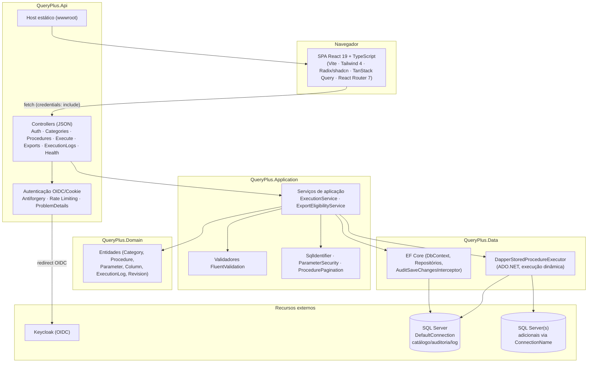
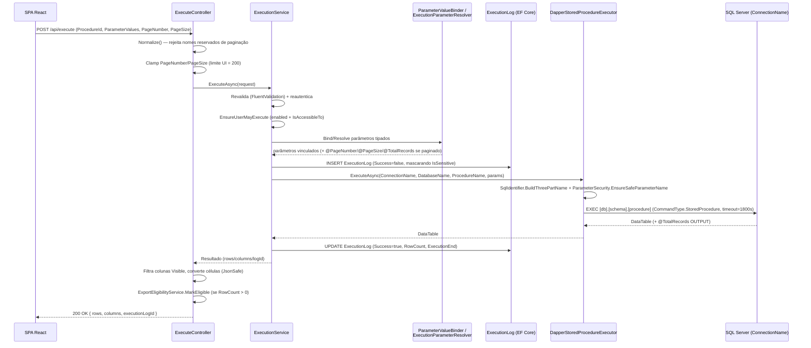

# Query Plus — Especificação de Requisitos de Software

**Versão:** 2.0
**Data:** 08/08/2026
**Status:** Implementado
**Público-alvo:** Arquitetos de software, desenvolvedores backend/frontend, revisores técnicos, equipes de segurança e DevOps

---

## 1. Introdução

### 1.1 Propósito

Este documento especifica os requisitos funcionais e não funcionais, a arquitetura, o modelo de dados e os mecanismos de segurança da aplicação **Query Plus**, tal como implementados no código-fonte atual. Ele serve como referência técnica para desenvolvimento, revisão de código, auditoria de segurança e integração de novos membros de equipe.

Query Plus é uma aplicação web governada que permite a usuários de negócio descobrir e executar stored procedures do SQL Server previamente catalogadas por um administrador, sem necessidade de acesso direto ao banco de dados ou de conhecimento de SQL. O sistema substitui a execução manual de consultas por equipes técnicas, reduzindo riscos de erro, vazamento de dados e modificações não autorizadas, ao mesmo tempo em que fornece controle de acesso baseado em papéis (RBAC), trilha de auditoria completa e suporte a grandes volumes de resultado via paginação e exportação assíncrona para Excel.

### 1.2 Escopo

Este documento descreve o comportamento real da aplicação, incluindo:

- Arquitetura em camadas do backend (.NET 10) e da SPA (React 19).
- Modelo de dados relacional (SQL Server), incluindo o padrão de auditoria de configuração.
- Funcionalidades de catálogo, execução, paginação, exportação e trilha de auditoria.
- Suporte à execução de procedures contra múltiplos servidores/bancos SQL Server distintos.
- Autenticação e autorização via Keycloak (OIDC) e o modelo de papéis (RBAC).
- Gestão de segredos de configuração (desenvolvimento local via `.env`; ambiente Docker via OpenBao).
- Controles de segurança defensivos (injeção de SQL, CSRF, tratamento de exceções).
- Contrato completo da API HTTP.
- Requisitos não funcionais observáveis na implementação (timeouts, limites de paginação, rate limiting, retenção de arquivos).

Está fora do escopo deste documento o detalhamento operacional de infraestrutura (ver `README.md` para setup local) e os guias de configuração específicos do Keycloak e do OpenBao, que são tratados em documentos próprios referenciados nas seções 6 e 7.

### 1.3 Público-alvo

Desenvolvedores backend (.NET) e frontend (React/TypeScript), arquitetos de software responsáveis por decisões estruturais, revisores de código e segurança, e engenheiros de DevOps responsáveis por implantação e gestão de segredos.

### 1.4 Definições e Convenções

| Termo | Significado |
|---|---|
| SPA | Single Page Application — a interface React servida como arquivos estáticos pela API em produção |
| RBAC | Role-Based Access Control — controle de acesso baseado em papéis do Keycloak |
| OIDC | OpenID Connect — protocolo de autenticação federada usado com Keycloak |
| Procedure catalogada | Stored procedure registrada em `tb_procedure`, com metadados de conexão, parâmetros e colunas de resultado |
| ConnectionName | Chave lógica que identifica, na configuração `ConnectionStrings`, o servidor/banco físico contra o qual uma procedure catalogada é executada |
| Revisão (revision) | Registro em `tb_revision` que agrupa todas as mudanças de configuração feitas em uma mesma transação (`SaveChanges`) |
| Execution log | Registro em `tb_execution_log` de uma tentativa de execução de procedure por um usuário |

---

## 2. Visão Geral da Arquitetura

Query Plus segue uma arquitetura em camadas (clean/layered architecture), com um projeto .NET por camada e dependências apontando sempre para dentro (Domain não depende de nada; Api depende de todas as demais). O frontend é uma SPA React independente, compilada e servida como arquivos estáticos pela camada Api em produção.

### 2.1 Camadas .NET

| Camada | Responsabilidade |
|---|---|
| `QueryPlus.Api` | Controllers Web API (JSON puro, sem Razor/MVC views), adaptadores OIDC/autenticação, tratamento de erros via ProblemDetails, hospedagem estática da SPA, composição de DI |
| `QueryPlus.Application` | Casos de uso/serviços de aplicação, DTOs, validadores FluentValidation, interfaces (portas) consumidas pela Api e implementadas pela Data |
| `QueryPlus.Domain` | Entidades de domínio (chaves primárias `int`), interfaces de repositório/Unit of Work, exceções de domínio — sem dependência de EF Core ou Dapper |
| `QueryPlus.Infrastructure` | Composition root fino que conecta a camada Data (e futuras integrações) ao container de DI |
| `QueryPlus.Data` | DbContext e repositórios EF Core (CRUD + migrations), executor de stored procedures via Dapper/ADO.NET, seed de dados de demonstração |

Cada camada expõe um método de extensão `AddXxx(IServiceCollection)` em uma pasta `DependencyInjection/` própria; `Program.cs` é um composition root enxuto que monta o host (serviços → autenticação → controllers → fallback da SPA → endpoints) e então executa o seed de dados de demonstração.

### 2.2 SPA React

A SPA (`client/queryplus-react`) é construída com Vite e usa `createBrowserRouter` (React Router 7) com uma rota raiz única que envolve um `AppShell`. Um `authLoader` compartilhado garante que a shell nunca é renderizada para um visitante não autenticado (redirecionamento de página inteira para `/login?returnUrl=...`); loaders `requireAnyRole(roles)` bloqueiam client-side o acesso às rotas administrativas — apenas por UX, já que a real fronteira de autorização é a API.

Rotas principais: `/` (execução — seleção de procedure acessível, formulário dinâmico de parâmetros, grid virtualizado de resultados, exportação para Excel), `admin/categories`, `admin/procedures` (+ `new` / `:id`), `admin/execution-logs` (somente administradores), `support`, e uma página 404 genérica.

Todo acesso a dados passa por um wrapper `apiFetch` (`src/api/client.ts`) que define `credentials: 'include'`, lança `ApiError` tipado em respostas não-2xx, redireciona automaticamente para `/login` em `401`, e busca/armazena em cache um token CSRF para anexar como `X-CSRF-TOKEN` em métodos não seguros. TanStack Query v5 gerencia todo o cache/polling de estado de servidor (ex.: `refetchInterval` durante o acompanhamento de um job de exportação).

O bundle de produção é gerado como um único chunk não fragmentado (`assets/queryplus.js`, `inlineDynamicImports: true`) — code splitting foi deliberadamente desabilitado após um bug de dupla montagem no overlay de maximização de resultados causado por um chunk de vendor separado.

### 2.3 Tabela de Tecnologias

| Camada / Área | Tecnologia |
|---|---|
| Runtime backend | .NET 10 (SDK fixado via `global.json`, `rollForward: latestFeature`) |
| Framework web | ASP.NET Core Web API (controllers, sem MVC views/Razor) |
| ORM (catálogo/auditoria) | Entity Framework Core |
| Acesso a dados dinâmico | Dapper + ADO.NET (`SqlConnection`/`SqlCommand`) |
| Banco de dados | Microsoft SQL Server |
| Autenticação | Keycloak (OpenID Connect, Authorization Code Flow) + cookie de sessão |
| Exportação Excel | ClosedXML |
| Testes backend | xUnit, FluentAssertions, NSubstitute, Testcontainers.MsSql (`Microsoft.Data.Sqlite` para um caso específico) |
| Framework frontend | React 19 + TypeScript |
| Build tool frontend | Vite |
| Estilização | Tailwind CSS 4 |
| Componentes UI | Radix UI / shadcn |
| Estado de servidor | TanStack Query v5 |
| Roteamento | React Router 7 (`createBrowserRouter`) |
| Internacionalização | react-i18next (`pt-BR` e `en`) |
| Grid virtualizado | `@tanstack/react-virtual` |
| Testes frontend | Vitest + Testing Library (jsdom) |
| Gestão de segredos (Docker) | OpenBao |
| Orquestração local | Docker Compose (SQL Server, Keycloak, API+SPA) |

---

## 3. Modelo de Dados

O esquema é relacional (SQL Server), com todas as entidades de domínio usando chaves primárias `int` (identity) — não são utilizados GUIDs. As tabelas de catálogo (`tb_category`, `tb_procedure`, `tb_procedure_parameter`, `tb_procedure_column`) possuem uma tabela de auditoria espelhada (`*_aud`) mantida automaticamente pelo EF Core; `tb_execution_log` é um log de execução de negócio independente, sem tabela `*_aud` correspondente.

### 3.1 `tb_category`

Categoria de agrupamento de nível superior à qual as procedures pertencem.

| Coluna | Tipo | Nulo | Observações |
|---|---|---|---|
| `id_category` | `int` (identity) | Não | PK |
| `description` | `varchar(200)` | Não | `UNIQUE` |
| `created_at` | `datetime2` | Não | Default `SYSDATETIME()` |
| `updated_at` | `datetime2` | Sim | |

### 3.2 `tb_category_aud`

Histórico de auditoria de `tb_category` — uma linha por (categoria, revisão).

| Coluna | Tipo | Nulo | Observações |
|---|---|---|---|
| `id_category` | `int` | Não | PK composta com `id_revision` |
| `id_revision` | `int` | Não | PK composta; FK → `tb_revision.id_revision` |
| `id_revision_type` | `tinyint` | Sim | FK → `tb_revision_type.id_revision_type` |
| `description` | `varchar(200)` | Sim | |
| `created_at` | `datetime2` | Sim | |
| `updated_at` | `datetime2` | Sim | |

### 3.3 `tb_procedure`

Stored procedure catalogada, com metadados de roteamento (conexão/banco/nome) e configuração de acesso.

| Coluna | Tipo | Nulo | Observações |
|---|---|---|---|
| `id_procedure` | `int` (identity) | Não | PK |
| `id_category` | `int` | Não | FK → `tb_category.id_category` (`Restrict`) |
| `caption` | `varchar(300)` | Não | `UNIQUE` |
| `connection_name` | `varchar(100)` | Não | Default `DefaultConnection`; chave lógica em `ConnectionStrings` (ver seção 5) |
| `database_name` | `varchar(128)` | Não | |
| `procedure_name` | `varchar(128)` | Não | `UNIQUE` em conjunto com `connection_name` + `database_name` |
| `enabled` | `bit` | Não | Default `true` |
| `supports_pagination` | `bit` | Não | Default `false` — ativa o contrato de paginação (seção 4.2) |
| `role_entitlement` | `varchar(100)` | Não | Lista de papéis (separados por vírgula) autorizados a executar; vazio = pública a qualquer usuário autenticado |
| `description` | `varchar(500)` | Sim | |
| `created_at` | `datetime2` | Não | Default `SYSDATETIME()` |
| `updated_at` | `datetime2` | Sim | |

### 3.4 `tb_procedure_aud`

Histórico de auditoria de `tb_procedure`, mesma estrutura de colunas (todas nulas) mais `id_revision`/`id_revision_type`, com PK composta `(id_procedure, id_revision)`.

### 3.5 `tb_procedure_parameter`

Definição de parâmetro de entrada de uma procedure catalogada (metadado de campo de formulário para a SPA).

| Coluna | Tipo | Nulo | Observações |
|---|---|---|---|
| `id_procedure_parameter` | `int` (identity) | Não | PK |
| `id_procedure` | `int` | Não | FK → `tb_procedure.id_procedure` (`Cascade`) |
| `caption` | `varchar(200)` | Não | Rótulo exibido na UI |
| `name` | `varchar(128)` | Não | Nome do parâmetro SQL (sem `@`); `UNIQUE` em conjunto com `id_procedure` |
| `parameter_type` | `varchar(50)` | Não | Enum: `FreeText`, `Numeric`, `Date`, `Time`, `DateTime`, `Boolean`, `Combo` |
| `default_value` | `nvarchar(500)` | Sim | |
| `combo_values` | `nvarchar(max)` | Sim | Array JSON de opções (para `Combo`) |
| `is_required` | `bit` | Não | Default `false` |
| `is_sensitive` | `bit` | Não | Default `false` — mascara o valor no execution log (seção 8) |
| `created_at` | `datetime2` | Não | Default `SYSDATETIME()` |
| `updated_at` | `datetime2` | Sim | |

### 3.6 `tb_procedure_parameter_aud`

Histórico de auditoria de `tb_procedure_parameter`, PK composta `(id_procedure_parameter, id_revision)`.

### 3.7 `tb_procedure_column`

Metadado de exibição/formatação de uma coluna do resultado de uma procedure catalogada.

| Coluna | Tipo | Nulo | Observações |
|---|---|---|---|
| `id_procedure_column` | `int` (identity) | Não | PK |
| `id_procedure` | `int` | Não | FK → `tb_procedure.id_procedure` (`Cascade`) |
| `technical_name` | `varchar(128)` | Não | Nome da coluna retornada pela procedure; `UNIQUE` com `id_procedure` |
| `caption` | `varchar(200)` | Não | Rótulo exibido na grid |
| `alignment` | `varchar(10)` | Não | Enum: `Left`, `Center`, `Right`; default `Left` |
| `format_mask` | `varchar(100)` | Sim | |
| `visible` | `bit` | Não | Default `true` |
| `created_at` | `datetime2` | Não | Default `SYSDATETIME()` |
| `updated_at` | `datetime2` | Sim | |

### 3.8 `tb_procedure_column_aud`

Histórico de auditoria de `tb_procedure_column`, PK composta `(id_procedure_column, id_revision)`.

### 3.9 `tb_execution_log`

Uma linha por tentativa de execução de stored procedure por um usuário. Não faz parte do sistema de auditoria de configuração (não possui `*_aud`).

| Coluna | Tipo | Nulo | Observações |
|---|---|---|---|
| `id_execution_log` | `int` (identity) | Não | PK |
| `id_procedure` | `int` | Não | FK → `tb_procedure.id_procedure` (`Restrict`) |
| `connection_name` | `varchar(100)` | Não | Default `DefaultConnection`; snapshot no momento da execução |
| `username` | `varchar(100)` | Não | |
| `ip_address` | `varchar(45)` | Sim | |
| `execution_start` | `datetime2` | Não | Default `SYSDATETIME()` |
| `execution_end` | `datetime2` | Sim | |
| `success` | `bit` | Não | Default `true` |
| `error_message` | `nvarchar(max)` | Sim | Truncado em 4000 caracteres |
| `parameter_values` | `nvarchar(max)` | Sim | JSON dos valores usados; parâmetros sensíveis mascarados |
| `row_count` | `int` | Sim | |

Índices: `ix_execution_log_user_date (username, execution_start DESC)`, `ix_execution_log_proc_date (id_procedure, execution_start DESC)`, `ix_execution_log_date (execution_start DESC)`.

### 3.10 `tb_revision` e `tb_revision_type`

| `tb_revision` | Tipo | Observações |
|---|---|---|
| `id_revision` | `int` (identity) | PK |
| `revision_timestamp` | `datetime2` | Default `SYSDATETIME()` |
| `username` | `varchar(100)` | Do contexto do usuário atual; fallback literal `"system"` |
| `ip_address` | `varchar(45)` | Nulo permitido |

| `tb_revision_type` | Tipo | Observações |
|---|---|---|
| `id_revision_type` | `tinyint` | PK; valores fixos (seed): `1 = INSERT`, `2 = UPDATE`, `3 = DELETE` |
| `description` | `varchar(50)` | |

### 3.11 Relacionamentos

| De | Para | Cardinalidade | Comportamento de exclusão |
|---|---|---|---|
| `tb_procedure` | `tb_category` | N:1 | `Restrict` |
| `tb_procedure_parameter` | `tb_procedure` | N:1 | `Cascade` |
| `tb_procedure_column` | `tb_procedure` | N:1 | `Cascade` |
| `tb_execution_log` | `tb_procedure` | N:1 | `Restrict` (procedure não pode ser excluída fisicamente enquanto houver logs) |
| `tb_*_aud` | `tb_revision` | N:1 | `Restrict` |
| `tb_*_aud` | `tb_revision_type` | N:1 | `Restrict` |

### 3.12 Padrão de Auditoria de Configuração (`tb_revision`)

A auditoria de configuração é implementada integralmente por `AuditSaveChangesInterceptor` (`src/QueryPlus.Data/Interceptors/AuditSaveChangesInterceptor.cs`), um `SaveChangesInterceptor` do EF Core registrado no `DbContext`. Ele intercepta toda chamada `SaveChanges`/`SaveChangesAsync` antes da escrita (`SavingChanges`) e novamente depois de concluída (`SavedChanges`), para corrigir chaves temporárias.

**Escopo**: apenas entidades que implementam a interface marcadora `IAuditedEntity` são auditadas — `Category`, `Procedure`, `ProcedureParameter`, `ProcedureColumn`. `ExecutionLog`, `Revision` e `RevisionType` **não** são auditados.

**Uma revisão por lote (`SaveChanges`)**:

1. No `SavingChanges`, o interceptor varre o `ChangeTracker` em busca de entradas `IAuditedEntity` em estado `Added`, `Modified` ou `Deleted`. Se nenhuma existir, nada é feito (por exemplo, salvar apenas um `ExecutionLog` não gera revisão).
2. Havendo ao menos uma mudança auditada, é criada **exatamente uma** linha em `tb_revision` para toda a chamada `SaveChanges` — não uma por entidade alterada — com `Username` (de `ICurrentUserContext.Username`, com fallback para `"system"`), `IpAddress` e `RevisionTimestamp = UtcNow`. Essa linha é inserida na mesma transação das entidades principais e das linhas de auditoria.
3. Para cada entrada auditada, o tipo de revisão é derivado do `EntityState`: `Added → Insert(1)`, `Modified → Update(2)`, `Deleted → Delete(3)`. Uma linha `*Aud` correspondente é montada copiando o `CurrentValue` de cada coluna de negócio (ou `OriginalValue` em caso de `Deleted`), mais `IdRevision` e `IdRevisionType`. Colunas enum (`ParameterType`, `Alignment`) são capturadas como string diretamente no código.
4. `IAuditedEntity` também compõe `IHasTimestamps`: `CreatedAt` é preenchido em `UtcNow` na inclusão e `UpdatedAt` na atualização.
5. **Chaves primárias compostas em inserções**: a PK de cada tabela `*_aud` é composta por `(id da entidade principal, id_revision)` — não há PK substituta própria. Para uma linha `Added` cuja chave é temporária (ainda não gerada pelo banco), o valor temporário é copiado para a linha de auditoria, que é enfileirada como `PendingInsertAudit`. Após o `SaveChanges` real concluir e o banco atribuir os identificadores definitivos (`SavedChanges`), uma instrução `UPDATE` bruta (`ExecuteSqlInterpolated`) por auditoria pendente corrige a(s) coluna(s) de id da linha de auditoria — e, quando aplicável, a FK (`id_category`/`id_procedure`) — para os valores reais.
6. Se `SaveChanges` lançar exceção, a fila de auditorias pendentes é limpa, evitando correções obsoletas em uma chamada futura não relacionada.

**Efeito líquido**: toda escrita (inserção/atualização/exclusão) em `tb_category`, `tb_procedure`, `tb_procedure_parameter` ou `tb_procedure_column` produz (a) exatamente uma linha compartilhada em `tb_revision` por chamada `SaveChanges` — de modo que uma única ação da UI que altera uma procedure e vários de seus parâmetros/colunas numa mesma chamada recebe um único `id_revision` ligando todas as linhas `*_aud` resultantes —, (b) uma linha `*_aud` por entidade alterada referenciando essa revisão e um código de `tb_revision_type` (1/2/3), e (c) os valores históricos completos preservados na linha `*_aud` (colunas anuláveis lá, ao contrário das colunas `NOT NULL` da tabela principal, já que o snapshot de uma linha excluída continua significativo mesmo após a linha viva ser removida). É um padrão clássico de "shadow/history table com agrupamento por revisão" (similar em espírito ao Hibernate Envers), **não** tabelas temporais nativas do SQL Server.

---

## 4. Funcionalidades

### 4.1 Catálogo de Categorias e Procedures

Administradores organizam stored procedures executáveis em categorias e catalogam cada procedure com: conexão/banco/nome três-partes qualificado, string de entitlement de papéis, flag `enabled`, flag `supports_pagination`, um conjunto de parâmetros tipados (rótulo, valor padrão, obrigatoriedade, sensibilidade, valores de combo) e um conjunto de colunas de saída (rótulo, visibilidade, alinhamento, máscara de formatação).

Uma ação de **sincronização de metadados** (`POST /api/procedures/{id}/sync-metadata`) conecta-se ao servidor/banco configurado e introspecciona a procedure real no SQL Server (`sys.parameters`, `sys.sp_describe_first_result_set`) para popular/atualizar automaticamente as definições de parâmetros e colunas no editor administrativo.

Arquivos-chave: `src/QueryPlus.Api/Api/CategoriesController.cs`, `src/QueryPlus.Api/Api/ProceduresController.cs`, `src/QueryPlus.Domain/Entities/Procedure.cs`, `src/QueryPlus.Application/Validation/ProcedureValidators.cs`.

### 4.2 Execução de Procedures com Paginação

Usuários de negócio selecionam, entre as procedures às quais têm direito (`GET /api/procedures/accessible`), preenchem um formulário de parâmetros renderizado dinamicamente e executam via `POST /api/execute`.

Procedures marcadas `supports_pagination = true` implementam um contrato fixo, não catalogável: `@PageNumber BIGINT = 1`, `@PageSize BIGINT = 50`, `@TotalRecords BIGINT OUTPUT`. A API injeta os parâmetros de paginação e lê o total via `OUTPUT`; o tamanho de página interativo é limitado a `MaxUiPageSize = 200` linhas (`ProcedurePagination.ClampUiPageSize`), enquanto a exportação para Excel reexecuta a mesma procedure com `@PageNumber = 1` e `@PageSize = ExportPageSize` (999.999.999 — efetivamente "todas as linhas em uma página").

Fluxo detalhado de execução (`POST /api/execute`):

1. A requisição passa pelo filtro `[Authorize(Roles = CanExecute)]` de nível de controller e pela política de rate limiting `execute` (máx. 3 execuções simultâneas por usuário, sem fila).
2. `ExecuteController.Normalize()` normaliza cada chave/valor de parâmetro (trim, remoção de `@` inicial) e rejeita com `400` qualquer chave reservada de paginação (`PageNumber`/`PageSize`/`TotalRecords`) antes de qualquer outro processamento — primeira camada de defesa contra contrabando desses valores via `ParameterValues`.
3. `PageNumber`/`PageSize` são ajustados (`ClampPageNumber`/`ClampUiPageSize`).
4. A procedure é carregada apenas se `enabled` (`GetEnabledByIdWithDetailsAsync`); `404` se ausente/desabilitada. Legendas de parâmetros obrigatórios sem valor e sem `DefaultValue` geram `400`.
5. `ExecutionService.ExecuteAsync` revalida a requisição via FluentValidation, reconfirma autenticação, e recarrega a procedure habilitada por id de forma independente do controller.
6. `EnsureUserMayExecute` lança `ForbiddenOperationException` se a procedure estiver desabilitada ou se `Procedure.IsAccessibleTo(roles do usuário)` retornar falso (ver seção 6).
7. `ExecutionParameterResolver`/`ParameterValueBinder` normalizam nomes de parâmetro, ignoram nomes reservados de paginação (segunda camada de defesa), aplicam `DefaultValue` quando o valor é vazio, validam `IsRequired` (booleanos são isentos) e convertem cada string para o tipo declarado, agregando erros de validação por parâmetro.
8. Se `SupportsPagination`, os parâmetros de paginação são reclamped de forma independente e injetados no dicionário de parâmetros vinculados, com `@TotalRecords` declarado como `OUTPUT`.
9. Parâmetros marcados `IsSensitive` têm seu valor substituído pela string literal `"***"` antes da serialização em `ExecutionLog.ParameterValues` — o valor real ainda é usado na execução, mas nunca chega ao log de auditoria.
10. Uma linha de `ExecutionLog` é inserida (`Success = false`, `ExecutionStart = UtcNow`) **antes** da execução da stored procedure, capturando `IdProcedure`, `ConnectionName` (snapshot do momento), `Username`, `IpAddress` e os valores de parâmetro (mascarados).
11. `DapperStoredProcedureExecutor.ExecuteAsync` resolve a connection string via `IConfiguration.GetConnectionString(connectionName)`, monta o nome três-partes seguro via `SqlIdentifier.BuildThreePartName`, revalida cada nome de parâmetro via `ParameterSecurity.EnsureSafeParameterName`, adiciona o parâmetro `OUTPUT bigint` para `@TotalRecords` quando aplicável, e executa como `CommandType.StoredProcedure` com timeout de **1800 segundos (30 minutos)**, carregando o resultado em um `DataTable`.
12. Em sucesso: o `ExecutionLog` é atualizado (`Success = true`, `ExecutionEnd`, `RowCount`); as colunas da grid são construídas a partir do metadado `ProcedureColumn` (com fallback para nome bruto/`visible = true` para colunas de resultado não catalogadas); apenas colunas `Visible` são retornadas; a elegibilidade de exportação é marcada quando há linhas retornadas.
13. Em falha: a exceção é logada no servidor, `ExecutionLog.Success = false` e `ErrorMessage` (truncado em 4000 caracteres) é gravado, mas a resposta HTTP retorna sempre a mensagem genérica fixa `"The stored procedure failed to execute. See execution log for details."` — o texto real da exceção nunca é exposto ao cliente — com `200 OK` e `Success = false` mais o `ExecutionLogId` para referência.

Arquivos-chave: `src/QueryPlus.Api/Api/ExecuteController.cs`, `src/QueryPlus.Application/Services/ExecutionService.cs`, `src/QueryPlus.Application/Services/ExecutionParameterResolver.cs`, `src/QueryPlus.Application/Services/ParameterValueBinder.cs`, `src/QueryPlus.Application/Common/ProcedurePagination.cs`, `src/QueryPlus.Data/StoredProcedures/DapperStoredProcedureExecutor.cs`.

### 4.3 Exportação para Excel em Background

Após uma execução interativa bem-sucedida com `RowCount > 0`, o usuário pode enfileirar a exportação em Excel do resultado (potencialmente completo, não limitado à página exibida na UI).

1. `POST /api/execute` bem-sucedido com linhas chama `ExportEligibilityService.MarkEligible(username, procedureId, parameterValues, rowCount)`, armazenando um hash SHA-256 dos pares `chave=valor` de parâmetro ordenados e um timestamp UTC com validade de **30 minutos**, por usuário. Qualquer outro desfecho (zero linhas, falha, id de procedure ausente/inválido) chama `Clear()`.
2. `POST /api/exports` (papéis `ROLE_QUERY_EXEC`/`ROLE_ADMIN`, limitado a 5 requisições/minuto/usuário) renormaliza os parâmetros (removendo/rejeitando chaves de paginação reservadas), valida contra a impressão digital armazenada via `ExportEligibilityService.TryValidate` (rejeitando com códigos distintos: `export-not-eligible`, `export-expired`, `export-procedure-mismatch`, `export-no-rows`, `export-params-mismatch`), confirma que a procedure ainda existe/está habilitada, e chama `ExcelExportService.QueueExport`, que gera um `Guid` de job, armazena um `ExportJobState` (`Queued`) em um `ConcurrentDictionary` em memória e publica o id em um `Channel` não limitado para um worker consumidor único. O controller responde `202 Accepted` com o DTO do job.
3. `ExcelExportBackgroundService` (um `BackgroundService`) executa dois laços concorrentes:
   - **`ProcessQueueAsync`**: lê ids de job um por vez, recarrega a procedure em um novo escopo de DI, reverifica `procedure.IsAccessibleTo(job.UserRoles)` (o direito pode ter mudado desde o enfileiramento), revincula os parâmetros, e — se `SupportsPagination` — injeta `@PageNumber = 1` e `@PageSize = ExportPageSize (999.999.999)` com `@TotalRecords` como `OUTPUT`; executa via o mesmo `IStoredProcedureExecutor` da execução interativa; grava uma nova linha de `ExecutionLog` (usuário `"export-worker"` se `job.Username` for nulo); em sucesso, transmite o `DataTable` para um `.xlsx` via ClosedXML (escrita direta de células, não a formatação estruturada de tabela do ClosedXML, por performance em exportações grandes; larguras de coluna são auto-dimensionadas a partir apenas das primeiras 500 linhas) para `App_Data/exports/export_{procedureId}_{jobId:N}.xlsx`; marca o job como `Completed` com `RowCount`/`CompletedAt`. Qualquer exceção marca o job como `Failed`, com a mensagem armazenada — só é exposta ao usuário dono do job via `GET /api/exports/{jobId}`.
   - **`EvictExpiredJobsLoopAsync`**: a cada 10 minutos, exclui jobs `Completed`/`Failed` (e seus arquivos) com mais de **1 hora** desde `CompletedAt` (ou `CreatedAt` se ausente); jobs `Queued`/`Running` nunca são removidos por essa rotina.
4. `GET /api/exports/{jobId}` consulta o status (`Queued`/`Running`/`Completed`/`Failed`); `GET /api/exports/{jobId}/download` transmite o arquivo físico via `PhysicalFile` com content type `xlsx`. Ambos são restritos ao usuário proprietário do job (`ExportsController.Owned()`); requisições de outro usuário recebem `404`, não um erro de autorização, evitando confirmar a existência do job para terceiros.

Arquivos-chave: `src/QueryPlus.Api/Api/ExportsController.cs`, `src/QueryPlus.Api/Services/ExcelExportService.cs`, `src/QueryPlus.Api/Services/ExportEligibilityService.cs`.

### 4.4 Trilha de Auditoria / Execution Log

Toda tentativa de execução (interativa ou via exportação) grava uma linha em `tb_execution_log` antes e depois da execução da stored procedure: horário de início/fim, flag de sucesso, contagem de linhas, `connection_name`, valores de parâmetro e (na falha) mensagem de erro.

⚠️ **Mascaramento de parâmetros sensíveis e mensagem de erro só se aplicam ao caminho interativo hoje.** `ExecutionService.ExecuteAsync` (`POST /api/execute`) mascara parâmetros com `IsSensitive = true` como `"***"` antes de gravar `ParameterValues`, e trunca a mensagem em caso de falha. `ExcelExportBackgroundService.ProcessQueueAsync` (o worker de exportação) serializa os valores de parâmetro sem checar `IsSensitive` — valores sensíveis ficam gravados em texto claro no log de uma execução disparada por exportação — e, em caso de falha na execução da procedure, não grava `ErrorMessage`/`ExecutionEnd` na linha de `ExecutionLog` (apenas o `ExportJobState` em memória recebe o erro, exposto via `GET /api/exports/{jobId}`). Esta é uma lacuna conhecida do comportamento atual, não um requisito.

Administradores (`ROLE_ADMIN`) podem pesquisar/filtrar esse log por usuário, procedure, sucesso e intervalo de datas via `GET /api/execution-logs`, com `GET /api/execution-logs/procedures` fornecendo a lista de procedures para o filtro.

Esta trilha é independente do sistema de auditoria de configuração descrito na seção 3.12 — audita **execuções**, não mudanças de catálogo.

Arquivos-chave: `src/QueryPlus.Api/Api/ExecutionLogsController.cs`, `src/QueryPlus.Application/Services/ExecutionService.cs`, `src/QueryPlus.Domain/Entities/ExecutionLog.cs`.

---

## 5. Suporte a Múltiplos Servidores SQL Server (`ConnectionName`)

Query Plus permite executar procedures catalogadas contra várias instâncias/bancos SQL Server distintos a partir de uma única implantação da aplicação.

Cada entidade `Procedure` carrega um `ConnectionName` (além de `DatabaseName` e `ProcedureName`) que nomeia uma **chave** na seção de configuração `ConnectionStrings` da aplicação, em vez de conter uma connection string fixa embutida.

`IProcedureConnectionCatalog` / `ProcedureConnectionCatalog` (`src/QueryPlus.Data/StoredProcedures/ProcedureConnectionCatalog.cs`) enumera toda chave filha de `ConnectionStrings` cujo valor não seja vazio — isso inclui `DefaultConnection` (o próprio banco de catálogo/auditoria/execution-log da aplicação) ao lado de qualquer conexão adicional que um operador configure, por exemplo um segundo SQL Server hospedando um sistema de negócio diferente.

`GET /api/procedures/connections` (requer `ROLE_PROCEDURE_WRITE` ou `ROLE_ADMIN`) expõe essa lista para que o editor de procedures na SPA a ofereça como dropdown ao criar/editar uma procedure.

A escolha não é apenas uma conveniência de UI: `SaveProcedureDtoValidator` exige que `ConnectionName` seja um dos nomes correntes do catálogo antes que uma procedure possa ser salva — um administrador não pode persistir uma conexão arbitrária/não configurada. Um nome só se torna inválido após ser salvo se a entrada correspondente for posteriormente removida da configuração; nesse caso, a execução falha com `InvalidOperationException` em `DapperStoredProcedureExecutor`.

Em tempo de execução (tanto `POST /api/execute` interativo quanto o worker de exportação em background), `ExecutionService`/`ExcelExportBackgroundService` repassam `procedure.ConnectionName` diretamente para `IStoredProcedureExecutor.ExecuteAsync`, e `DapperStoredProcedureExecutor` resolve o nome via `IConfiguration.GetConnectionString(connectionName)` para abrir uma nova `SqlConnection` isolada por chamada.

`ExecutionLog.ConnectionName` registra um **snapshot** do nome de conexão da procedure no momento da execução (não é reconsultado depois), de modo que a trilha de auditoria reflete contra qual servidor/banco físico uma execução específica de fato ocorreu, mesmo que a configuração de conexão da procedure mude posteriormente.

Arquivos-chave: `src/QueryPlus.Application/Abstractions/IProcedureConnectionCatalog.cs`, `src/QueryPlus.Data/StoredProcedures/ProcedureConnectionCatalog.cs`, `src/QueryPlus.Api/Api/ProceduresController.cs`, `src/QueryPlus.Application/Validation/ProcedureValidators.cs`.

---

## 6. Autenticação e Controle de Acesso (RBAC)

A autenticação é federada via **Keycloak**, usando OpenID Connect com Authorization Code Flow, seguida de sessão via cookie (`QueryPlus.Auth`). O pipeline de autorização nega por padrão: controllers exigem `[Authorize(Roles = ...)]` explicitamente; endpoints marcados `[AllowAnonymous]` (`/api/auth/user`, `/api/auth/csrf`, `/api/auth/logout`, `/api/health`, `/login`, e o fallback estático `MapFallbackToFile("index.html")` que serve a SPA) fogem dessa regra. Chamadas de API não autenticadas recebem HTTP `401` sem corpo — não um redirecionamento — e a SPA intercepta essa resposta para navegar até `/login?returnUrl=...`. Ver [docs/keycloak.md](./keycloak.md) para uma explicação detalhada de todo o fluxo.

Instruções detalhadas de configuração e provisionamento do realm Keycloak (client, roles, mapeamento de claims) estão em **[`./keycloak.md`](./keycloak.md)**.

### 6.1 Papéis (Roles) do Realm

| Papel | Concede |
|---|---|
| `ROLE_ADMIN` | Papel superconjunto, implícito em toda combinação de permissões do sistema — inclui `Procedure.IsAccessibleTo` sempre retornando verdadeiro independentemente do `RoleEntitlement` da procedure (contorna checagens de entitlement por procedure), além de acesso exclusivo ao visualizador de execution log (`ExecutionLogsController` é restrito a `ROLE_ADMIN`) |
| `ROLE_CATEGORY_READ` | Acesso somente leitura à busca/detalhe de categorias; também incluído no lookup de categorias usado pelo dropdown de categoria do editor de procedures |
| `ROLE_CATEGORY_WRITE` | Tudo que `ROLE_CATEGORY_READ` concede, mais criar/atualizar/excluir categorias |
| `ROLE_PROCEDURE_READ` | Acesso somente leitura à busca/detalhe/parâmetros de procedures; também incluído no lookup de categorias (administradores de procedure precisam do dropdown de categoria) |
| `ROLE_PROCEDURE_WRITE` | Tudo que `ROLE_PROCEDURE_READ` concede, mais criar/atualizar/excluir procedures, listar nomes de conexão disponíveis (`GET /api/procedures/connections`) e disparar a sincronização de metadados contra o SQL Server real |
| `ROLE_QUERY_EXEC` | Papel de usuário de negócio: listar procedures acessíveis ao chamador, visualizar parâmetros de uma procedure (também usável por administradores de procedure), executar stored procedures (`POST /api/execute`) sujeito ao `RoleEntitlement` da própria procedure via `Procedure.IsAccessibleTo`, e enfileirar/consultar/baixar exportações Excel da última execução elegível |

### 6.2 Autorização por Procedure (`RoleEntitlement`)

`ROLE_ADMIN` sempre passa. Se `RoleEntitlement` da procedure estiver vazio, ela é pública a qualquer usuário autenticado. Caso contrário, `RoleEntitlement` é uma lista separada por vírgula, e o usuário precisa possuir ao menos um dos papéis listados (comparação sem distinção de maiúsculas/minúsculas) para poder executar a procedure — validado em `Procedure.IsAccessibleTo(currentUser.Roles)`, tanto na execução interativa quanto, de forma independente, no worker de exportação em background.

---

## 7. Gestão de Segredos

| Ambiente | Mecanismo | Descrição |
|---|---|---|
| Desenvolvimento local | Arquivo `.env` (gitignored) | Carregado tanto pelo Docker Compose quanto por `EnvFileLoader` (`src/QueryPlus.Api/Hosting/EnvFileLoader.cs`) para dentro de `dotnet run`, sem sobrescrever variáveis já definidas pelo shell/CI. Criado a partir de `.env.example` (`cp .env.example .env`) |
| Perfil Docker (`docker compose --profile full up`) | **OpenBao** | Cofre de segredos usado no perfil Docker containerizado completo, para fornecer segredos (connection strings, client secrets do Keycloak, etc.) aos containers sem embuti-los em imagens ou arquivos de configuração versionados |

Em nenhum ambiente segredos reais são colocados em `appsettings*.json` — esses arquivos contêm apenas valores padrão não sensíveis.

Instruções detalhadas de provisionamento e uso do OpenBao no perfil Docker estão em **[`./openbao.md`](./openbao.md)**.

---

## 8. Segurança

| Controle | Descrição | Arquivo |
|---|---|---|
| **Validação/quoting de identificadores SQL** | Whitelist de segmentos de identificador (`^[A-Za-z_][A-Za-z0-9_]*$`) antes de aplicar `[colchetes]` (duplicando `]` embutido). `BuildThreePartName` compõe `[database].[schema].[procedure]` apenas a partir de segmentos validados (schema padrão `dbo` se `ProcedureName` não tiver ponto). Único caminho usado para montar o nome três-partes dinâmico passado ao ADO.NET como `CommandType.StoredProcedure` — nunca concatenado em texto SQL bruto. | `src/QueryPlus.Application/Common/SqlIdentifier.cs` |
| **Sanitização de parâmetros de texto livre** | Defesa em profundidade sobre chamadas ADO.NET já parametrizadas: remove caracteres de controle C0 (preserva tab/LF/CR), rejeita `NUL` embutido, limita a 200 caracteres, rejeita strings compostas só de curingas LIKE (`%`, `_`, `[`), escapa metacaracteres LIKE via sintaxe de classe de caracteres do SQL Server, e rejeita via regex fragmentos que lembrem comentários SQL/separadores de lote/`UNION`/`SELECT`/`DROP`/`EXEC`/`xp_`/`sp_`/`OR 1=1`. Também valida nomes de parâmetro antes de repassá-los ao `DynamicParameters` do Dapper. | `src/QueryPlus.Application/Common/ParameterSecurity.cs` |
| **CSRF / antiforgery** | Filtro global `AutoValidateAntiforgeryAuthorizationFilter` valida requisições de mutação contra um cookie antiforgery (`QueryPlus.Csrf`, `HttpOnly`, `SameSite=Lax`); a SPA chama `GET /api/auth/csrf` uma vez, armazena o token em cache e o ecoa via header `X-CSRF-TOKEN` em toda requisição não segura subsequente. O próprio `/api/auth/csrf` é explicitamente isento. | `src/QueryPlus.Api/Security/AutoValidateAntiforgeryAuthorizationFilter.cs` |
| **`ApiExceptionHandler` — sem vazamento de exceção bruta** | `IExceptionHandler` central mapeia exceções para ProblemDetails: `AppValidationException` expõe seus erros de campo estruturados mais um `detail` fixo (`"One or more fields are invalid."`); `EntityNotFoundException`/`ForbiddenOperationException` expõem sua própria mensagem (tipos selados com templates revisados); qualquer outra `DomainException` recebe mensagem fixa (`"The request could not be processed."`); qualquer exceção não reconhecida vira `500` puro com título `"An unexpected error occurred"` e sem `detail`. A exceção real é sempre logada no servidor primeiro. | `src/QueryPlus.Api/ProblemDetails/ApiExceptionHandler.cs` |
| **Negação por padrão + `401` sem redirecionamento** | Endpoints `[AllowAnonymous]` dispensam autenticação (`/api/auth/*`, `/api/health`, `/login`, e o fallback estático da SPA); todo o restante exige `[Authorize(Roles = ...)]`. Chamadas não autenticadas recebem HTTP `401` sem corpo (não um redirecionamento OIDC do servidor); a SPA intercepta o status e navega para `/login?returnUrl=...`. | `src/QueryPlus.Api/Program.cs` |
| **Mascaramento de parâmetro sensível no log de auditoria (caminho interativo)** | Em `POST /api/execute`, valores de parâmetros marcados `IsSensitive` são substituídos por `"***"` antes da serialização em `ExecutionLog.ParameterValues`; o valor real ainda é usado na execução. **Não se aplica** ao worker de exportação (`ExcelExportBackgroundService`), que grava os valores sem mascaramento — ver seção 4.4. | `src/QueryPlus.Application/Services/ExecutionService.cs` |
| **Posse de job de exportação + reverificação de entitlement** | `ExportsController.Owned()` compara o `Username` armazenado do job com o chamador atual antes de retornar status ou permitir download (ids de job de outro usuário retornam `404`, não vazam a existência do job). O worker em background reverifica `procedure.IsAccessibleTo(job.UserRoles)` em tempo de execução (não apenas no enfileiramento). | `src/QueryPlus.Api/Api/ExportsController.cs` |
| **Portão de elegibilidade de exportação (anti-replay/adulteração)** | `ExportEligibilityService` só permite enfileirar uma exportação se a última execução bem-sucedida do mesmo usuário (casada por hash SHA-256 dos pares de parâmetro ordenados) retornou linhas, dentro de uma janela de 30 minutos. | `src/QueryPlus.Api/Services/ExportEligibilityService.cs` |
| **Aplicação de nomes de parâmetro de paginação reservados** | `@PageNumber`/`@PageSize`/`@TotalRecords` nunca podem ser configurados como parâmetros de catálogo (validado em `SaveProcedureDtoValidator`/`SaveProcedureParameterDtoValidator`), nunca podem ser fornecidos por um chamador via `ExecuteController`/`ExportsController` (rejeitados com `400`), e são removidos novamente se de alguma forma presentes em `ParameterValueBinder`/`ExecutionParameterResolver` — o único ponto onde são definidos é a injeção server-side para procedures `SupportsPagination`. | `src/QueryPlus.Application/Common/ProcedurePagination.cs` |
| **Rate limiting por usuário em endpoints de execução longa** | Política `execute`: limitador de concorrência por usuário (chave = claim `preferred_username`, com fallback para `Identity.Name` ou `"anonymous"`), máximo de 3 execuções simultâneas, sem fila (`429` na 4ª). Política `export`: janela fixa de 5 submissões/minuto/usuário. | `src/QueryPlus.Api/DependencyInjection/RateLimitingServiceCollectionExtensions.cs` |
| **`ConnectionName` validado contra o catálogo configurado** | `SaveProcedureDtoValidator` exige que `ConnectionName` seja uma das chaves atuais de `IProcedureConnectionCatalog.GetConnectionNames()` antes de permitir salvar uma procedure. | `src/QueryPlus.Application/Validation/ProcedureValidators.cs` |
| **CORS restritivo fora de Development** | `Program.cs` lança `InvalidOperationException` na inicialização em ambientes não-`Development` se `Cors:AllowedOrigins` não estiver explicitamente configurado (sem fallback permissivo silencioso); apenas `Development` recebe uma lista fixa de `localhost`. A política usa `AllowCredentials` com origens explícitas (necessário para autenticação por cookie) e expõe apenas os headers `Location` e `X-CSRF-TOKEN`. | `src/QueryPlus.Api/Program.cs` |

---

## 9. Endpoints da API

| Método | Rota | Descrição | Papel(éis) exigido(s) |
|---|---|---|---|
| `GET` | `/api/auth/user` | Usuário atual, papéis e estado de autenticação | Anônimo (`IsAuthenticated=false` se não logado) |
| `GET` | `/api/auth/csrf` | Emite par de token antiforgery | Anônimo |
| `POST` | `/api/auth/logout` | Encerra sessão (cookie + OIDC), redireciona para `/` | Anônimo |
| `GET` | `/login` | Desafio OIDC redirecionando ao Keycloak (`returnUrl` validado como same-origin) | Anônimo |
| `GET` | `/api/health` | Verificação de liveness (`{status: healthy}`) | Anônimo |
| `GET` | `/api/categories` | Busca paginada/filtrável de categorias por descrição | `ROLE_CATEGORY_READ`, `ROLE_CATEGORY_WRITE`, `ROLE_ADMIN` |
| `GET` | `/api/categories/lookup` | Lista completa não paginada de categorias (dropdowns) | `ROLE_CATEGORY_READ`, `ROLE_CATEGORY_WRITE`, `ROLE_PROCEDURE_READ`, `ROLE_PROCEDURE_WRITE`, `ROLE_ADMIN` |
| `GET` | `/api/categories/{id}` | Detalhe de categoria por id (`404` se ausente) | `ROLE_CATEGORY_READ`, `ROLE_CATEGORY_WRITE`, `ROLE_ADMIN` |
| `POST` | `/api/categories` | Cria categoria | `ROLE_CATEGORY_WRITE`, `ROLE_ADMIN` |
| `PUT` | `/api/categories/{id}` | Atualiza descrição de categoria | `ROLE_CATEGORY_WRITE`, `ROLE_ADMIN` |
| `DELETE` | `/api/categories/{id}` | Exclui categoria | `ROLE_CATEGORY_WRITE`, `ROLE_ADMIN` |
| `GET` | `/api/procedures/connections` | Lista chaves de `ConnectionStrings` configuradas (alvos multi-servidor) | `ROLE_PROCEDURE_WRITE`, `ROLE_ADMIN` |
| `GET` | `/api/procedures/accessible` | Procedures que o usuário atual pode executar (`Procedure.IsAccessibleTo`) | `ROLE_QUERY_EXEC`, `ROLE_ADMIN` |
| `GET` | `/api/procedures` | Busca paginada/filtrável de procedures (categoria, caption, entitlement, enabled, banco, nome) | `ROLE_PROCEDURE_READ`, `ROLE_PROCEDURE_WRITE`, `ROLE_ADMIN` |
| `GET` | `/api/procedures/lookup` | Lista completa não paginada de procedures (dropdowns admin) | `ROLE_PROCEDURE_READ`, `ROLE_PROCEDURE_WRITE`, `ROLE_ADMIN` |
| `GET` | `/api/procedures/{id}` | Detalhe de procedure com parâmetros/colunas (`404` se ausente) | `ROLE_PROCEDURE_READ`, `ROLE_PROCEDURE_WRITE`, `ROLE_ADMIN` |
| `GET` | `/api/procedures/{id}/parameters` | Definições de parâmetro de uma procedure (formulário dinâmico) | `ROLE_PROCEDURE_READ`, `ROLE_PROCEDURE_WRITE`, `ROLE_QUERY_EXEC`, `ROLE_ADMIN` |
| `POST` | `/api/procedures` | Cria procedure catalogada | `ROLE_PROCEDURE_WRITE`, `ROLE_ADMIN` |
| `PUT` | `/api/procedures/{id}` | Atualiza procedure catalogada | `ROLE_PROCEDURE_WRITE`, `ROLE_ADMIN` |
| `DELETE` | `/api/procedures/{id}` | Exclui procedure catalogada | `ROLE_PROCEDURE_WRITE`, `ROLE_ADMIN` |
| `POST` | `/api/procedures/{id}/sync-metadata` | Introspecciona a procedure real no SQL Server e atualiza parâmetros/colunas | `ROLE_PROCEDURE_WRITE`, `ROLE_ADMIN` |
| `POST` | `/api/execute` | Executa procedure catalogada habilitada com parâmetros vinculados (e paginação) | `ROLE_QUERY_EXEC`, `ROLE_ADMIN` (rate limit: política `execute`) |
| `GET` | `/api/execution-logs` | Busca paginada/filtrável da trilha de execução | `ROLE_ADMIN` |
| `GET` | `/api/execution-logs/procedures` | Lookup de procedures para o filtro do log de execução | `ROLE_ADMIN` |
| `POST` | `/api/exports` | Enfileira exportação Excel em background da última execução elegível | `ROLE_QUERY_EXEC`, `ROLE_ADMIN` (rate limit: política `export`, 5/min) |
| `GET` | `/api/exports/{jobId}` | Consulta status do job de exportação (`404` se inexistente/não pertencente ao chamador) | `ROLE_QUERY_EXEC`, `ROLE_ADMIN` |
| `GET` | `/api/exports/{jobId}/download` | Baixa o `.xlsx` do job concluído (`404` se não concluído/não pertencente) | `ROLE_QUERY_EXEC`, `ROLE_ADMIN` |

---

## 10. Requisitos Não Funcionais

| Categoria | Requisito observado | Fonte/implementação |
|---|---|---|
| Paginação server-side | Contrato fixo `@PageNumber`/`@PageSize`/`@TotalRecords OUTPUT` para procedures `SupportsPagination`; tamanho de página interativo limitado a 200 linhas (`MaxUiPageSize`) | `ProcedurePagination.cs` |
| Exportação de conjunto completo | Exportação reexecuta com `@PageNumber = 1` e `@PageSize = 999.999.999` (`ExportPageSize`) para capturar todo o resultado | `ProcedurePagination.cs` |
| Timeout de comando SQL | 1800 segundos (30 minutos) para execução de stored procedure via ADO.NET | `DapperStoredProcedureExecutor.cs` |
| Concorrência de execução por usuário | Máximo de 3 execuções simultâneas por usuário, sem fila (`429` além disso) | Política de rate limiting `execute` |
| Taxa de submissão de exportação | Máximo de 5 submissões de exportação por minuto por usuário (janela fixa) | Política de rate limiting `export` |
| Elegibilidade/expiração de exportação | Janela de validade de 30 minutos entre a execução bem-sucedida e a solicitação de exportação, casada por hash dos parâmetros | `ExportEligibilityService.cs` |
| Retenção de arquivos de exportação | Jobs `Completed`/`Failed` com mais de 1 hora desde a conclusão são removidos (arquivo + estado) a cada varredura de 10 minutos | `ExcelExportBackgroundService` (`EvictExpiredJobsLoopAsync`) |
| Performance de geração de planilha | Escrita direta de células via ClosedXML (não tabela estruturada); largura de coluna auto-dimensionada a partir apenas das primeiras 500 linhas | `ExcelExportBackgroundService` |
| Truncamento de mensagem de erro | Mensagens de erro de execução truncadas em 4000 caracteres antes de persistir no log | `ExecutionService.cs` |
| Limite de valor de parâmetro texto livre | Máximo de 200 caracteres por valor de parâmetro `FreeText`, após sanitização | `ParameterSecurity.cs` |
| Empacotamento único do bundle SPA | `entryFileNames: "assets/queryplus.js"`, `inlineDynamicImports: true` — sem code splitting, para evitar dupla montagem do overlay de maximização de resultados | Configuração Vite (`client/queryplus-react`) |
| Internacionalização | `pt-BR` (padrão) e `en`, inteiramente client-side via `react-i18next`; a SPA também lê um cookie de cultura no formato do ASP.NET Core (`c=xx\|uic=xx`), se presente, apenas como heurística própria de detecção — não existe middleware de localização no backend hoje | `client/queryplus-react/src/i18n` |
| Disponibilidade multi-servidor | Uma única implantação pode rotear execuções para múltiplos servidores/bancos SQL Server distintos via `ConnectionName` | Seção 5 |
| Isolamento de conexão por chamada | Cada execução abre uma `SqlConnection` própria, resolvida dinamicamente pelo `ConnectionName` da procedure | `DapperStoredProcedureExecutor.cs` |
| Rebuild da SPA | Alterações em `client/queryplus-react/` exigem `pnpm run build` — `dotnet run` isolado não reconstrói a SPA se `wwwroot/index.html` já existir | `CLAUDE.md` / processo de build |

---

## Referências

- [`./keycloak.md`](./keycloak.md) — Configuração e provisionamento do realm Keycloak (RBAC/OIDC)
- [`./openbao.md`](./openbao.md) — Gestão de segredos via OpenBao no perfil Docker containerizado
- `README.md` — Setup e configuração de ambiente local
- `CLAUDE.md` — Comandos de build/teste e convenções de arquitetura para desenvolvimento assistido
