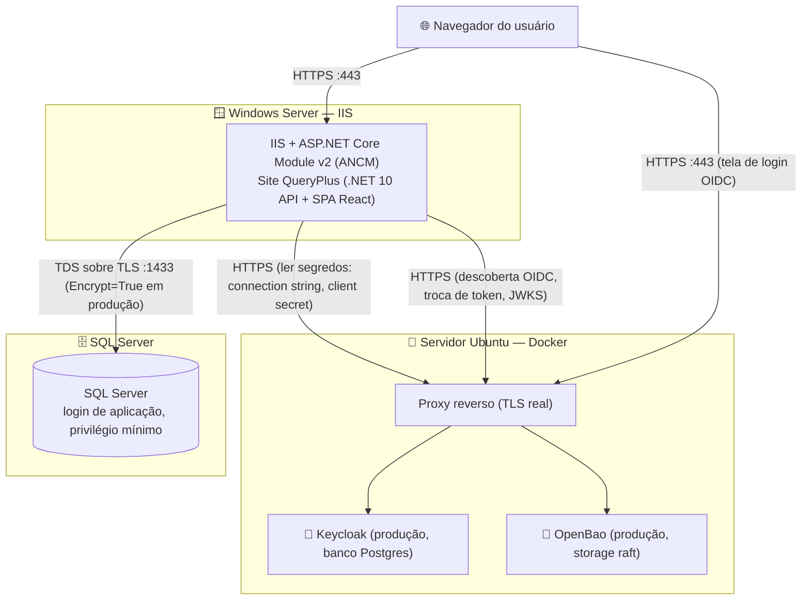
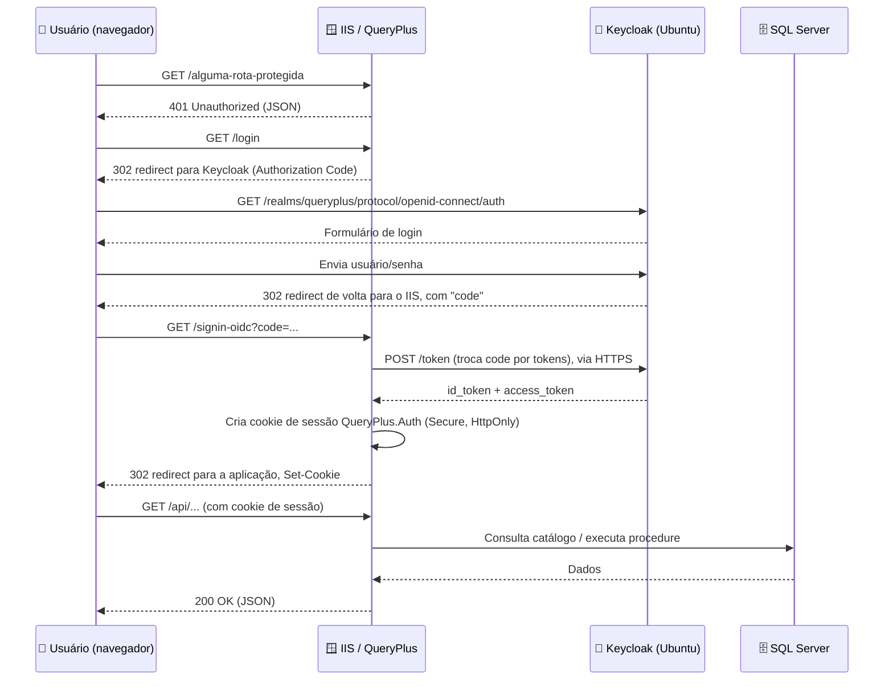
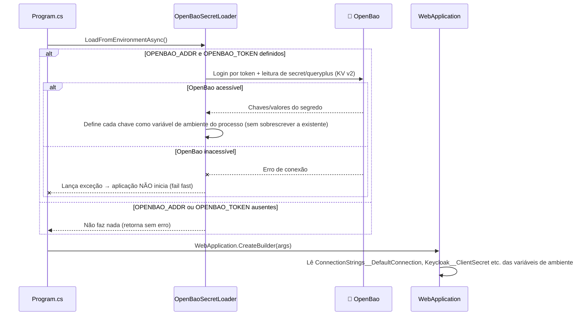
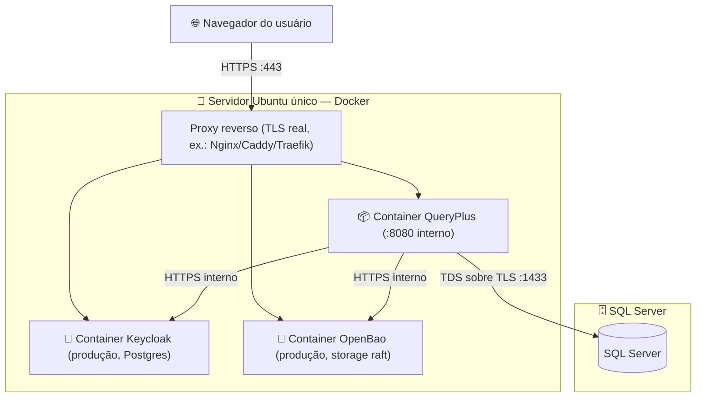

# 🚀 Guia de Deploy em Produção — QueryPlus

> **Para quem é este documento:** engenheiros do time que vão colocar o QueryPlus em produção **pela primeira vez**. O texto é intencionalmente detalhado e não pula etapas "óbvias" — se você já fez isso dezenas de vezes, sinta-se livre para pular direto para a seção 9 (checklist final).
>
> **Antes de começar:** este documento assume que você já leu `docs/SPECIFICATION.md` (o que o QueryPlus faz) e, se quiser entender _por que_ o Keycloak e o OpenBao funcionam do jeito que funcionam em desenvolvimento, os documentos explicativos `docs/keycloak.md` e `docs/openbao.md` são ótimas leituras complementares — mas **não são** guias de produção, e os dois deixam isso claro: o `docker-compose.yml` deste repositório é **somente para desenvolvimento local** (Keycloak em `start-dev`, OpenBao em modo dev com root token fixo). Este documento aqui é o guia oficial para produção.

---

## 1. 🗺️ Visão geral da topologia de produção

A topologia **oficial e recomendada pela empresa** é híbrida:

| Componente                                                                                | Onde roda                                                                         | Sistema operacional                                                              |
| ----------------------------------------------------------------------------------------- | --------------------------------------------------------------------------------- | -------------------------------------------------------------------------------- |
| QueryPlus (API .NET + SPA React, mesma origem)                                            | **IIS** (Internet Information Services — o servidor web nativo do Windows Server) | Windows Server                                                                   |
| Keycloak (IAM — _Identity and Access Management_, o "porteiro" que autentica os usuários) | Container Docker                                                                  | Ubuntu (Linux)                                                                   |
| OpenBao (cofre de segredos — um _fork_ open source do HashiCorp Vault)                    | Container Docker                                                                  | Ubuntu (Linux) — pode ser o **mesmo** servidor Ubuntu do Keycloak ou um separado |
| SQL Server (catálogo, auditoria, dados de negócio)                                        | Instância própria (Windows ou Linux)                                              | Definido pela equipe de banco de dados                                           |

Ou seja: **o IIS não fala com o Keycloak e o OpenBao via `localhost`** — eles estão em uma máquina Linux separada, então toda comunicação entre o Windows Server e o servidor Ubuntu acontece **pela rede**, e por isso precisa ser feita em **HTTPS** (TLS — _Transport Layer Security_, o protocolo que criptografa o tráfego).



**Leitura do diagrama:**

1. O navegador do usuário fala **diretamente** com dois lugares: o IIS (para usar a aplicação) e o Keycloak (durante o fluxo de login, o navegador é redirecionado até lá).
2. O IIS (o processo .NET do QueryPlus) fala com o Keycloak em segundo plano, sem passar pelo navegador, para trocar o "código de autorização" por tokens e para buscar as chaves públicas (JWKS — _JSON Web Key Set_) usadas para validar tokens.
3. O IIS fala com o OpenBao **uma vez, na inicialização do processo**, para buscar a connection string do SQL Server e o client secret do Keycloak (isso é opcional — veja a seção 3.7 sobre as duas formas válidas de configurar segredos).
4. O IIS fala com o SQL Server para tudo que é dado de negócio (catálogo, execução de procedures, auditoria).

⚠️ **Nunca** deixe o Keycloak ou o OpenBao expostos em HTTP puro na internet ou até mesmo na rede interna da empresa. Mesmo sendo "rede interna", trate como hostil — use TLS ponta a ponta.

---

## 2. ✅ Pré-requisitos

Confira esta tabela **antes** de começar qualquer parte do deploy. Ter algo faltando no meio do caminho é a causa mais comum de deploys que travam.

| Item                                                                                                                    | Onde é necessário                       | Detalhe                                                                                        |
| ----------------------------------------------------------------------------------------------------------------------- | --------------------------------------- | ---------------------------------------------------------------------------------------------- |
| Windows Server 2019 ou superior (recomendado 2022+)                                                                     | Servidor do IIS                         | Com acesso administrativo local (RDP)                                                          |
| .NET 10 Hosting Bundle                                                                                                  | Servidor do IIS                         | Runtime ASP.NET Core + módulo ANCM (ver seção 5.1)                                             |
| Papel "Web Server (IIS)" habilitado                                                                                     | Servidor do IIS                         | Via _Server Manager_ (ver seção 5.2)                                                           |
| Node.js 22+ e pnpm 10+                                                                                                  | Máquina onde você roda `dotnet publish` | Só é necessário se o build da SPA React **não** tiver sido feito separadamente (ver seção 5.3) |
| Ubuntu Server 20.04+ ou 22.04+                                                                                          | Servidor de Keycloak/OpenBao            | Com acesso `sudo` via SSH                                                                      |
| Docker Engine + plugin Docker Compose                                                                                   | Servidor Ubuntu                         | Ver seção 4.1                                                                                  |
| Certificado TLS válido para o domínio do QueryPlus                                                                      | IIS                                     | Emitido por uma CA confiável (interna da empresa ou pública)                                   |
| Certificado TLS válido para o domínio do Keycloak                                                                       | Proxy reverso no Ubuntu                 | Pode ser um certificado _wildcard_ cobrindo os três domínios                                   |
| Certificado TLS válido para o domínio do OpenBao                                                                        | Proxy reverso no Ubuntu                 | Idem acima                                                                                     |
| Registros DNS resolvendo os três nomes                                                                                  | DNS da empresa                          | Ex.: `queryplus.suaempresa.com`, `auth.suaempresa.com`, `vault.suaempresa.com`                 |
| Acesso de rede liberado do Windows Server para o Ubuntu nas portas HTTPS do proxy                                       | Firewall entre as redes                 | Normalmente só a porta 443 do proxy reverso, nunca as portas internas dos containers           |
| Instância de SQL Server acessível pela rede, porta 1433 (ou a que estiver configurada)                                  | Rede                                    | Com TLS habilitado na conexão (`Encrypt=True`)                                                 |
| Login de aplicação no SQL Server (não `sa`)                                                                             | Banco de dados                          | Ver seção 4.3 — criado durante o deploy                                                        |
| Acesso ao repositório (`git clone`) e ao SDK .NET 10 (via `global.json`, versão `10.0.0`, `rollForward: latestFeature`) | Máquina de build                        | Necessário para rodar `dotnet publish`                                                         |

---

## 3. 🐧 Parte 1 — Preparando o servidor Ubuntu (Keycloak + OpenBao via Docker)

Esta parte prepara a máquina Linux que vai hospedar o Keycloak e o OpenBao **em modo de produção**. Isso é **diferente** do `docker-compose.yml` que já existe neste repositório: aquele arquivo sobe o Keycloak com `start-dev --import-realm` (modo de desenvolvimento, importa usuários de demonstração) e o OpenBao com `BAO_DEV_ROOT_TOKEN_ID` (modo dev, tudo em memória, token fixo). **Nenhum dos dois pode ser usado assim em produção.**

### 3.1. Instalar o Docker Engine

Conecte via SSH no servidor Ubuntu e instale o Docker seguindo o repositório oficial:

```bash
# Atualiza a lista de pacotes
sudo apt-get update

# Instala dependências para adicionar um repositório HTTPS
sudo apt-get install -y ca-certificates curl gnupg

# Adiciona a chave GPG oficial do Docker
sudo install -m 0755 -d /etc/apt/keyrings
curl -fsSL https://download.docker.com/linux/ubuntu/gpg | sudo gpg --dearmor -o /etc/apt/keyrings/docker.gpg
sudo chmod a+r /etc/apt/keyrings/docker.gpg

# Adiciona o repositório do Docker às fontes do APT
echo \
  "deb [arch=$(dpkg --print-architecture) signed-by=/etc/apt/keyrings/docker.gpg] https://download.docker.com/linux/ubuntu \
  $(. /etc/os-release && echo "$VERSION_CODENAME") stable" | \
  sudo tee /etc/apt/sources.list.d/docker.list > /dev/null

# Instala o Docker Engine + plugin Compose
sudo apt-get update
sudo apt-get install -y docker-ce docker-ce-cli containerd.io docker-compose-plugin

# Habilita o Docker para iniciar junto com o sistema
sudo systemctl enable --now docker

# (opcional, mas recomendado) permite rodar docker sem sudo para o seu usuário
sudo usermod -aG docker $USER
```

Depois de rodar o último comando, saia e entre de novo na sessão SSH para o grupo `docker` ter efeito.

Confirme que deu certo:

```bash
docker --version
docker compose version
```

### 3.2. Firewall — restrinja o acesso às portas

🔒 **Aviso de segurança:** por padrão, containers Docker publicados com `-p 0.0.0.0:PORTA:PORTA` ficam acessíveis por **qualquer máquina que alcance o servidor na rede**. Isso inclui as portas internas do Keycloak (8080/8443) e do OpenBao (8200) — elas **nunca** devem ficar abertas diretamente para a internet nem para toda a rede interna. Só o proxy reverso (rodando na própria máquina, ou vinculado a `127.0.0.1`) deve enxergar essas portas; o mundo externo só deve alcançar a porta 443 do proxy.

Exemplo de regras com `ufw` (_Uncomplicated Firewall_, a ferramenta de firewall padrão do Ubuntu):

```bash
# Nega tudo por padrão, exceto o que for liberado explicitamente
sudo ufw default deny incoming
sudo ufw default allow outgoing

# Libera SSH (idealmente restrito ao IP/rede da equipe de infraestrutura)
sudo ufw allow from 203.0.113.0/24 to any port 22 proto tcp

# Libera apenas HTTPS do proxy reverso, publicamente
sudo ufw allow 443/tcp

# Libera a comunicação vinda do Windows Server (IIS) até o proxy, se o proxy
# estiver em uma porta diferente da 443 pública — ajuste conforme sua topologia
sudo ufw allow from 198.51.100.10 to any port 443 proto tcp

sudo ufw enable
sudo ufw status verbose
```

⚠️ As portas internas do Keycloak e do OpenBao **não devem** aparecer nesta lista de liberações — elas ficam só acessíveis via `127.0.0.1` (loopback), e é o proxy reverso, rodando na mesma máquina, que fala com elas.

### 3.3. Colocando o OpenBao em modo de produção

Em desenvolvimento, o `docker-compose.yml` sobe o OpenBao assim (não use isto em produção):

```yaml
# docker-compose.yml (DESENVOLVIMENTO — NÃO USAR EM PRODUÇÃO)
openbao:
    image: openbao/openbao:2.6.1
    environment:
        BAO_DEV_ROOT_TOKEN_ID: "${OPENBAO_TOKEN}"
        BAO_ADDR: "http://127.0.0.1:8200"
```

Esse modo (`BAO_DEV_ROOT_TOKEN_ID`) mantém **tudo em memória** — cada `restart` do container apaga todos os segredos — e usa um **root token fixo e conhecido**. Isso é ótimo para rodar o QueryPlus na sua máquina em cinco minutos, e catastrófico em produção.

🔒 **Aviso de segurança crítico:** o _root token_ do OpenBao é equivalente a uma chave mestra — quem o possui pode ler/escrever/apagar qualquer segredo e reconfigurar qualquer política. **Nunca** use o root token como o `OPENBAO_TOKEN` da aplicação, nunca o deixe em variável de ambiente de longa duração, e nunca o reaproveite de um ambiente de desenvolvimento.

#### 3.3.1. Arquivo de configuração de produção

Crie um diretório para os dados e a configuração do OpenBao no servidor Ubuntu:

```bash
sudo mkdir -p /opt/openbao/data /opt/openbao/config /opt/openbao/tls
```

Copie o certificado TLS do domínio do OpenBao (ex.: `vault.suaempresa.com`) para `/opt/openbao/tls/fullchain.pem` e a chave privada para `/opt/openbao/tls/privkey.pem`.

Crie `/opt/openbao/config/config.hcl`:

```hcl
ui = true

cluster_addr = "https://10.0.0.5:8201"
api_addr     = "https://vault.suaempresa.com:8200"

storage "raft" {
  path    = "/openbao/data"
  node_id = "openbao-node-1"
}

listener "tcp" {
  address       = "0.0.0.0:8200"
  tls_cert_file = "/openbao/tls/fullchain.pem"
  tls_key_file  = "/openbao/tls/privkey.pem"
}
```

> 📌 **Por que `storage "raft"` e não `storage "file"`?** O backend `file` (usado por conveniência em vários tutoriais) **não é transacional** e não tem travamento de arquivo em nível de sistema — a documentação oficial do OpenBao recomenda usá-lo apenas para desenvolvimento local ou situações de servidor único sem requisitos sérios de durabilidade. Para produção, o backend recomendado é o `raft` ("Integrated Storage"), que é transacional e oferece um caminho natural para alta disponibilidade no futuro.

Suba o container apontando para essa configuração:

```bash
docker run -d \
  --name queryplus-openbao \
  --restart unless-stopped \
  -p 127.0.0.1:8200:8200 \
  -v /opt/openbao/config:/openbao/config \
  -v /opt/openbao/data:/openbao/data \
  -v /opt/openbao/tls:/openbao/tls \
  --cap-add=IPC_LOCK \
  openbao/openbao:2.6.1 \
  server -config=/openbao/config/config.hcl
```

Note que a porta é publicada apenas em `127.0.0.1` — só o proxy reverso local (seção 3.5) vai falar com ela.

#### 3.3.2. Inicializando (`init`) e destravando (`unseal`) o OpenBao

Um OpenBao recém-instalado nasce "selado" (_sealed_) — ele não consegue decifrar seu próprio storage até ser inicializado e destravado. Isso só é feito **uma vez**, na vida do cluster.

```bash
export BAO_ADDR="https://127.0.0.1:8200"
export BAO_SKIP_VERIFY="true"   # só se o certificado ainda não estiver confiável localmente; remova depois

bao operator init
```

Esse comando gera:

- **5 "unseal key shares"** por padrão (fragmentos da chave mestra, divididos pelo algoritmo de Shamir);
- um **limiar (threshold)** de 3 fragmentos necessários para destravar o cofre (também o padrão);
- o **Initial Root Token**.

🔒 **Aviso de segurança crítico:**

- **Nunca** anote os 5 fragmentos de chave e o root token no mesmo lugar (ex.: um único arquivo de texto no próprio servidor). O objetivo do esquema de Shamir é justamente que nenhuma pessoa sozinha consiga destravar o cofre — distribua os fragmentos entre pessoas/cofres de senha diferentes.
- Considere usar as flags `-pgp-keys` do `bao operator init` para que cada fragmento já saia cifrado com a chave PGP de uma pessoa diferente da equipe.
- O **root token** só deve ser usado para a configuração inicial (política + token da aplicação, seção 3.4). Depois disso, revogue-o ou guarde-o com o mesmo cuidado que os fragmentos de unseal, longe de qualquer variável de ambiente de uso corrente.

Depois do `init`, o servidor ainda está selado. Destrave-o rodando o comando uma vez por fragmento, até atingir o limiar (3 vezes, no padrão):

```bash
bao operator unseal
# Key (will be hidden): <cole o primeiro fragmento e pressione Enter>

bao operator unseal
# Key (will be hidden): <cole o segundo fragmento>

bao operator unseal
# Key (will be hidden): <cole o terceiro fragmento>
```

> 💡 Prefira sempre o modo interativo (sem passar a chave como argumento do comando) — passar a chave direto na linha de comando deixa o valor no histórico do shell.

⚠️ **Todo restart do container do OpenBao volta ao estado "selado"** — alguém precisa repetir o `bao operator unseal` três vezes depois de qualquer reinício (veja a seção 8, "Solução de problemas").

#### 3.3.3. Criando uma política restrita e um token só para a aplicação

Nunca dê ao QueryPlus o root token. Crie uma política de acesso mínimo, específica para o segredo que ele precisa ler:

```hcl
# queryplus-policy.hcl
path "secret/data/queryplus" {
  capabilities = ["read"]
}

path "secret/metadata/queryplus" {
  capabilities = ["read"]
}
```

```bash
# ainda autenticado como root, só nesta etapa de bootstrap
bao policy write queryplus-app queryplus-policy.hcl

# cria um token de aplicação preso a essa política
bao token create -policy=queryplus-app -ttl=8760h
```

📌 **Limitação real e importante a considerar:** a forma recomendada pela documentação do OpenBao/Vault para autenticação de aplicações é o método **AppRole** (um par `role_id`/`secret_id` com renovação automática), não um token estático de longa duração. Porém, a classe que o QueryPlus usa hoje para buscar segredos — `OpenBaoSecretLoader` (`src/QueryPlus.Api/Hosting/OpenBaoSecretLoader.cs`) — **só implementa autenticação por token estático** (`TokenAuthMethodInfo` da biblioteca VaultSharp). Não há suporte a AppRole nem a certificado embutido no código hoje. Na prática, isso significa:

- Você precisa gerar um token com um TTL (_time to live_, tempo de vida) longo o suficiente para não expirar em produção sem aviso (no exemplo acima, `8760h` ≈ 1 ano), **ou**
- Assumir um processo manual de rotação: gerar um novo token periodicamente e atualizar a variável `OPENBAO_TOKEN` no IIS antes do token antigo expirar.
- Trate isso como um item de acompanhamento: dar suporte a AppRole no `OpenBaoSecretLoader` é uma melhoria futura desejável, não algo já implementado.

Guarde o valor retornado por `bao token create` — ele vai virar a variável `OPENBAO_TOKEN` da aplicação (seção 5.7).

### 3.4. Colocando o Keycloak em modo de produção

Em desenvolvimento, o `docker-compose.yml` sobe o Keycloak assim (não use isto em produção):

```yaml
# docker-compose.yml (DESENVOLVIMENTO — NÃO USAR EM PRODUÇÃO)
keycloak:
    image: quay.io/keycloak/keycloak:26.0
    command: start-dev --import-realm
    environment:
        KEYCLOAK_ADMIN: "${KEYCLOAK_ADMIN}"
        KEYCLOAK_ADMIN_PASSWORD: "${KEYCLOAK_ADMIN_PASSWORD}"
```

O `start-dev` roda um perfil inseguro e de conveniência: permite HTTP puro, usa um banco de dados efêmero e importa `docker/keycloak/realm-export.json`, que contém usuários de demonstração **`demo/demo`** e **`admin/admin`** e um client secret fixo e público: **`change-me-in-production`**. Isso é aceitável só em máquina de desenvolvedor.

🔒 **Aviso de segurança crítico:** nunca aponte um Keycloak de produção para `realm-export.json`. Ele existe só para o time subir um ambiente de teste local rapidamente e contém credenciais conhecidas por qualquer pessoa que tenha acesso ao repositório.

#### 3.4.1. Subindo o Keycloak com banco Postgres real

Primeiro, suba um Postgres dedicado ao Keycloak (pode ser um container separado ou uma instância gerenciada — o exemplo abaixo usa container):

```bash
docker run -d \
  --name queryplus-keycloak-db \
  --restart unless-stopped \
  -e POSTGRES_DB=keycloak \
  -e POSTGRES_USER=keycloak \
  -e POSTGRES_PASSWORD='TrocarPorUmaSenhaForteAqui!' \
  -v /opt/keycloak/db:/var/lib/postgresql/data \
  --network queryplus-net \
  postgres:16
```

Depois suba o Keycloak em modo de **produção** (`start`, não `start-dev`), apontando para esse Postgres:

```bash
docker run -d \
  --name queryplus-keycloak \
  --restart unless-stopped \
  --network queryplus-net \
  -p 127.0.0.1:8080:8080 \
  -e KC_DB=postgres \
  -e KC_DB_URL="jdbc:postgresql://queryplus-keycloak-db/keycloak" \
  -e KC_DB_USERNAME=keycloak \
  -e KC_DB_PASSWORD='TrocarPorUmaSenhaForteAqui!' \
  -e KC_HOSTNAME=auth.suaempresa.com \
  -e KC_HTTP_ENABLED=true \
  -e KC_PROXY_HEADERS=xforwarded \
  -e KC_BOOTSTRAP_ADMIN_USERNAME=admin \
  -e KC_BOOTSTRAP_ADMIN_PASSWORD='TrocarPorUmaSenhaForteAqui!' \
  quay.io/keycloak/keycloak:26.0 \
  start
```

Pontos importantes desta configuração:

- `start` (não `start-dev`) ativa o **perfil seguro de produção**, que faz duas exigências obrigatórias na inicialização: hostname configurado (`KC_HOSTNAME`) e TLS configurado — aqui optamos por **terminar o TLS no proxy reverso** (seção 3.5), então avisamos o Keycloak disso com `KC_HTTP_ENABLED=true` + `KC_PROXY_HEADERS=xforwarded` (para ele confiar nos cabeçalhos `X-Forwarded-*` enviados pelo proxy).
- A porta 8080 continua publicada só em `127.0.0.1` — o mundo externo só alcança o Keycloak através do proxy com TLS.
- `KC_BOOTSTRAP_ADMIN_USERNAME` / `KC_BOOTSTRAP_ADMIN_PASSWORD` criam a conta administrativa do Keycloak na primeira subida (equivalente ao antigo `KEYCLOAK_ADMIN`/`KEYCLOAK_ADMIN_PASSWORD` usado no modo dev).

### 3.5. Proxy reverso com TLS real na frente do Keycloak e do OpenBao

Tanto o Keycloak quanto o OpenBao, neste desenho, ficam publicados só em `127.0.0.1` — um proxy reverso rodando na mesma máquina (Nginx, Caddy ou Traefik, à escolha da equipe) é quem termina o TLS de verdade e encaminha para os containers.

Exemplo simplificado com Nginx (arquivo `/etc/nginx/sites-available/queryplus-infra.conf`):

```nginx
server {
    listen 443 ssl;
    server_name auth.suaempresa.com;

    ssl_certificate     /etc/ssl/suaempresa/fullchain.pem;
    ssl_certificate_key /etc/ssl/suaempresa/privkey.pem;

    location / {
        proxy_pass http://127.0.0.1:8080;
        proxy_set_header Host $host;
        proxy_set_header X-Forwarded-For $proxy_add_x_forwarded_for;
        proxy_set_header X-Forwarded-Proto $scheme;
        proxy_set_header X-Forwarded-Host $host;
    }
}

server {
    listen 443 ssl;
    server_name vault.suaempresa.com;

    ssl_certificate     /etc/ssl/suaempresa/fullchain.pem;
    ssl_certificate_key /etc/ssl/suaempresa/privkey.pem;

    location / {
        proxy_pass https://127.0.0.1:8200;
        proxy_ssl_verify off; # o OpenBao já usa um cert próprio internamente; ajuste conforme sua CA
        proxy_set_header Host $host;
        proxy_set_header X-Forwarded-For $proxy_add_x_forwarded_for;
        proxy_set_header X-Forwarded-Proto $scheme;
    }
}
```

> Como o OpenBao já está configurado (seção 3.3.1) para falar TLS diretamente no `listener "tcp"`, o proxy pode tanto reencaminhar em TLS (_passthrough_ simplificado, como no exemplo acima) quanto terminar o TLS externo e falar HTTP internamente com o OpenBao — escolha o padrão que sua equipe de infraestrutura já usa para os demais serviços.

### 3.6. Criando o realm de produção no Keycloak

Diferente do ambiente de desenvolvimento (que importa `realm-export.json` automaticamente), em produção você cria o realm manualmente pelo console administrativo:

1. Acesse `https://auth.suaempresa.com/admin/` e faça login com as credenciais de `KC_BOOTSTRAP_ADMIN_USERNAME`/`KC_BOOTSTRAP_ADMIN_PASSWORD`.
2. No menu superior esquerdo (seletor de realm), clique em **"Create Realm"**.
3. Dê o nome `queryplus` (ou o nome real que a equipe padronizar) e confirme.
4. Dentro do realm novo, vá em **Clients → Create client**:
    - **Client ID**: o mesmo valor que você vai colocar na variável `Keycloak__ClientId` (ex.: `queryplus-web`).
    - **Client authentication**: **On** (é um client confidencial, com secret).
    - **Valid redirect URIs**: `https://queryplus.suaempresa.com/signin-oidc`.
    - **Web origins**: `https://queryplus.suaempresa.com`.
5. Depois de criar o client, vá na aba **Credentials** e copie o **Client secret** gerado automaticamente pelo Keycloak — esse é um segredo forte e único, gerado de verdade, bem diferente do `change-me-in-production` do ambiente de desenvolvimento.
6. Crie os usuários reais da empresa (ou configure federação com o diretório corporativo, se aplicável) em **Users**. **Não** copie usuários de demonstração do ambiente de dev.
7. Configure os _roles_ que o QueryPlus espera (consulte `docs/keycloak.md`, seção "As placas nas portas", para a lista de roles usadas pela aplicação) e atribua-os aos usuários/grupos corretos.

```
🖼️ Representação ilustrativa da tela (não é uma captura de tela real) — os nomes de
menu podem variar um pouco conforme a versão instalada.

┌───────────────────────────────────────────────────────────────┐
│ Keycloak Admin Console          Realm: [ queryplus       ▾ ]  │
├───────────────────────────────────────────────────────────────┤
│  Clients > queryplus-web > Credentials                        │
│                                                               │
│   Client Authenticator:  Client Id and Secret                 │
│                                                               │
│   Client secret:  ••••••••••••••••••••••••    [ Regenerate ]  │
│                                       [ 📋 Copy to clipboard ]│
└───────────────────────────────────────────────────────────────┘
```

⚠️ Copie esse client secret imediatamente para um cofre de senhas temporário — você vai precisar dele na seção 3.7 para gravá-lo no OpenBao (ou, se optar pela alternativa mais simples, diretamente como variável de ambiente do IIS na seção 5.7).

### 3.7. Gravando os segredos reais de produção no OpenBao

Com a política e o token de aplicação já criados (seção 3.3.3) e o client secret real do Keycloak em mãos (seção 3.6), grave o segredo de produção:

```bash
export BAO_ADDR="https://vault.suaempresa.com:8200"
export BAO_TOKEN="<token com a política queryplus-app, NÃO o root token>"

bao kv put secret/queryplus \
  ConnectionStrings__DefaultConnection="Server=sql.suaempresa.com,1433;Database=QueryPlus;User Id=queryplus_app;Password=<senha-forte-do-login-de-app>;TrustServerCertificate=False;Encrypt=True" \
  Keycloak__ClientSecret="<client secret real copiado do Keycloak>"
```

🔒 **Aviso de segurança crítico:**

- O caminho é `secret/queryplus` (mount point `secret`, engine KV versão 2) — é exatamente o que o `OpenBaoSecretLoader` do QueryPlus vai ler. Não use outro caminho.
- Use aqui a senha do **login de aplicação** do SQL Server (seção 4.3), nunca a senha de `sa`.
- Nunca reaproveite o valor de `MSSQL_SA_PASSWORD` ou de `Keycloak__ClientSecret` que aparecem no `.env`/`docker-compose.yml` de desenvolvimento. Eles existem só para sua máquina local.
- `TrustServerCertificate=False` + `Encrypt=True` são o padrão recomendado quando o SQL Server tem um certificado TLS válido — evite `TrustServerCertificate=True` em produção (ele desativa a validação do certificado do servidor).

---

## 4. 🗄️ Parte 2 — Preparando o SQL Server de produção

### 4.1. Rodando as migrations do EF Core

O QueryPlus usa Entity Framework Core para o esquema do catálogo/auditoria. Você tem duas formas de aplicar as migrations em um banco de produção vazio:

**Opção A — rodar manualmente antes do primeiro start da aplicação** (recomendado, dá mais controle):

```bash
dotnet ef database update \
  --project src/QueryPlus.Data \
  --startup-project src/QueryPlus.Api
```

Isso precisa da variável `ConnectionStrings__DefaultConnection` apontando para o banco de produção no ambiente onde você roda o comando.

**Opção B — deixar a própria aplicação aplicar na primeira subida.** O `DemoDataSeeder`, chamado a partir de `Program.cs` (`await app.SeedDemoDataAsync();`), aplica as migrations automaticamente todo início de aplicação — isso é geralmente desejável (garante que o esquema esteja sempre atualizado). **Porém, leia com atenção o aviso a seguir antes de contar com essa opção.**

### 4.2. ⚠️ RISCO REAL: o seed de demonstração roda sempre, em qualquer ambiente

Este é o ponto mais importante deste documento — leia com atenção antes do primeiro deploy contra um banco de produção real.

> Em `src/QueryPlus.Api/Program.cs`, a linha `await app.SeedDemoDataAsync();` executa **sempre, incondicionalmente, em todo ambiente** — hoje **não existe** nenhum controle por `ASPNETCORE_ENVIRONMENT` (nenhum `if (app.Environment.IsDevelopment())` protegendo essa chamada).

Isso quer dizer que, ao subir a aplicação pela **primeira vez** contra um banco de produção vazio, o `DemoDataSeeder` vai:

1. ✅ Aplicar automaticamente todas as migrations do EF Core — isso geralmente **é** desejável.
2. ❌ **Instalar objetos SQL de demonstração e um catálogo de procedures de demonstração** (`Sp_Demo_*`, `tb_usa_president`, e outros) — isso é **altamente indesejável** em um banco de produção real.

Hoje **não existe** nenhuma forma de desativar apenas a parte (2) via configuração — é tudo ou nada, dentro do mesmo método.

**O time precisa escolher conscientemente uma das duas estratégias abaixo antes do primeiro deploy real:**

| Estratégia                                     | Como funciona                                                                                                                                                                                                                                                          | Quando faz sentido                                                                                                                                                      |
| ---------------------------------------------- | ---------------------------------------------------------------------------------------------------------------------------------------------------------------------------------------------------------------------------------------------------------------------- | ----------------------------------------------------------------------------------------------------------------------------------------------------------------------- |
| **A. Aceitar temporariamente e limpar depois** | Deixe o primeiro start instalar os objetos de demo, confirme que a aplicação subiu corretamente, depois rode um script manual para remover os objetos/procedures de demonstração e as linhas de catálogo correspondentes do banco de produção                          | Deploys sob pressão de tempo, equipes já confortáveis em auditar e limpar o catálogo manualmente depois                                                                 |
| **B. Tratar como item de trabalho bloqueante** | Antes do primeiro deploy real, o time implementa um gate (ex.: `if (!app.Environment.IsProduction())` ou uma flag de configuração dedicada) para que o seed de demonstração nunca rode contra um banco marcado como produção, e só então aplica as migrations "limpas" | Ambientes regulados, bancos compartilhados com outros sistemas, ou qualquer situação em que "objetos de demonstração aparecerem" mesmo que por minutos seja inaceitável |

⚠️ Este documento **não resolve** esse problema por você — ele existe hoje no código, sem solução pronta via configuração. Trate a escolha acima como uma decisão de equipe, documentada, antes de apontar `ConnectionStrings__DefaultConnection` para um banco de produção real pela primeira vez.

### 4.3. Criando um login de aplicação com privilégio mínimo (nunca use `sa`)

🔒 **Aviso de segurança crítico:** a conta `sa` (_system administrator_) do SQL Server tem privilégio total sobre a instância inteira. Usá-la como a conta de conexão da aplicação (como o `docker-compose.yml` de desenvolvimento faz, por conveniência) é aceitável **só** em ambiente local. Em produção, crie um login dedicado.

```sql
-- Rode isto como um administrador do SQL Server, uma única vez.

-- 1. Cria o login de nível de servidor
CREATE LOGIN queryplus_app WITH PASSWORD = 'TrocarPorUmaSenhaForteEUnica!';

-- 2. Cria o usuário dentro do banco QueryPlus e o vincula ao login
USE QueryPlus;
CREATE USER queryplus_app FOR LOGIN queryplus_app;

-- 3. Concede apenas o necessário: leitura/escrita nas tabelas do catálogo/auditoria
ALTER ROLE db_datareader ADD MEMBER queryplus_app;
ALTER ROLE db_datawriter ADD MEMBER queryplus_app;

-- 4. Permite executar as stored procedures catalogadas (ajuste o schema/nome
--    conforme os procedures reais que o catálogo vai apontar)
GRANT EXECUTE ON SCHEMA::dbo TO queryplus_app;

-- 5. Se as migrations do EF Core forem aplicadas por este MESMO login (Opção B da
--    seção 4.1), ele também vai precisar de permissão para alterar o schema
--    (criar/alterar tabelas). Considere usar um login SEPARADO, mais privilegiado,
--    só para rodar migrations, e manter este aqui restrito ao runtime.
```

| Prática                     | Recomendado                                                                    | Evite                                             |
| --------------------------- | ------------------------------------------------------------------------------ | ------------------------------------------------- |
| Conta de conexão em runtime | Login dedicado (`queryplus_app`) com `db_datareader`/`db_datawriter`/`EXECUTE` | `sa`                                              |
| Conta para rodar migrations | Login separado com permissão de alterar schema, usado só durante o deploy      | Reaproveitar o login de runtime para tudo         |
| Senha do login de aplicação | Gerada por um gerenciador de senhas, única, guardada no OpenBao                | Reaproveitar `MSSQL_SA_PASSWORD` do `.env` de dev |
| Criptografia da conexão     | `Encrypt=True`, `TrustServerCertificate=False`                                 | `TrustServerCertificate=True`                     |

---

## 5. 🪟 Parte 3 — Publicando o QueryPlus no IIS

Esta é a forma **principal e preferida pela empresa** de publicar o QueryPlus. Siga os passos na ordem — pular etapas é a causa mais comum dos erros 500.30/502.5 descritos na seção 8.

### 5.1. Instalar o .NET 10 Hosting Bundle

O **Hosting Bundle** é o instalador que traz, juntos: o runtime do ASP.NET Core (o "framework compartilhado" que a aplicação usa em tempo de execução, já que o QueryPlus é publicado como _framework-dependent_ — leia a nota abaixo) e o **ASP.NET Core Module v2 (ANCM)**, o componente que permite o IIS encaminhar requisições para um processo .NET.

> 📌 **Por que isso é necessário:** o arquivo de projeto da API (`src/QueryPlus.Api/QueryPlus.Api.csproj`) **não define** `RuntimeIdentifier` nem `SelfContained` — ou seja, o publish gerado é _framework-dependent_ (depende do runtime já estar instalado na máquina que vai rodá-lo). Isso é visível no próprio `Dockerfile` do repositório, que publica com `dotnet publish ... /p:UseAppHost=false` e depois roda em cima da imagem `mcr.microsoft.com/dotnet/aspnet:10.0` (que já traz o runtime). No IIS, quem cumpre esse papel de "runtime já instalado" é justamente o Hosting Bundle.

1. Baixe o instalador do link oficial e atual (redireciona sempre para a versão mais recente do .NET, hoje .NET 10):
   `https://dotnet.microsoft.com/permalink/dotnetcore-current-windows-runtime-bundle-installer`
   Se precisar de uma versão específica, acesse `https://dotnet.microsoft.com/en-us/download/dotnet`, escolha a versão do .NET e, na coluna **"Run apps - Runtime"**, clique no link **"Hosting Bundle"** da linha correspondente.
2. Rode o instalador como Administrador no Windows Server.
3. **Reinicie o IIS** depois da instalação, para garantir que os processos de trabalho do IIS enxerguem o novo módulo:

```powershell
net stop was /y
net start w3svc
```

⚠️ **Ordem importa:** se o Hosting Bundle for instalado **antes** do papel do IIS (próximo passo), você precisa **reinstalar/reparar** o Hosting Bundle depois de habilitar o IIS — caso contrário o módulo ANCM não fica registrado corretamente. Siga a ordem deste documento (IIS primeiro, Hosting Bundle depois) para evitar esse problema.

### 5.2. Habilitar o papel "Web Server (IIS)"

1. Abra o **Server Manager**.
2. Clique em **"Add Roles and Features"**.
3. Avance até a etapa **"Server Roles"**.
4. Marque a caixa **"Web Server (IIS)"**.
5. Na etapa seguinte ("Role Services"), **aceite os serviços de função padrão** (já vêm marcados os recursos essenciais, como _Common HTTP Features_) — não é necessário escolher nada manualmente além do que já vem selecionado.
6. Conclua o assistente e aguarde a instalação.

```
🖼️ Representação ilustrativa da tela (não é uma captura de tela real) — os nomes de
menu podem variar um pouco conforme a versão instalada.

┌─────────────────────────────────────────────────────────────────┐
│ Add Roles and Features Wizard                                   │
├─────────────────────────────────────────────────────────────────┤
│  Select server roles                                            │
│                                                                 │
│   [ ] Active Directory Domain Services                          │
│   [x] Web Server (IIS)                                          │
│         [x]   Web Server                                        │
│               [x]   Common HTTP Features   (padrão)             │
│               [x]   Health and Diagnostics (padrão)             │
│   [ ] Windows Server Update Services                            │
│                                                                 │
│                          [ < Previous ]  [ Next > ]  [ Cancel ] │
└─────────────────────────────────────────────────────────────────┘
```

Não é necessário reiniciar o servidor depois de instalar apenas o papel do IIS.

### 5.3. Publicar a aplicação (`dotnet publish`)

Na máquina que vai gerar o publish (precisa ter o SDK .NET 10 — fixado em `global.json` como `10.0.0` — e, se você não for pular o build da SPA, Node.js 22+ e pnpm 10+ instalados), rode:

```bash
dotnet publish src/QueryPlus.Api/QueryPlus.Api.csproj -c Release -o C:\publish\queryplus /p:UseAppHost=false
```

Este é exatamente o mesmo comando usado pelo `Dockerfile` do repositório (só muda a pasta de saída). Note que:

- O build da SPA React acontece **automaticamente** durante o `dotnet publish`, via um target do MSBuild chamado `BuildClientAppOnPublish`, que roda `pnpm install` + `pnpm run build` por baixo dos panos e copia o resultado para `wwwroot`. Por isso a máquina de build precisa ter Node.js 22+/pnpm 10+ disponíveis — sem eles, o publish falha.
- Se a SPA **já** foi compilada em uma etapa separada (por exemplo, em um pipeline de CI que builda o front e o back separadamente) e você só quer publicar o back sem reconstruir o front, pule esse passo com:

```bash
dotnet publish src/QueryPlus.Api/QueryPlus.Api.csproj -c Release -o C:\publish\queryplus /p:UseAppHost=false /p:SkipClientAppBuild=true
```

Nesse caso, você precisa garantir manualmente que `src/QueryPlus.Api/wwwroot` já contenha os arquivos estáticos da SPA compilada antes de rodar o publish.

Copie o conteúdo de `C:\publish\queryplus` (ou o caminho equivalente do seu pipeline) para o Windows Server, em uma pasta dedicada, por exemplo `C:\inetpub\queryplus`.

### 5.4. Criar o Application Pool (sem código gerenciado)

1. Abra o **IIS Manager** (`inetmgr`).
2. No painel à esquerda, clique com o botão direito em **Application Pools → Add Application Pool...**.
3. Nome: `QueryPlusAppPool` (ou o padrão de nomenclatura da sua equipe).
4. **.NET CLR version: "No Managed Code"** — o ASP.NET Core roda seu próprio runtime dentro do processo de trabalho (worker process), então ele **não** usa o CLR clássico do .NET Framework que o IIS gerenciaria aqui.
5. Managed pipeline mode: `Integrated` (padrão, não precisa mexer).
6. Depois de criado, abra as **Advanced Settings** do pool e confirme:
    - **Enable 32-Bit Applications: `False`** (o publish é x64 framework-dependent, não misture com 32 bits).

```
🖼️ Representação ilustrativa da tela (não é uma captura de tela real) — os nomes de
menu podem variar um pouco conforme a versão instalada.

┌───────────────────────────────────────────────────────────┐
│ Add Application Pool                                      │
├───────────────────────────────────────────────────────────┤
│  Name:                 [ QueryPlusAppPool            ]    │
│  .NET CLR version:     [ No Managed Code           ▾ ]    │
│  Managed pipeline mode:[ Integrated                ▾ ]    │
│                                                           │
│  [x] Start application pool immediately                   │
│                                                           │
│                                   [ OK ]      [ Cancel ]  │
└───────────────────────────────────────────────────────────┘
```

### 5.5. Criar o Site

1. No IIS Manager, clique com o botão direito em **Sites → Add Website...**.
2. **Site name**: `QueryPlus`.
3. **Application pool**: selecione `QueryPlusAppPool` (criado no passo anterior).
4. **Physical path**: `C:\inetpub\queryplus` (a pasta onde você copiou o resultado do publish).
5. **Binding**: veja o passo seguinte para configurar HTTPS.

### 5.6. Configurar o binding HTTPS com certificado

1. Antes de tudo, importe o certificado TLS do domínio do QueryPlus (arquivo `.pfx`, com chave privada) no **repositório de certificados do computador** (via `certlm.msc` ou pela própria tela de bindings do IIS).
2. No site criado, vá em **Bindings...**.
3. Clique em **Add...**:
    - **Type**: `https`
    - **IP address**: `All Unassigned` (ou o IP específico do servidor, conforme sua rede)
    - **Port**: `443`
    - **Host name**: `queryplus.suaempresa.com` (precisa bater com o DNS e com o certificado)
    - **SSL certificate**: selecione o certificado importado no passo 1.
4. Confirme e feche.

```
🖼️ Representação ilustrativa da tela (não é uma captura de tela real) — os nomes de
menu podem variar um pouco conforme a versão instalada.

┌───────────────────────────────────────────────────────────┐
│ Add Site Binding                                          │
├───────────────────────────────────────────────────────────┤
│  Type:          [ https                             ▾ ]   │
│  IP address:    [ All Unassigned                    ▾ ]   │
│  Port:          [ 443                                 ]   │
│  Host name:     [ queryplus.suaempresa.com            ]   │
│                                                           │
│  SSL certificate: [ queryplus.suaempresa.com (RSA)  ▾ ]   │
│                                           [ Select... ]   │
│                                                           │
│                                   [ OK ]      [ Cancel ]  │
└───────────────────────────────────────────────────────────┘
```

⚠️ Recomenda-se **remover** o binding HTTP (porta 80) padrão criado automaticamente pelo IIS, ou redirecioná-lo para HTTPS — nunca deixe a aplicação acessível em HTTP puro em produção.

> 📌 Diferente do cenário de um load balancer externo terminando TLS na frente do IIS, aqui o **próprio IIS termina o HTTPS** com o certificado instalado localmente — este é o cenário mais simples e o recomendado para este documento. Se no futuro a empresa colocar outro proxy/load balancer **na frente do IIS** também terminando TLS antes dele, será necessário configurar o middleware `ForwardedHeaders` do ASP.NET Core em `Program.cs` (algo que **não existe hoje** no código) para que a aplicação reconheça corretamente o protocolo original da requisição. Não é necessário para o cenário padrão descrito aqui.

### 5.7. Configurar as variáveis de ambiente via `web.config`

O `dotnet publish` já gera um `web.config` na pasta de publicação, contendo a seção `<aspNetCore>` que instrui o módulo ANCM sobre como iniciar o processo .NET. Você vai **editar esse arquivo** para acrescentar as variáveis de ambiente da aplicação.

> 📌 Como a aplicação está hospedada em **modo in-process** (o padrão gerado pelo publish, `hostingModel="InProcess"`), o IIS entrega as requisições diretamente ao processo .NET através de um _named pipe_ (um canal de comunicação interno do Windows) — **não é necessário** definir `ASPNETCORE_URLS` manualmente como se faz no Docker (`http://+:8080`); o próprio `web.config` já cuida disso.

Abra `C:\inetpub\queryplus\web.config` em um editor de texto e localize a seção `<aspNetCore>`. Ela vai se parecer com isto (edite conforme o exemplo abaixo, preenchendo os valores reais da sua empresa):

```xml
<?xml version="1.0" encoding="utf-8"?>
<configuration>
  <location path="." inheritInChildApplications="false">
    <system.webServer>
      <handlers>
        <add name="aspNetCore" path="*" verb="*" modules="AspNetCoreModuleV2" resourceType="Unspecified" />
      </handlers>
      <aspNetCore processPath="dotnet"
                  arguments=".\QueryPlus.Api.dll"
                  stdoutLogEnabled="false"
                  stdoutLogFile=".\logs\stdout"
                  hostingModel="InProcess">
        <environmentVariables>
          <environmentVariable name="ASPNETCORE_ENVIRONMENT" value="Production" />

          <!-- Opção A (recomendada): buscar segredos no OpenBao. -->
          <environmentVariable name="OPENBAO_ADDR" value="https://vault.suaempresa.com:8200" />
          <environmentVariable name="OPENBAO_TOKEN" value="&lt;token com a política queryplus-app, NUNCA o root token&gt;" />

          <!-- Keycloak: Authority é a URL PÚBLICA que o NAVEGADOR usa para o fluxo OIDC. -->
          <environmentVariable name="Keycloak__Authority" value="https://auth.suaempresa.com/realms/queryplus" />
          <environmentVariable name="Keycloak__ClientId" value="queryplus-web" />
          <environmentVariable name="Keycloak__RequireHttpsMetadata" value="true" />

          <!-- CORS é OBRIGATÓRIO em qualquer ambiente != Development. -->
          <environmentVariable name="Cors__AllowedOrigins__0" value="https://queryplus.suaempresa.com" />
        </environmentVariables>
      </aspNetCore>
    </system.webServer>
  </location>
</configuration>
```

**Duas formas válidas de fornecer os segredos** (`ConnectionStrings__DefaultConnection` e `Keycloak__ClientSecret`):

| Opção                                                                 | Como fazer                                                                                                                                                                                                                                                                                                                                                                                                                                                           | Vantagem                                                                                       | Desvantagem                                                                                                   |
| --------------------------------------------------------------------- | -------------------------------------------------------------------------------------------------------------------------------------------------------------------------------------------------------------------------------------------------------------------------------------------------------------------------------------------------------------------------------------------------------------------------------------------------------------------- | ---------------------------------------------------------------------------------------------- | ------------------------------------------------------------------------------------------------------------- |
| **A. Via OpenBao (recomendada — é a arquitetura que a empresa quer)** | Defina só `OPENBAO_ADDR` (endereço HTTPS público do OpenBao) e `OPENBAO_TOKEN` (token com a política restrita `queryplus-app`, **nunca** o root token) no `web.config`. A aplicação busca `ConnectionStrings__DefaultConnection` e `Keycloak__ClientSecret` automaticamente no OpenBao, na inicialização, **antes** mesmo de `WebApplication.CreateBuilder(args)` rodar (isso acontece em `Program.cs`, na chamada `OpenBaoSecretLoader.LoadFromEnvironmentAsync()`) | Segredos centralizados, com política de acesso e possibilidade de rotação/auditoria no OpenBao | Se o OpenBao ficar inacessível, a aplicação **recusa iniciar** (fail fast intencional)                        |
| **B. Direto como variável de ambiente do IIS**                        | Não defina `OPENBAO_ADDR`/`OPENBAO_TOKEN`. Em vez disso, defina `ConnectionStrings__DefaultConnection` e `Keycloak__ClientSecret` diretamente no bloco `<environmentVariables>` do `web.config`                                                                                                                                                                                                                                                                      | Mais simples, um ponto a menos de dependência externa                                          | O segredo fica em texto no `web.config`/configuração do IIS (que por sua vez fica no disco do Windows Server) |

> Se **nenhuma** das duas variáveis `OPENBAO_ADDR`/`OPENBAO_TOKEN` estiver definida, a função simplesmente não faz nada (não é um erro) e a aplicação cai automaticamente para a Opção B, lendo `ConnectionStrings__DefaultConnection`/`Keycloak__ClientSecret` como variáveis de ambiente normais. Se as duas estiverem definidas mas o OpenBao estiver inacessível no momento do start, a aplicação lança uma exceção e recusa iniciar — isso é proposital, para nunca subir "meio configurada".

🔒 **Aviso de segurança:** independentemente da opção escolhida, **nunca** deixe o `web.config` com segredos em texto claro acessível por controle de versão, backups não criptografados, ou por qualquer usuário do Windows Server que não precise dele. Restrinja as permissões NTFS do arquivo.

Exemplo da tabela completa de variáveis de ambiente relevantes em produção:

| Variável                                                  | Obrigatória?                              | Exemplo de valor                               | Observação                                                                                         |
| --------------------------------------------------------- | ----------------------------------------- | ---------------------------------------------- | -------------------------------------------------------------------------------------------------- |
| `ASPNETCORE_ENVIRONMENT`                                  | Sim                                       | `Production`                                   | Nunca deixe em branco/`Development` em produção                                                    |
| `OPENBAO_ADDR`                                            | Só se usar Opção A                        | `https://vault.suaempresa.com:8200`            | Endereço público HTTPS do proxy do OpenBao                                                         |
| `OPENBAO_TOKEN`                                           | Só se usar Opção A                        | `hvs.CAESI...`                                 | Token com política restrita, nunca o root token                                                    |
| `ConnectionStrings__DefaultConnection`                    | Só se usar Opção B (senão vem do OpenBao) | `Server=sql.suaempresa.com,1433;...`           | Use o login `queryplus_app`, nunca `sa`                                                            |
| `Keycloak__Authority`                                     | Sim                                       | `https://auth.suaempresa.com/realms/queryplus` | URL **pública** — é para onde o navegador é redirecionado                                          |
| `Keycloak__ClientId`                                      | Sim                                       | `queryplus-web`                                | Deve bater com o Client ID criado na seção 3.6                                                     |
| `Keycloak__ClientSecret`                                  | Só se usar Opção B (senão vem do OpenBao) | `********`                                     | Copiado da aba Credentials do Keycloak                                                             |
| `Keycloak__RequireHttpsMetadata`                          | Recomendado `true`                        | `true`                                         | Mantenha `true` em produção (só é `false` em dev local)                                            |
| `Keycloak__MetadataAddress`                               | Opcional                                  | —                                              | Só use se precisar apontar a descoberta OIDC para um endereço diferente da `Authority`             |
| `Keycloak__BackchannelHost` / `Keycloak__BackchannelPort` | Opcional                                  | —                                              | Só relevante se o tráfego servidor-a-servidor precisar de um nome DNS interno diferente do público |
| `Cors__AllowedOrigins__0` (`__1`, `__2`, ...)             | **Sim, obrigatório**                      | `https://queryplus.suaempresa.com`             | Sem isso, a aplicação lança exceção e recusa iniciar em qualquer ambiente != Development           |

### 5.8. Conceder permissões de pasta corretas

O pool de aplicativo roda, por padrão, sob a identidade virtual `IIS AppPool\QueryPlusAppPool`. Essa identidade precisa de permissão de **leitura** na pasta do site inteiro e de **leitura + escrita** especificamente na pasta usada para os arquivos de exportação Excel (`App_Data/exports`, criada em tempo de execução).

```powershell
# Leitura na pasta inteira do site
icacls "C:\inetpub\queryplus" /grant "IIS AppPool\QueryPlusAppPool:(OI)(CI)RX"

# Garante que a pasta de exports exista
New-Item -ItemType Directory -Force -Path "C:\inetpub\queryplus\App_Data\exports"

# Leitura + escrita na pasta de exports
icacls "C:\inetpub\queryplus\App_Data\exports" /grant "IIS AppPool\QueryPlusAppPool:(OI)(CI)M"
```

### 5.9. Testar (smoke test)

1. Reinicie o site/pool no IIS Manager (botão direito no site → **Manage Website → Restart**, ou reinicie só o Application Pool).
2. Teste o endpoint de saúde:

```bash
curl -i https://queryplus.suaempresa.com/api/health
```

Resposta esperada:

```json
{ "status": "healthy" }
```

⚠️ **Importante entender o que esse endpoint realmente verifica**: `GET /api/health` (implementado em `HealthController.cs`, `[AllowAnonymous]`) só confirma que **o processo .NET está de pé** — ele **não** verifica conectividade com o SQL Server, com o Keycloak ou com o OpenBao. Hoje não existem endpoints adicionais como `/health/live` ou `/health/ready` que façam essa verificação mais profunda. Um `{"status":"healthy"}` **não é garantia** de que o banco de dados ou o Keycloak estejam alcançáveis.

3. Por isso, complemente o smoke test testando o fluxo real de login pelo navegador:
    - Acesse `https://queryplus.suaempresa.com` — você deve ser redirecionado para a tela de login do Keycloak (`https://auth.suaempresa.com/...`).
    - Faça login com um usuário real criado na seção 3.6.
    - Confirme que é redirecionado de volta para o QueryPlus, autenticado.
    - Abra alguma tela que efetivamente consulte o SQL Server (ex.: a lista de categorias/procedures do catálogo) e confirme que os dados aparecem — isso valida a conexão com o banco de forma muito mais completa do que o `/api/health`.

O fluxo completo, do clique em "Entrar" até a resposta autenticada, segue esta sequência:



> 📌 Sobre o cookie de sessão: o QueryPlus não configura explicitamente `Cookie.SecurePolicy` no código hoje — ele usa o padrão do ASP.NET Core (`SameAsRequest`), que já marca o cookie como `Secure` automaticamente **desde que** o IIS esteja de fato servindo a requisição em HTTPS real (que é exatamente o cenário configurado na seção 5.6). Ou seja: isso funciona corretamente **contanto que** o binding HTTPS esteja certo — não é preciso nenhuma configuração adicional no código para este cenário padrão.

E, por trás dos panos, é assim que o processo decide de onde vêm os segredos ao subir:



### 5.10. 🔁 Atualizando uma instalação existente (redeploy)

As seções anteriores cobrem a **primeira** publicação. Para atualizar um site que já está no ar com uma nova versão do QueryPlus, o procedimento manual é:

1. Gere um novo pacote publicado em uma pasta separada (nunca publique direto em cima do site em produção):

    ```bash
    dotnet publish src/QueryPlus.Api/QueryPlus.Api.csproj -c Release -o C:\publish\queryplus-novo
    ```

2. No servidor IIS, pare o Application Pool (isso derruba as requisições em andamento de forma controlada — o processo `w3wp.exe` do pool é encerrado):

    ```powershell
    Import-Module WebAdministration
    Stop-WebAppPool -Name "QueryPlusAppPool"
    ```

3. Copie os arquivos novos por cima da pasta do site, preservando o `App_Data\exports` (que guarda os arquivos de exportação em andamento/recentes — não é gerado pelo publish) e sem apagar o `web.config` **se** você tiver customizado variáveis de ambiente nele manualmente (veja a ressalva abaixo):

    ```powershell
    robocopy "C:\publish\queryplus-novo" "C:\inetpub\queryplus" /MIR /XD "C:\inetpub\queryplus\App_Data\exports"
    ```

    ⚠️ `/MIR` espelha o diretório de origem no destino (apaga no destino o que não existe mais na origem) — o `/XD` exclui a pasta de exports dessa limpeza. Se você editou o `web.config` manualmente na seção 5.7 (em vez de usar transformações de publish), faça backup dele antes do `robocopy` e restaure os valores de ambiente depois, já que o publish gera um `web.config` novo por padrão.

4. Reinicie o Application Pool:

    ```powershell
    Start-WebAppPool -Name "QueryPlusAppPool"
    ```

5. Repita o smoke test da seção 5.9 (`/api/health` + login real) antes de considerar a atualização concluída.

💡 Esse é exatamente o mesmo padrão parar → copiar → iniciar que o `docs/jenkins-ci-cd.md` automatiza no estágio de deploy em produção — vale a pena ler os dois documentos em conjunto se você for automatizar isso.

---

## 6. 🔒 Segurança — checklist consolidado

Use esta tabela como revisão final antes de considerar o ambiente pronto. Cada linha remete à seção onde o assunto foi detalhado.

| ✔️  | Item                                                                                                                                                            | Seção         |
| --- | --------------------------------------------------------------------------------------------------------------------------------------------------------------- | ------------- |
| ⬜  | TLS real (não autoassinado, não expirado) em: site do IIS, proxy do Keycloak, proxy do OpenBao, conexão com o SQL Server                                        | 5.6, 3.5, 4.3 |
| ⬜  | **Nunca** usar o root token do OpenBao como `OPENBAO_TOKEN` da aplicação                                                                                        | 3.3.3, 5.7    |
| ⬜  | Fragmentos de unseal e root token do OpenBao guardados separadamente, fora do próprio servidor                                                                  | 3.3.2         |
| ⬜  | Firewall restringindo quem alcança as portas internas do Keycloak (8080) e do OpenBao (8200) — só o proxy local                                                 | 3.2           |
| ⬜  | Login de aplicação do SQL Server com privilégio mínimo (`db_datareader`/`db_datawriter`/`EXECUTE`), nunca `sa`                                                  | 4.3           |
| ⬜  | Nenhum segredo de desenvolvimento (`MSSQL_SA_PASSWORD` do `.env`, client secret `change-me-in-production`, `demo/demo`/`admin/admin`) reaproveitado em produção | 3.4, 3.7, 4.3 |
| ⬜  | Cookie de sessão servido só sobre HTTPS real (garante `Secure` automaticamente)                                                                                 | 5.9           |
| ⬜  | Keycloak rodando com `start` (produção), não `start-dev`                                                                                                        | 3.4.1         |
| ⬜  | Keycloak com banco Postgres real, não o datastore efêmero de dev                                                                                                | 3.4.1         |
| ⬜  | Realm de produção criado do zero, sem usuários de demonstração                                                                                                  | 3.6           |
| ⬜  | `Cors__AllowedOrigins__0` (e demais) configurados com a(s) origem(ns) real(is) da SPA                                                                           | 5.7           |
| ⬜  | `Keycloak__RequireHttpsMetadata=true` em produção                                                                                                               | 5.7           |
| ⬜  | Decisão tomada e documentada sobre o risco do seed de demonstração automático (`SeedDemoDataAsync`) antes do primeiro deploy                                    | 4.2           |
| ⬜  | Permissões NTFS do `web.config` restritas (se a Opção B de segredos for usada)                                                                                  | 5.7           |
| ⬜  | `stdoutLogEnabled` desativado (`false`) fora de sessões de depuração pontuais                                                                                   | 8             |

---

## 7. 🐳 Seção alternativa — Deploy de toda a stack via Docker em um servidor Linux

> ℹ️ **Isto é uma alternativa documentada, não a recomendação principal da empresa.** A forma preferida e principal segue sendo IIS + Windows Server para o QueryPlus (Partes 1 a 3 acima). Use esta seção quando fizer mais sentido operacional ter tudo containerizado em um único servidor Linux (por exemplo: equipe sem Windows Server disponível, ambiente efêmero, ou uma prova de conceito antes de decidir a topologia definitiva).

Esta alternativa reaproveita **exatamente** a mesma infraestrutura de Keycloak e OpenBao em modo de produção descrita na Parte 1 (seções 3.1 a 3.7) — a única diferença é que o próprio QueryPlus também roda como container, na mesma máquina (ou em uma máquina na mesma rede privada), atrás do mesmo proxy reverso com TLS.



### 7.1. Build da imagem do QueryPlus

O repositório já traz um `Dockerfile` na raiz, usado para este cenário. Ele:

- Usa a imagem `mcr.microsoft.com/dotnet/sdk:10.0` no estágio de build, com Node.js 22 copiado da imagem oficial `node:22-slim` e `pnpm@10.14.0` ativado via Corepack — ou seja, **não precisa instalar Node/pnpm manualmente no servidor**, tudo acontece dentro do build da imagem.
- Roda o mesmo `dotnet publish src/QueryPlus.Api/QueryPlus.Api.csproj -c Release -o /app/publish /p:UseAppHost=false` usado na Parte 3.
- No estágio final, usa `mcr.microsoft.com/dotnet/aspnet:10.0` (runtime, já resolvendo a mesma dependência de framework-dependent explicada na seção 5.1 — só que aqui embutida na própria imagem, sem precisar de Hosting Bundle).
- Expõe a porta `8080` e já define `ENV ASPNETCORE_URLS=http://+:8080` e `ENV ASPNETCORE_ENVIRONMENT=Docker` (um nome de ambiente próprio para o cenário containerizado — não é `Production`, mas conta igualmente como "não-Development" para a checagem obrigatória de CORS).
- Roda como usuário não-root (`$APP_UID`) e já cria a pasta `App_Data/exports` com o dono correto.
- Já traz um `HEALTHCHECK` que chama `GET /api/health` a cada 30 segundos.

Para gerar a imagem:

```bash
docker build -t queryplus:latest .
```

> Se quiser rodar sob `ASPNETCORE_ENVIRONMENT=Production` em vez do `Docker` padrão da imagem, sobrescreva a variável no `docker run`/compose (veja abaixo) — ambos os valores satisfazem a checagem de "ambiente não-Development" exigida para `Cors__AllowedOrigins`.

### 7.2. Subindo o container do QueryPlus

```bash
docker network create queryplus-net 2>/dev/null || true

docker run -d \
  --name queryplus-app \
  --restart unless-stopped \
  --network queryplus-net \
  -p 127.0.0.1:8081:8080 \
  -e ASPNETCORE_ENVIRONMENT=Production \
  -e OPENBAO_ADDR="https://vault.suaempresa.com:8200" \
  -e OPENBAO_TOKEN="<token com a política queryplus-app>" \
  -e Keycloak__Authority="https://auth.suaempresa.com/realms/queryplus" \
  -e Keycloak__ClientId="queryplus-web" \
  -e Keycloak__RequireHttpsMetadata="true" \
  -e Cors__AllowedOrigins__0="https://queryplus.suaempresa.com" \
  queryplus:latest
```

Assim como na seção 5.7, valem as mesmas duas opções para os segredos (`ConnectionStrings__DefaultConnection`/`Keycloak__ClientSecret`): via OpenBao (`OPENBAO_ADDR`/`OPENBAO_TOKEN`, como no exemplo acima) ou diretamente como variável de ambiente do container (Opção B — nesse caso, tome cuidado redobrado, já que variáveis de ambiente de containers costumam ficar visíveis via `docker inspect` para qualquer um com acesso ao Docker daemon).

### 7.3. Proxy reverso com TLS na frente de tudo

Estenda a configuração de proxy reverso da seção 3.5 (o mesmo Nginx/Caddy/Traefik) com mais um bloco de servidor, agora para o QueryPlus:

```nginx
server {
    listen 443 ssl;
    server_name queryplus.suaempresa.com;

    ssl_certificate     /etc/ssl/suaempresa/fullchain.pem;
    ssl_certificate_key /etc/ssl/suaempresa/privkey.pem;

    location / {
        proxy_pass http://127.0.0.1:8081;
        proxy_set_header Host $host;
        proxy_set_header X-Forwarded-For $proxy_add_x_forwarded_for;
        proxy_set_header X-Forwarded-Proto $scheme;
    }
}
```

⚠️ Diferente do cenário do IIS (onde o próprio IIS termina o TLS), aqui o proxy reverso é quem termina o TLS **na frente** do container QueryPlus. Isso significa que, se no futuro a aplicação precisar saber o protocolo/host original da requisição (por exemplo, para gerar URLs absolutas corretas), será necessário configurar o middleware `ForwardedHeaders` do ASP.NET Core em `Program.cs` — algo que **não existe hoje** no código. Na prática, para o uso atual da aplicação (cookie de sessão, redirecionamento OIDC), isso não costuma ser bloqueante, mas é um ponto a manter em mente neste cenário especificamente (diferente do IIS, que termina TLS ele mesmo).

⚠️ Todos os avisos de segurança da Parte 1 (nunca usar root token do OpenBao, nunca usar `sa` no SQL Server, nunca reaproveitar segredos de dev) e o risco do seed de demonstração (seção 4.2) valem **igualmente** neste cenário — containerizar tudo não elimina nenhum desses riscos.

---

## 8. 🧯 Solução de problemas comuns

| Sintoma                                                                                                           | Causa provável                                                                                                                                         | O que fazer                                                                                                                                                                                                                                                                                                                 |
| ----------------------------------------------------------------------------------------------------------------- | ------------------------------------------------------------------------------------------------------------------------------------------------------ | --------------------------------------------------------------------------------------------------------------------------------------------------------------------------------------------------------------------------------------------------------------------------------------------------------------------------- |
| **HTTP 500.30** — "ASP.NET Core app failed to start" (hospedagem in-process)                                      | O runtime ASP.NET Core esperado pela aplicação não está instalado no servidor, ou houve uma exceção na inicialização (ex.: falha ao acessar o OpenBao) | Rode `dotnet --list-runtimes` no servidor e confirme que a versão compatível com .NET 10 aparece; habilite temporariamente `stdoutLogEnabled="true"` no `web.config` (seção 5.7) e crie a pasta `logs` na raiz do site; examine o arquivo `stdout_*.log` gerado; lembre-se de voltar `stdoutLogEnabled` para `false` depois |
| **HTTP 502.5** — falha ao iniciar o processo filho (ANCM)                                                         | Incompatibilidade de arquitetura (32 vs 64 bits) entre o publish e o Application Pool, ou o framework compartilhado não está instalado                 | Confira se **Enable 32-Bit Applications** está `False` no pool (seção 5.4); reinstale/repare o Hosting Bundle (seção 5.1); confirme que o IIS foi reiniciado (`net stop was /y && net start w3svc`) depois da instalação do Hosting Bundle                                                                                  |
| **OpenBao "sealed" depois de um restart**                                                                         | Todo restart do container do OpenBao volta ao estado selado — isso é esperado, não é um bug                                                            | Rode `bao operator unseal` três vezes (ou o número correspondente ao limiar configurado), colando um fragmento de cada vez, conforme a seção 3.3.2; considere documentar isso no runbook de operação da equipe                                                                                                              |
| A aplicação recusa iniciar reclamando de `Cors:AllowedOrigins`                                                    | `Cors__AllowedOrigins__0` não foi definido no `web.config`/variáveis de ambiente do container, e o ambiente não é `Development`                        | Adicione `Cors__AllowedOrigins__0` (e `__1`, `__2` se houver mais de uma origem) com a(s) URL(s) pública(s) real(is) da SPA, seção 5.7                                                                                                                                                                                      |
| A aplicação recusa iniciar depois de configurar `OPENBAO_ADDR`/`OPENBAO_TOKEN`                                    | O OpenBao está inacessível (rede/firewall) ou o token está expirado/inválido, ou o OpenBao está selado                                                 | Teste `curl https://vault.suaempresa.com:8200/v1/sys/health` a partir do Windows Server; confirme que o token ainda não expirou (`bao token lookup`); confirme que o cofre não está selado (seção acima)                                                                                                                    |
| `/api/health` responde `{"status":"healthy"}` mas a aplicação não funciona de verdade                             | Esse endpoint só verifica se o processo está de pé — não checa SQL Server nem Keycloak/OpenBao (ver seção 5.9)                                         | Teste o fluxo de login completo e uma tela que efetivamente consulte o banco, não confie só no `/api/health`                                                                                                                                                                                                                |
| Objetos `Sp_Demo_*`/`tb_usa_president` aparecem no catálogo de produção                                           | O `DemoDataSeeder` instalou os dados de demonstração no primeiro start, como descrito na seção 4.2                                                     | Siga uma das duas estratégias da seção 4.2 (limpar manualmente ou implementar um gate antes de repetir o deploy)                                                                                                                                                                                                            |
| Redirecionamento de login cai em um domínio Docker-interno (`http://keycloak:8080/...`) em vez do domínio público | `Keycloak__Authority` foi configurado com o hostname interno do Docker em vez da URL pública                                                           | Use sempre a URL **pública** HTTPS do Keycloak (`https://auth.suaempresa.com/realms/queryplus`) em `Keycloak__Authority`; hostnames internos só valem para `Keycloak__MetadataAddress`/`Keycloak__BackchannelHost` em cenários específicos de rede                                                                          |

---

## 9. ✅ Checklist final "pronto para produção"

Antes de anunciar o QueryPlus como disponível para os usuários finais, confirme cada item:

| ✔️  | Item                                                                                                                                                                                                                                                                         |
| --- | ---------------------------------------------------------------------------------------------------------------------------------------------------------------------------------------------------------------------------------------------------------------------------- |
| ⬜  | Servidor Ubuntu com Docker instalado, Keycloak e OpenBao rodando em modo de **produção** (não os comandos de `docker-compose.yml` de dev)                                                                                                                                    |
| ⬜  | OpenBao inicializado (`operator init`), destravado (`operator unseal`) e com uma política + token restritos criados para a aplicação (nunca o root token)                                                                                                                    |
| ⬜  | Segredo real gravado em `secret/queryplus` no OpenBao (`ConnectionStrings__DefaultConnection` com o login de aplicação, `Keycloak__ClientSecret` real) — **ou**, se optando pela Opção B, variáveis definidas diretamente e protegidas no `web.config`/ambiente do container |
| ⬜  | Realm de produção do Keycloak criado do zero, sem usuários/segredos de demonstração, com client secret gerado de verdade                                                                                                                                                     |
| ⬜  | Login de aplicação do SQL Server (`queryplus_app` ou equivalente) criado com privilégio mínimo, `sa` não usado pela aplicação                                                                                                                                                |
| ⬜  | Migrations do EF Core aplicadas contra o banco de produção                                                                                                                                                                                                                   |
| ⬜  | Decisão da equipe tomada e registrada sobre o risco do seed de demonstração automático (`SeedDemoDataAsync`) — ver seção 4.2                                                                                                                                                 |
| ⬜  | .NET 10 Hosting Bundle instalado no Windows Server, papel "Web Server (IIS)" habilitado                                                                                                                                                                                      |
| ⬜  | `dotnet publish` gerado com sucesso (SPA incluída) e copiado para o servidor                                                                                                                                                                                                 |
| ⬜  | Application Pool criado com "No Managed Code", site criado, binding HTTPS configurado com certificado válido                                                                                                                                                                 |
| ⬜  | `web.config` com as variáveis de ambiente corretas (`ASPNETCORE_ENVIRONMENT=Production`, `Cors__AllowedOrigins__0`, Keycloak, e os segredos via OpenBao ou diretos)                                                                                                          |
| ⬜  | Permissões NTFS corretas na pasta do site e em `App_Data/exports`                                                                                                                                                                                                            |
| ⬜  | `GET /api/health` respondendo `{"status":"healthy"}`                                                                                                                                                                                                                         |
| ⬜  | Fluxo de login completo testado manualmente no navegador, ponta a ponta, com um usuário real                                                                                                                                                                                 |
| ⬜  | Uma tela que consulta o SQL Server testada com sucesso (validação além do `/api/health`)                                                                                                                                                                                     |
| ⬜  | Firewall do servidor Ubuntu restringindo o acesso às portas internas do Keycloak/OpenBao apenas ao proxy local                                                                                                                                                               |
| ⬜  | Checklist de segurança da seção 6 revisado item a item                                                                                                                                                                                                                       |
| ⬜  | `stdoutLogEnabled` desligado (`false`) no `web.config`, exceto durante depuração pontual                                                                                                                                                                                     |
| ⬜  | DNS e certificados TLS válidos e sem previsão de expiração próxima para os três domínios (QueryPlus, Keycloak, OpenBao)                                                                                                                                                      |

Se todos os itens acima estiverem marcados, o ambiente está pronto para receber usuários reais. 🎉
