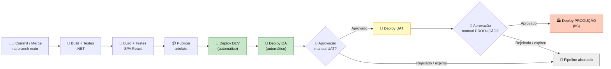
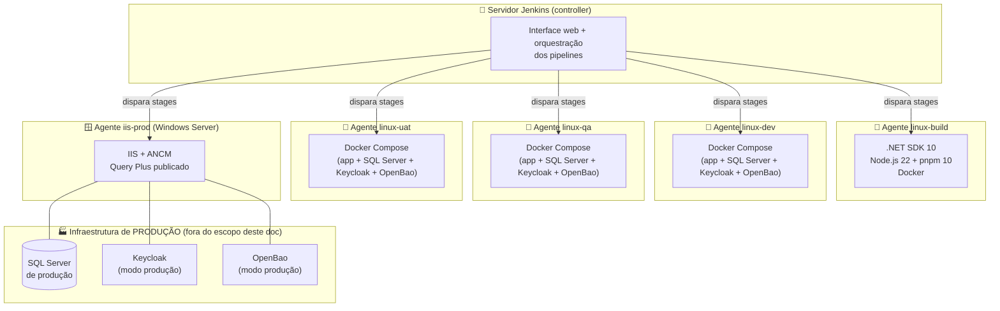
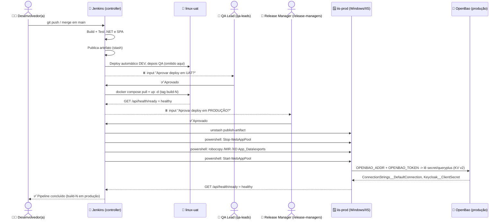

# 🔧 CI/CD com Jenkins — Deploy Multi-Ambiente do Query Plus

> **Status deste documento:** opcional/complementar. Ele descreve **como automatizar** o deploy do Query Plus em quatro ambientes (DEV, QA, UAT e PRODUÇÃO) usando Jenkins. Ele **não substitui** o `docs/deploy-producao.md` — quando este guia chegar na etapa de PRODUÇÃO, ele vai apenas **executar em Jenkins** os mesmos passos manuais que já estão documentados lá. Se você ainda não leu aquele documento, pare agora e leia primeiro: [`docs/deploy-producao.md`](./deploy-producao.md).

**Siglas usadas neste documento** (definidas aqui, na primeira vez em que aparecem, e não repetidas depois):

- **CI/CD**: Integração Contínua / Entrega Contínua (do inglês *Continuous Integration / Continuous Delivery*) — práticas de automatizar build, testes e deploy a cada mudança de código.
- **IIS**: Internet Information Services, o servidor web da Microsoft usado para hospedar a aplicação em produção no Windows.
- **ANCM**: ASP.NET Core Module — o módulo do IIS que encaminha as requisições HTTP para o processo .NET em execução.
- **SPA**: *Single Page Application* — a interface React do Query Plus, compilada como um conjunto de arquivos estáticos (HTML/JS/CSS).
- **KV v2**: *Key-Value version 2* — o formato de segredos usado pelo OpenBao/Vault, onde cada segredo é um conjunto de pares chave-valor versionado.
- **RDP**: *Remote Desktop Protocol* — protocolo usado para acessar remotamente a área de trabalho de um servidor Windows.
- **WinRM**: *Windows Remote Management* — protocolo da Microsoft para executar comandos remotamente em um Windows sem precisar de RDP.
- **CIFS/SMB**: *Common Internet File System* / *Server Message Block* — protocolo de compartilhamento de arquivos do Windows (usado por pastas de rede tipo `\\servidor\pasta`).

---

## 🗺️ Visão geral do pipeline multi-ambiente

A ideia central é simples: **todo código passa pelos mesmos portões, na mesma ordem, sempre**. Nada pula etapa. Quanto mais avançamos no pipeline (DEV → QA → UAT → PRODUÇÃO), mais "caro" fica um erro — por isso os dois últimos ambientes exigem uma pessoa aprovar manualmente antes do deploy continuar.



Pontos-chave desse fluxo, explicados passo a passo para quem nunca configurou isso:

1. **Commit/merge na branch `main`** dispara o Jenkins automaticamente (via *webhook* do repositório Git, configurado uma única vez).
2. **Build + Testes (.NET e SPA)** rodam sempre, em toda execução — se algum teste falhar, o pipeline para ali mesmo e **nenhum ambiente é tocado**.
3. **Deploy DEV** e **Deploy QA** são **automáticos**: não precisam de aprovação humana, porque são ambientes de teste interno, de baixo risco.
4. Antes de **UAT** (*User Acceptance Testing* — testes de aceitação feitos por usuários de negócio), o pipeline **para e espera** alguém clicar em "Aprovar" na interface do Jenkins.
5. O mesmo acontece antes de **PRODUÇÃO** — normalmente exigindo aprovação de uma pessoa diferente da que aprovou UAT (ver seção de segurança).
6. Se ninguém aprovar dentro de um prazo definido (ex: 24 horas), o pipeline expira sozinho e **não faz nada** — ele nunca fica esperando para sempre (ver `timeout()` na seção do Jenkinsfile).

### 🏗️ Topologia dos agentes Jenkins

Um **agente Jenkins** (também chamado de *node*) é uma máquina onde o Jenkins efetivamente executa os comandos de um pipeline (o `controller`/servidor principal do Jenkins normalmente só orquestra, não deveria rodar builds pesadas). Neste desenho, cada ambiente tem sua própria máquina com um agente instalado:



⚠️ **Atenção**: por que instalar um agente Jenkins *dentro* de cada servidor (em vez de o Jenkins "se conectar remotamente" via CIFS/SMB ou WinRM)? Porque para um time júnior isso é **muito mais simples de depurar**: os passos de deploy viram PowerShell/bash comuns, executados localmente naquele servidor — se algo der errado, basta acessar a máquina (via RDP no Windows, ou SSH no Linux) e rodar o mesmo comando manualmente para reproduzir o problema. A alternativa (Jenkins controlando remotamente via WinRM + CIFS) tem mais partes móveis (autenticação separada, firewall, dois plugins diferentes) e é mais difícil de diagnosticar quando falha. Por isso este documento recomenda o agente instalado localmente como serviço, em cada máquina.

---

## 📋 Pré-requisitos

Antes de escrever a primeira linha do `Jenkinsfile`, confira item por item desta tabela. Não pule nenhum — cada um deles vai causar um erro obscuro mais tarde se faltar.

| # | Pré-requisito | Onde | Detalhe |
|---|---|---|---|
| 1 | Servidor Jenkins instalado e acessível via HTTPS | Controller | Pode ser uma VM própria ou um container; fora do escopo deste documento (a instalação do Jenkins em si é padrão e está bem documentada em jenkins.io) |
| 2 | Plugin **Pipeline** (suíte que inclui `Pipeline: Groovy`, `Pipeline: Stage View` etc.) | Controller | Necessário para escrever o `Jenkinsfile` no formato declarativo usado neste documento |
| 3 | Plugin **Git** | Controller | Necessário para o `checkout scm` puxar o repositório do Query Plus |
| 4 | Plugin **Credentials Binding** | Controller | Necessário para os passos `withCredentials { }` e o helper `credentials()` usados na seção de segredos |
| 5 | Plugin **Pipeline: Input Step** | Controller | Fornece o passo `input`, usado nas aprovações manuais de UAT e PRODUÇÃO |
| 6 | Agente Jenkins rodando como **serviço** em `linux-build` | Máquina Linux | Precisa ter: .NET SDK 10.0.x (a versão exata pinada em `global.json`), Node.js 22+, pnpm 10+ (via `corepack enable`) e Docker instalado |
| 7 | Agente Jenkins rodando como **serviço** em cada servidor `linux-dev`, `linux-qa`, `linux-uat` | Máquinas Linux de teste | Precisam de Docker e Docker Compose instalados |
| 8 | Agente Jenkins rodando como **serviço do Windows** no servidor de PRODUÇÃO com IIS | Servidor Windows de produção | Ver `docs/deploy-producao.md` para os pré-requisitos completos do próprio IIS (Hosting Bundle do ASP.NET Core, certificado TLS, criação do site/app pool). O agente Jenkins é **adicional** a tudo isso |
| 9 | Credenciais cadastradas no **Jenkins Credentials Store** | Controller | Ver tabela detalhada na seção 6 (🔐) |
| 10 | *Webhook* configurado no repositório Git apontando para o Jenkins | Repositório Git | Assim um `git push` na branch `main` dispara o pipeline automaticamente, sem precisar clicar em "Build Now" manualmente |

🖼️ Representação ilustrativa da tela (não é uma captura de tela real) — os nomes de menu podem variar um pouco conforme a versão instalada:

```
┌─────────────────────────────────────────────────────────┐
│ Jenkins > Manage Jenkins > Nodes                        │
├─────────────────────────────────────────────────────────┤
│  Nome           │ Status  │ Labels                      │
├─────────────────┼─────────┼─────────────────────────────┤
│  linux-build    │ 🟢 Online │ linux-build               │
│  linux-dev      │ 🟢 Online │ linux-dev                 │
│  linux-qa       │ 🟢 Online │ linux-qa                  │
│  linux-uat      │ 🟢 Online │ linux-uat                 │
│  iis-prod       │ 🟢 Online │ iis-prod windows          │
└─────────────────────────────────────────────────────────┘
```

### 📌 Como instalar um agente como serviço (resumo)

Cada agente é instalado baixando o `agent.jar` a partir da própria tela do Jenkins ("Manage Jenkins > Nodes > New Node") e registrando-o como serviço do sistema operacional, para que ele suba sozinho quando o servidor reiniciar:

- **No Windows** (servidor IIS de produção): use a opção "Install as Windows Service" oferecida pelo próprio instalador do agente Jenkins (ou, como alternativa, uma ferramenta como o NSSM para transformar o `agent.jar` em serviço).
- **No Linux** (servidores DEV/QA/UAT e o agente de build): registre o agente como um serviço `systemd`, para que ele reinicie automaticamente junto com o sistema operacional.

Os detalhes exatos (nome do serviço, caminho do `agent.jar`, secret de conexão) variam pouco conforme a versão do Jenkins — siga o passo a passo mostrado na própria tela "New Node" ao criar cada agente.

---

## 🌳 Estratégia de branches e ambientes

Este documento recomenda um **pipeline único e linear**: toda mudança que chega em `main` percorre DEV → QA → UAT → PRODUÇÃO, na mesma execução, com portões de aprovação no meio do caminho. Não existem branches separadas por ambiente (`develop`, `qa`, `release`...) — isso simplifica bastante a vida de um time júnior, porque existe **um único `Jenkinsfile`, um único fluxo, sem necessidade de sincronizar múltiplas branches**.

| Origem no Git | Ambiente afetado | Deploy é automático? | Observação |
|---|---|---|---|
| Push/merge em `main` | DEV | ✅ Sim, automático | Dispara o pipeline inteiro |
| (mesma execução, etapa seguinte) | QA | ✅ Sim, automático | Só roda se o deploy em DEV teve sucesso |
| (mesma execução, etapa seguinte) | UAT | ⛔ Não — requer aprovação manual (`input`) | Alguém do time (ex: QA lead) precisa clicar em "Aprovar" |
| (mesma execução, etapa seguinte) | PRODUÇÃO | ⛔ Não — requer **segunda** aprovação manual (`input`) | Recomendado: uma pessoa diferente de quem aprovou UAT (ver seção 7) |
| Tag `vX.Y.Z` (opcional) | — | — | Não dispara pipeline por si só; serve apenas para **marcar** no Git qual commit efetivamente chegou à produção, depois do fato |

### 🆚 Alternativa: Multibranch Pipeline (uma branch por ambiente)

Existe uma segunda estratégia possível, mais usada em times maiores. Vale conhecer as duas para decidir com consciência:

| Critério | Pipeline único e linear (recomendado aqui) | Multibranch Pipeline (uma branch por ambiente) |
|---|---|---|
| Complexidade para o time júnior | ✅ Baixa — um só `Jenkinsfile`, um só fluxo mental | ⚠️ Média/alta — precisa manter branches sincronizadas (merge de `main` para `qa`, de `qa` para `release` etc.) |
| Risco de "esquecer" de promover algo | ✅ Baixo — tudo acontece na mesma execução | ⚠️ Alto — é fácil uma branch ficar defasada da outra |
| Permite pipelines bem diferentes por ambiente | ⚠️ Menos flexível (mas ainda dá para usar `when { }` e variáveis) | ✅ Cada `Jenkinsfile` pode ser totalmente diferente |
| Descoberta automática de branches | Não se aplica | ✅ O Jenkins escaneia o repositório e cria um pipeline por branch com `Jenkinsfile` |
| Indicado para | Times pequenos/médios, primeiro pipeline de CI/CD do time | Times grandes, múltiplas equipes trabalhando em paralelo |

Este documento segue com a opção da esquerda (pipeline único linear) no exemplo completo da seção 5.

---

## 📦 Build uma vez, promova sempre o mesmo artefato

Este é o princípio mais importante de todo o documento, então vale explicar o "porquê" antes do "como".

### Por que não recompilar em cada ambiente?

Imagine que o pipeline recompilasse o código do zero antes de cada deploy (uma compilação para DEV, outra para QA, outra para UAT, outra para PRODUÇÃO). O problema: **nada garante que essas quatro compilações produzam exatamente o mesmo binário**. Pequenas diferenças de timing na resolução de pacotes NuGet/npm, uma atualização de uma dependência transitiva entre uma build e outra, um comportamento não-determinístico qualquer — qualquer uma dessas coisas pode fazer o artefato que passou nos testes de UAT ser **sutilmente diferente** do que efetivamente vai para PRODUÇÃO. Isso destrói o propósito de testar em ambientes intermediários: você estaria testando uma coisa e implantando outra.

A prática recomendada — **build once, deploy many** ("construa uma vez, implante várias vezes") — resolve isso: compile **uma única vez**, gere um artefato versionado, e **promova esse mesmo artefato**, byte a byte, por todos os ambientes. Isso também deixa os deploys mais rápidos (sem recompilar toda vez) e o rollback mais simples (basta reimplantar o mesmo artefato de uma versão anterior).

### Como isso se aplica ao Query Plus, na prática

O `dotnet publish` do Query Plus já produz um artefato único que contém **tanto o backend quanto o frontend**: a SPA React é compilada automaticamente durante o publish (via um *target* do MSBuild chamado `BuildClientAppOnPublish`, definido em `src/QueryPlus.Api/QueryPlus.Api.csproj`) e seus arquivos estáticos ficam embutidos na pasta `wwwroot/` do artefato publicado — não existem dois artefatos separados (um do backend, outro do frontend) para gerenciar.

Passo a passo de como o pipeline evita recompilar sem necessidade:

1. Um estágio dedicado ("Build + Test SPA React") já roda `pnpm install` e `pnpm run build` explicitamente, deixando `src/QueryPlus.Api/wwwroot/index.html` pronto **no workspace do agente `linux-build`**.
2. O estágio seguinte ("Publicar artefato") roda `dotnet publish ... /p:SkipClientAppBuild=true`. A flag `SkipClientAppBuild=true` avisa o MSBuild para **não** rodar `pnpm install`/`pnpm run build` de novo — ele reaproveita o `wwwroot/` que acabou de ser gerado no passo anterior. Sem essa flag, o `dotnet publish` rebuild a SPA de novo do zero, mesmo que ela já tenha acabado de ser compilada (isso é o comportamento normal do target `BuildClientAppOnPublish`, que roda sempre que `SkipClientAppBuild` não é `true`, independentemente de `wwwroot/index.html` já existir — só o target usado pelo `dotnet build` simples pula a etapa se o arquivo já existir).
3. Esse artefato publicado (a pasta `publish/`) é guardado (`stash`/`archiveArtifacts`, ver seção 5) e é **exatamente esse conteúdo** que será copiado, sem qualquer nova compilação, para o servidor IIS de PRODUÇÃO ao final do pipeline.

### ⚠️ Uma limitação honesta: DEV/QA/UAT (Docker) e PRODUÇÃO (IIS) não compartilham o mesmo artefato binário

O briefing deste documento pede ambientes DEV/QA/UAT mais simples, rodando em Docker Compose num servidor Linux de testes, enquanto PRODUÇÃO roda em IIS num servidor Windows (conforme `docs/deploy-producao.md`). Isso é uma decisão de infraestrutura sensata — mas é importante ser transparente sobre a consequência técnica dela:

- A **imagem Docker** usada em DEV/QA/UAT é construída pelo `Dockerfile` do repositório, que faz seu **próprio** `dotnet publish` (com `/p:UseAppHost=false`, uma flag específica para empacotamento em container Linux) dentro de um estágio de build isolado.
- O **artefato de PRODUÇÃO** é a pasta `publish/` gerada pelo estágio "Publicar artefato" do Jenkins (rodando fora de qualquer container, direto no agente `linux-build`).

São **dois processos de compilação diferentes**, ainda que a partir do **mesmo commit exato do Git**. Isso quebra, no sentido estrito, a promessa de "o mesmo binário, byte a byte" entre UAT e PRODUÇÃO — o que passa em UAT é uma imagem Docker; o que vai para PRODUÇÃO é uma pasta publicada direto para IIS.

Na prática, isso é um compromisso aceitável **desde que fique documentado e visível** (é exatamente o que este parágrafo está fazendo). Para minimizar o risco:

- Ambos os artefatos (imagem Docker e pasta `publish/`) são gerados **na mesma execução do pipeline**, a partir do mesmo `checkout` do mesmo commit — nunca em execuções separadas ou dias diferentes.
- Nenhuma correção "rápida" deve ser aplicada só em um dos dois lados (ex: nunca edite manualmente arquivos dentro do container de UAT achando que "é só para teste" — se precisar de uma mudança, ela tem que voltar pelo commit e passar pelo pipeline inteiro de novo).
- Uma evolução futura recomendada (fora do escopo deste documento) seria também rodar UAT em Windows/IIS, usando a mesma pasta `publish/` que vai para PRODUÇÃO — isso eliminaria completamente essa diferença, ao custo de um servidor Windows adicional só para UAT.

---

## 📝 Exemplo de Jenkinsfile declarativo completo

O `Jenkinsfile` abaixo implementa o fluxo descrito acima. Ele fica na raiz do repositório do Query Plus (junto de `QueryPlus.sln`) e é lido automaticamente pelo Jenkins a cada execução (isso é o que torna o pipeline "como código", versionado junto com a aplicação).

Leia os comentários `//` — eles fazem parte da explicação, não apague-os ao copiar.

```groovy
pipeline {
    // Nenhum agente global: cada estágio declara o seu próprio agente,
    // porque cada ambiente vive numa máquina diferente.
    agent none

    options {
        // Evita duas execuções do pipeline rodando ao mesmo tempo por engano.
        disableConcurrentBuilds()
        // Mantém só os últimos 20 builds (artefatos + logs) para não lotar o disco do Jenkins.
        buildDiscarder(logRotator(numToKeepStr: '20'))
    }

    environment {
        // TAG usada para versionar tanto a imagem Docker quanto o artefato de publish.
        // BUILD_NUMBER é uma variável automática do Jenkins (número sequencial do build).
        RELEASE_TAG = "build-${env.BUILD_NUMBER}"
        REGISTRY    = "registry.interno.queryplus.example.com"
    }

    stages {

        stage('Checkout') {
            agent { label 'linux-build' }
            steps {
                checkout scm
            }
        }

        stage('Build + Test .NET') {
            agent { label 'linux-build' }
            steps {
                checkout scm
                sh 'dotnet restore QueryPlus.sln'
                // Compila sem tocar na SPA ainda - ela é compilada no próximo estágio.
                sh 'dotnet build QueryPlus.sln --no-restore --configuration Release /p:SkipClientAppBuild=true'
                // Mesmo filtro usado no CI do GitHub Actions (.github/workflows/ci.yml):
                // exclui os testes de integração, que precisam de Docker/Testcontainers
                // e não devem rodar no agente de build comum.
                sh '''
                    dotnet test QueryPlus.sln --no-build --configuration Release \
                        --filter "Category!=Integration"
                '''
            }
        }

        stage('Build + Test SPA React') {
            agent { label 'linux-build' }
            steps {
                dir('client/queryplus-react') {
                    sh 'corepack enable'
                    sh 'pnpm install --frozen-lockfile'
                    // tsc + oxlint via vite-plus (equivalente a "pnpm run check" do projeto)
                    sh 'pnpm run check'
                    sh 'pnpm test -- --run'
                    // Gera src/QueryPlus.Api/wwwroot/ - usado no próximo estágio.
                    sh 'pnpm run build'
                }
            }
        }

        stage('Publicar artefato (.NET + SPA)') {
            agent { label 'linux-build' }
            steps {
                // SkipClientAppBuild=true: a SPA JÁ foi compilada no estágio anterior,
                // NO MESMO workspace (mesmo agente linux-build) - não recompilar de novo.
                sh '''
                    dotnet publish src/QueryPlus.Api/QueryPlus.Api.csproj \
                        -c Release -o publish /p:SkipClientAppBuild=true
                '''
                // Checagem de sanidade: se este arquivo não existir, a SPA não foi
                // embutida no artefato e o deploy resultaria numa API sem frontend,
                // sem nenhum erro visível no pipeline. Falhar cedo é melhor.
                sh '''
                    test -f publish/wwwroot/index.html || \
                    (echo "ERRO: wwwroot/index.html ausente no artefato publicado" && exit 1)
                '''
                // "Guarda" a pasta publish/ para ser recuperada em outro agente
                // (o agente Windows de PRODUÇÃO, mais adiante) via unstash.
                stash name: 'publish-artifact', includes: 'publish/**'
                archiveArtifacts artifacts: 'publish/**', fingerprint: true
            }
        }

        stage('Build + push imagem Docker') {
            agent { label 'linux-build' }
            steps {
                checkout scm
                sh "docker build -t ${REGISTRY}/queryplus:${RELEASE_TAG} ."
                withCredentials([usernamePassword(
                    credentialsId: 'docker-registry-creds',
                    usernameVariable: 'REG_USER',
                    passwordVariable: 'REG_PASS'
                )]) {
                    sh "echo \$REG_PASS | docker login ${REGISTRY} -u \$REG_USER --password-stdin"
                    sh "docker push ${REGISTRY}/queryplus:${RELEASE_TAG}"
                }
            }
        }

        stage('Deploy DEV') {
            agent { label 'linux-dev' }
            steps {
                withCredentials([
                    string(credentialsId: 'dev-openbao-token', variable: 'OPENBAO_TOKEN'),
                    string(credentialsId: 'dev-keycloak-admin-password', variable: 'KEYCLOAK_ADMIN_PASSWORD')
                ]) {
                    sh """
                        export IMAGE_TAG=${RELEASE_TAG}
                        docker compose -f docker-compose.yml -f docker-compose.deploy.yml \
                            --profile full pull
                        docker compose -f docker-compose.yml -f docker-compose.deploy.yml \
                            --profile full up -d
                    """
                }
                // Smoke test simples - /ready confirma conectividade real com o SQL
                // Server; ver ressalvas importantes na seção 9 sobre o que mesmo assim
                // NÃO é verificado (Keycloak, OpenBao, um login de verdade).
                sh 'curl -f http://localhost:8080/api/health/ready'
            }
        }

        stage('Deploy QA') {
            agent { label 'linux-qa' }
            steps {
                withCredentials([
                    string(credentialsId: 'qa-openbao-token', variable: 'OPENBAO_TOKEN')
                ]) {
                    sh """
                        export IMAGE_TAG=${RELEASE_TAG}
                        docker compose -f docker-compose.yml -f docker-compose.deploy.yml \
                            --profile full pull
                        docker compose -f docker-compose.yml -f docker-compose.deploy.yml \
                            --profile full up -d
                    """
                }
                sh 'curl -f http://localhost:8080/api/health/ready'
            }
        }

        stage('Aprovação manual - UAT') {
            agent none
            steps {
                // input NÃO tem timeout embutido - por isso é envolvido manualmente
                // num timeout(), para o pipeline não ficar esperando para sempre.
                timeout(time: 24, unit: 'HOURS') {
                    input message: "Deploy da build ${RELEASE_TAG} em UAT. Confirmar?",
                          ok: 'Aprovar deploy em UAT',
                          submitter: 'qa-leads'
                }
            }
        }

        stage('Deploy UAT') {
            agent { label 'linux-uat' }
            steps {
                withCredentials([
                    string(credentialsId: 'uat-openbao-token', variable: 'OPENBAO_TOKEN')
                ]) {
                    sh """
                        export IMAGE_TAG=${RELEASE_TAG}
                        docker compose -f docker-compose.yml -f docker-compose.deploy.yml \
                            --profile full pull
                        docker compose -f docker-compose.yml -f docker-compose.deploy.yml \
                            --profile full up -d
                    """
                }
                sh 'curl -f http://localhost:8080/api/health/ready'
            }
        }

        stage('Aprovação manual - PRODUÇÃO') {
            agent none
            steps {
                timeout(time: 24, unit: 'HOURS') {
                    // Submitter diferente do estágio de UAT - ver seção 7 (Segurança).
                    input message: "Deploy da build ${RELEASE_TAG} em PRODUÇÃO. Confirmar?",
                          ok: 'Aprovar deploy em PRODUÇÃO',
                          submitter: 'release-managers'
                }
            }
        }

        stage('Deploy PRODUÇÃO (IIS)') {
            // Agente Windows instalado como serviço NO PRÓPRIO servidor IIS de produção.
            agent { label 'iis-prod' }
            steps {
                // Recupera a pasta publish/ gerada lá no agente linux-build - o
                // agente Windows tem um workspace totalmente separado e vazio,
                // então sem este unstash o robocopy abaixo copiaria... nada.
                unstash 'publish-artifact'

                withCredentials([
                    string(credentialsId: 'prod-openbao-token', variable: 'PROD_OPENBAO_TOKEN')
                ]) {
                    powershell '''
                        Import-Module WebAdministration

                        $ErrorActionPreference = "Stop"
                        $appPoolName = "QueryPlusAppPool"
                        $sitePath    = "C:\inetpub\queryplus"

                        Write-Host "Parando o Application Pool $appPoolName..."
                        Stop-WebAppPool -Name $appPoolName

                        # Stop-WebAppPool é assíncrono - espera ativamente o pool
                        # realmente parar antes de sobrescrever os arquivos.
                        do {
                            Start-Sleep -Seconds 2
                            $state = (Get-WebAppPoolState -Name $appPoolName).Value
                            Write-Host "Estado atual do pool: $state"
                        } while ($state -ne "Stopped")

                        Write-Host "Copiando artefato publicado para $sitePath..."
                        # /MIR espelha a origem no destino (copia novos, atualiza
                        # alterados, remove o que não existe mais na origem).
                        # /XD exclui a pasta de exports do Excel - ela é gerada em
                        # tempo de execução e NÃO existe no artefato publicado;
                        # sem essa exclusão, /MIR apagaria os exports já gerados.
                        robocopy "publish" "$sitePath" /MIR /XD "$sitePath\App_Data\exports"
                        if ($LASTEXITCODE -ge 8) {
                            throw "robocopy falhou com código $LASTEXITCODE"
                        }

                        Write-Host "Reiniciando o Application Pool $appPoolName..."
                        Start-WebAppPool -Name $appPoolName
                    '''
                }

                // Smoke test pós-deploy - /ready confirma conectividade real com o SQL
                // Server; ver ressalvas na seção 9 sobre o que mesmo assim NÃO é
                // verificado (Keycloak, OpenBao, um login de verdade).
                powershell '''
                    Start-Sleep -Seconds 5
                    Invoke-WebRequest -Uri "https://queryplus.empresa.example.com/api/health/ready" -UseBasicParsing
                '''
            }
        }
    }

    post {
        failure {
            echo "Pipeline falhou. Nenhum ambiente além do último estágio concluído foi alterado."
        }
        always {
            echo "Build ${RELEASE_TAG} finalizado com status: ${currentBuild.currentResult}"
        }
    }
}
```

📌 **Nota sobre `docker-compose.deploy.yml`**: o `docker-compose.yml` deste repositório, hoje, constrói a imagem localmente (`build: context: .`) — ele foi feito para desenvolvimento local, não para apontar para uma imagem já publicada num registro. O `docker-compose.deploy.yml` referenciado acima (com `image: ${REGISTRY}/queryplus:${IMAGE_TAG}` sobrescrevendo o serviço `app`) é um **arquivo de sobreposição que ainda não existe no repositório** — ele precisa ser criado como parte da adoção deste pipeline. Isso é mencionado explicitamente aqui para não passar a impressão de que já está tudo pronto.

🖼️ Representação ilustrativa da tela (não é uma captura de tela real) — os nomes de menu podem variar um pouco conforme a versão instalada:

```
┌──────────────────────────────────────────────────────────────┐
│  Query Plus #42  >  Aprovação manual - PRODUÇÃO              │
├──────────────────────────────────────────────────────────────┤
│  Deploy da build build-42 em PRODUÇÃO. Confirmar?            │
│                                                              │
│   [ Aprovar deploy em PRODUÇÃO ]        [ Abort ]            │
│                                                              │
│  Apenas usuários do grupo "release-managers" podem responder │
└──────────────────────────────────────────────────────────────┘
```

---

## 🔐 Gestão de credenciais e segredos no pipeline

🔒 **Regra de ouro: nenhum segredo em texto puro no `Jenkinsfile`.** Toda senha, token ou secret referenciado no exemplo acima (`credentialsId: '...'`) é apenas um **identificador opaco** — o valor real fica guardado, criptografado, no **Jenkins Credentials Store**, e só é injetado como variável de ambiente durante a execução do passo, sendo automaticamente mascarado (`****`) em qualquer log do console.

### Como cadastrar uma credencial (passo a passo)

1. Acesse **Manage Jenkins > Credentials > System > Global credentials**.
2. Clique em **Add Credentials**.
3. Escolha o **Kind** (tipo) certo: `Secret text` para um token único (ex: `OPENBAO_TOKEN`), `Username with password` para pares usuário/senha (ex: registro Docker), `Secret file` para arquivos inteiros.
4. Preencha o **ID** com um nome estável e descritivo (ex: `prod-openbao-token`) — é esse ID, e só ele, que vai aparecer no `Jenkinsfile`.
5. Salve. O valor nunca mais aparece na tela do Jenkins depois de salvo (só pode ser substituído, não visualizado).

🖼️ Representação ilustrativa da tela (não é uma captura de tela real) — os nomes de menu podem variar um pouco conforme a versão instalada:

```
┌─────────────────────────────────────────────────────────┐
│ Manage Jenkins > Credentials > Add Credentials          │
├─────────────────────────────────────────────────────────┤
│ Kind:   [ Secret text                        ▼ ]        │
│ Scope:  [ Global (Jenkins, nodes, items...)  ▼ ]        │
│ Secret: [ ************************             ]        │
│ ID:     [ prod-openbao-token                   ]        │
│ Description: [ Token OpenBao restrito - PROD   ]        │
│                                                         │
│                                    [ OK ]  [ Cancel ]   │
└─────────────────────────────────────────────────────────┘
```

### Credenciais necessárias para o pipeline do Query Plus

| ID sugerido no Credentials Store | Tipo | Usado em | Descrição |
|---|---|---|---|
| `docker-registry-creds` | Username with password | Estágio "Build + push imagem Docker" | Login no registro de imagens Docker interno |
| `dev-openbao-token` | Secret text | Deploy DEV | Token do OpenBao **do ambiente DEV**, com política restrita |
| `qa-openbao-token` | Secret text | Deploy QA | Token do OpenBao **do ambiente QA** — diferente do de DEV |
| `uat-openbao-token` | Secret text | Deploy UAT | Token do OpenBao **do ambiente UAT** — diferente dos anteriores |
| `prod-openbao-token` | Secret text | Deploy PRODUÇÃO | Token do OpenBao **de produção**, com política restrita e **nunca** o root token |
| `dev-keycloak-admin-password` | Secret text | Deploy DEV (se aplicável) | Só necessário se o ambiente DEV também provisiona o Keycloak via variável de admin |

🔒 **Nunca reutilize o mesmo token/segredo entre ambientes.** Cada ambiente (DEV, QA, UAT, PRODUÇÃO) deve ter seu **próprio** token do OpenBao, sua **própria** connection string de banco, seu **próprio** client secret do Keycloak. Se o token de DEV vazar (ambiente tipicamente menos protegido), o estrago fica limitado a DEV.

### ⚠️ Um detalhe importante sobre precedência de variáveis de ambiente

`OpenBaoSecretLoader` (`src/QueryPlus.Api/Hosting/OpenBaoSecretLoader.cs`) busca segredos no OpenBao e os aplica como variáveis de ambiente do processo **somente se a variável ainda não existir** — ele nunca sobrescreve uma variável já definida. Isso é útil (permite sobrepor um segredo manualmente para depuração), mas é também uma **armadilha silenciosa em pipelines de deploy**:

> Se o Jenkins (ou o `docker-compose.deploy.yml`) já injetar `ConnectionStrings__DefaultConnection` como variável de ambiente do container/processo, **e** o OpenBao também tiver um valor para essa mesma chave no caminho `secret/queryplus`, o valor injetado pelo Jenkins **vence silenciosamente**, sem nenhum aviso ou erro. Na prática, isso é como o ambiente de PRODUÇÃO poderia acabar apontando, por engano, para o banco de dados errado (ex: o de QA), sem que ninguém perceba até tarde.

🔒 Para evitar isso: **decida, por ambiente, uma única fonte de verdade para cada segredo** — ou tudo vem do OpenBao (não defina a variável em nenhum outro lugar), ou tudo vem de variáveis de ambiente/`withCredentials` diretamente (e nesse caso, nem defina `OPENBAO_ADDR`/`OPENBAO_TOKEN`, para que `OpenBaoSecretLoader` simplesmente não faça nada). Nunca misture as duas fontes para a mesma chave no mesmo ambiente.

---

## 🛡️ Segurança do pipeline

| Prática | Por quê |
|---|---|
| Conta de serviço do Jenkins com privilégio mínimo em cada agente | Se um agente for comprometido, o dano fica limitado ao que aquela conta pode fazer — evite usar contas de administrador do domínio/root sem necessidade |
| Aprovação obrigatória (`input`) antes de UAT e de PRODUÇÃO | Garante que uma pessoa humana revisou o que está prestes a ser implantado, antes de afetar usuários reais ou de negócio |
| `submitter` diferente para UAT (`qa-leads`) e para PRODUÇÃO (`release-managers`) | Separação de responsabilidades: quem aprova para teste de aceitação não é necessariamente quem tem autoridade para liberar produção |
| `timeout()` envolvendo cada `input` | O passo `input` do Jenkins não tem timeout embutido — sem o `timeout()`, o pipeline (e o agente reservado para ele) poderia ficar bloqueado indefinidamente esperando alguém clicar |
| Escopo das credenciais restrito ao necessário | Cadastre credenciais com o menor escopo possível (ex: uma credencial só visível para o job/pasta do Query Plus, não `Global` quando não for preciso) |
| Trilha de auditoria | O próprio Jenkins já registra, por build: quem disparou, quando cada `input` foi aprovado e por qual usuário, e o log completo de cada estágio. Isso, junto com o Git (quem fez o commit/merge), forma o rastro de "quem mandou o quê para produção e quando" |
| Nunca pular hooks/testes para "acelerar" um deploy urgente | Um "hotfix" que pula os estágios de teste é exatamente o tipo de mudança com maior chance de precisar de rollback depois |

🔒 **Sobre o OpenBao especificamente**: em produção, o OpenBao precisa rodar em **modo de produção real** (não o modo `dev` usado no `docker-compose.yml` deste repositório para desenvolvimento local, que mantém tudo em memória e usa um `BAO_DEV_ROOT_TOKEN_ID` fixo). O token usado pelo pipeline/aplicação em produção deve ser um **token de política restrita**, capaz apenas de ler o caminho `secret/queryplus` — nunca o *root token*. O mesmo vale para o Keycloak: a imagem `quay.io/keycloak/keycloak:26.0` usada localmente com `command: start-dev --import-realm` (que carrega usuários de demonstração como `demo/demo`, `admin/admin`, e um client secret fixo `change-me-in-production`) **não pode** ser usada dessa forma em produção — o Keycloak de produção precisa rodar em modo de produção de verdade, com um banco de dados próprio, HTTPS terminado corretamente e credenciais reais, nunca as de demonstração.

---

## ⏪ Estratégia de rollback

A vantagem de "build uma vez, promova o mesmo artefato" (seção 4) aparece com força total aqui: reverter uma versão problemática significa apenas **reimplantar um artefato anterior que já passou por todos os testes** — não recompilar nada, não torcer para que o código antigo ainda compile do jeito que compilava antes.

### Para os ambientes Docker (DEV/QA/UAT)

1. Toda imagem publicada no estágio "Build + push imagem Docker" fica marcada com uma tag imutável (`build-<número do build>`), nunca sobrescrita.
2. Para reverter, basta reimplantar a tag anterior conhecida como boa:

```bash
export IMAGE_TAG=build-41   # a tag anterior, por exemplo
docker compose -f docker-compose.yml -f docker-compose.deploy.yml --profile full up -d
```

3. Mantenha um número razoável de tags antigas disponíveis no registro Docker (ex: as últimas 10-20 builds) antes de fazer *garbage collection* nele — sem isso, não há para onde reverter.

### Para PRODUÇÃO (IIS)

1. O Jenkins já guarda os artefatos publicados via `archiveArtifacts` (com `fingerprint: true`) — por padrão, os últimos 20 builds (`buildDiscarder(logRotator(numToKeepStr: '20'))` no exemplo da seção 5).
2. Para reverter rapidamente:
   - Baixe o artefato `publish/` do build anterior conhecido como bom (aba **Artifacts** daquele build específico, na interface do Jenkins), **ou** re-execute manualmente apenas o estágio "Deploy PRODUÇÃO (IIS)" apontando para o `RELEASE_TAG` anterior (a maioria das instalações do Jenkins permite "Replay" de um build específico).
   - No servidor IIS, repita exatamente os mesmos passos do estágio de deploy (`Stop-WebAppPool` → `robocopy` do artefato anterior → `Start-WebAppPool`), desta vez copiando o artefato antigo por cima do atual.

⚠️ **Cuidado com o `robocopy /MIR` e a pasta de exports**: assim como no deploy normal, um rollback feito com `/MIR` **sem** excluir `App_Data\exports` apagaria os arquivos de exportação do Excel gerados pelos usuários entre o deploy problemático e o rollback. Sempre inclua `/XD "<caminho do site>\App_Data\exports"` também no rollback.

🔒 **Rollback de banco de dados é um problema à parte, não coberto por este documento.** Reverter o binário da aplicação **não desfaz migrations do EF Core já aplicadas no banco**. Se a versão problemática incluiu uma migration que alterou o schema, reverter só o artefato pode deixar a aplicação antiga incompatível com o schema novo. Trate isso caso a caso — o ideal é que migrations problemáticas tenham sua própria migration de reversão testada antes de qualquer rollback de produção.

| Checklist de rollback | |
|---|---|
| ☐ Identifiquei a última build (`RELEASE_TAG`) conhecida como saudável | |
| ☐ Verifiquei se essa build envolveu alguma migration de banco que precise de atenção especial | |
| ☐ Reimplantei o artefato antigo (imagem Docker ou pasta `publish/`, conforme o ambiente) | |
| ☐ Excluí `App_Data\exports` do `robocopy` (produção) | |
| ☐ Rodei o smoke test (`GET /api/health/ready`) após o rollback | |
| ☐ Comuniquei o time sobre o rollback e abri um item de trabalho para investigar a causa raiz | |

---

## ⚠️ Limitações conhecidas e itens em aberto

Esta seção existe para não passar a falsa impressão de que "está tudo pronto". Leia com atenção antes do primeiro deploy real em produção via este pipeline.

### ✅ Seed de demonstração — gateado, mas confira o `ASPNETCORE_ENVIRONMENT` de cada estágio

`DemoDataSeeder` (`src/QueryPlus.Api/Program.cs`, chamado via `await app.SeedDemoDataAsync();`) sempre aplica as migrations do EF Core, em qualquer ambiente — isso é desejável. A instalação de objetos SQL/catálogo de **demonstração** (`Sp_Demo_*`, `tb_usa_president` e afins) é uma etapa separada, controlada pela configuração `Database:SeedDemoDataOnStartup` (`appsettings.{Environment}.json`): `true` em `Development`/`Docker`, `false` no `appsettings.json` base — ou seja, `false` em qualquer ambiente sem override próprio, incluindo `Production`. Há ainda um segundo gate independente e não desativável por configuração: se o banco já tiver alguma tabela que o QueryPlus não criou, o seed de demonstração é pulado incondicionalmente (ver `docs/deploy-producao.md` seção 4.2 para os detalhes).

Isso importa especificamente para **este** pipeline porque os estágios DEV/QA/UAT usam `docker compose --profile full`, cuja imagem roda com `ASPNETCORE_ENVIRONMENT=Docker` por padrão — então DEV/QA/UAT **recebem** dados de demonstração de propósito (é o comportamento esperado para ambientes de teste interno). O estágio **Deploy PRODUÇÃO (IIS)**, por sua vez, publica direto no IIS com `ASPNETCORE_ENVIRONMENT=Production` no `web.config` (seção 6) — nesse ambiente o seed de demonstração já vem desligado, sem nenhum passo extra no `Jenkinsfile`. O único jeito de isso dar errado é se alguém, manualmente, definir `Database__SeedDemoDataOnStartup=true` (ou trocar `ASPNETCORE_ENVIRONMENT` para algo diferente de `Production`) na configuração do IIS de produção.

### 🩺 `GET /api/health/ready` é o smoke test recomendado, mas ainda não prova tudo

Desde que `/api/health/ready` existe (`HealthController.cs`, `[AllowAnonymous]`), os estágios de deploy deste pipeline chamam esse endpoint em vez do antigo `/api/health` simples — `/ready` faz um `CanConnectAsync()` real contra o SQL Server (timeout de 5s) e responde HTTP 503 se o banco estiver inacessível, então um "verde" aqui já prova bem mais do que "o processo subiu". Ainda assim, ele **não** verifica Keycloak nem OpenBao, e não prova que as migrations aplicaram sem erro nem que a autenticação funciona de ponta a ponta. Trate os estágios de "Deploy DEV/QA/UAT/PRODUÇÃO" deste pipeline como confirmação de que **o processo subiu e consegue falar com o SQL Server**, e complemente sempre com uma verificação manual funcional (login real, execução de uma procedure catalogada) antes de considerar um deploy de produção como concluído.

### 🔌 Duas formas válidas de fornecer segredos ao IIS — escolha uma conscientemente

Conforme detalhado na seção 6, existem duas formas válidas de configurar `ConnectionStrings__DefaultConnection` e `Keycloak__ClientSecret` no IIS de produção: via OpenBao (recomendado — `OPENBAO_ADDR` + `OPENBAO_TOKEN`) ou diretamente como variáveis de ambiente do IIS/registro do Windows (mais simples, porém o segredo fica gravado na configuração do próprio servidor). Este pipeline assume a opção via OpenBao no exemplo do estágio "Deploy PRODUÇÃO (IIS)"; se o time optar pela opção B, ajuste o estágio para usar `withCredentials` com os segredos reais em vez do token do OpenBao.

### 🧵 `Cors__AllowedOrigins__0` é obrigatório fora de `Development`

A aplicação recusa iniciar (lança exceção na inicialização) em qualquer ambiente cujo `ASPNETCORE_ENVIRONMENT` não seja `Development`, caso `Cors__AllowedOrigins` (ex: `Cors__AllowedOrigins__0`, `__1`, ...) não esteja configurado — a mensagem exata do erro é *"CORS origins ('Cors:AllowedOrigins') must be explicitly configured in non-Development environments"*. Isso vale também para DEV/QA/UAT deste pipeline: como o `Dockerfile` já define `ASPNETCORE_ENVIRONMENT=Docker` (que não é `Development`), **todo** ambiente Docker Compose precisa ter `Cors__AllowedOrigins__0` configurado, ou o container simplesmente não sobe.

---

## ✅ Checklist final antes de habilitar o pipeline em produção

| # | Item | Feito? |
|---|---|---|
| 1 | Todos os agentes (`linux-build`, `linux-dev`, `linux-qa`, `linux-uat`, `iis-prod`) instalados e "Online" no Jenkins | ☐ |
| 2 | Plugins Pipeline, Git, Credentials Binding e Pipeline: Input Step instalados no controller | ☐ |
| 3 | Todas as credenciais da tabela da seção 6 cadastradas, com IDs correspondendo ao `Jenkinsfile` | ☐ |
| 4 | `docker-compose.deploy.yml` criado (sobreposição referenciando a imagem publicada, não `build:`) | ☐ |
| 5 | `Cors__AllowedOrigins__0` (e demais) configurado em DEV, QA, UAT e PRODUÇÃO | ☐ |
| 6 | OpenBao/Keycloak de produção rodando em modo produção real (não `dev`/`start-dev`), com tokens/segredos próprios, nunca os de desenvolvimento | ☐ |
| 7 | Decisão tomada e documentada sobre o risco do `SeedDemoDataAsync()` em produção (seção 9) | ☐ |
| 8 | `submitter` de UAT e de PRODUÇÃO configurados com grupos/pessoas reais no Jenkins | ☐ |
| 9 | Testado ao menos um rollback completo num ambiente não-produtivo, seguindo a seção 8 | ☐ |
| 10 | Time revisou `docs/deploy-producao.md` e sabe reproduzir manualmente os mesmos passos do estágio "Deploy PRODUÇÃO (IIS)", caso o Jenkins fique indisponível | ☐ |

---

## 🔄 Diagrama de sequência: da aprovação ao deploy em produção

Para fechar, um resumo de "quem fala com quem" durante a fase final do pipeline (a partir da aprovação de UAT), incluindo onde os segredos entram em jogo:



---

**Documentos relacionados:**

- [`docs/deploy-producao.md`](./deploy-producao.md) — passo a passo completo de publicação manual no IIS (referência canônica para o estágio final deste pipeline).
- [`docs/keycloak.md`](./keycloak.md) — configuração do Keycloak.
- [`docs/openbao.md`](./openbao.md) — configuração do OpenBao.
- [`CLAUDE.md`](../CLAUDE.md) — comandos de build/test do repositório usados nos estágios deste `Jenkinsfile`.
