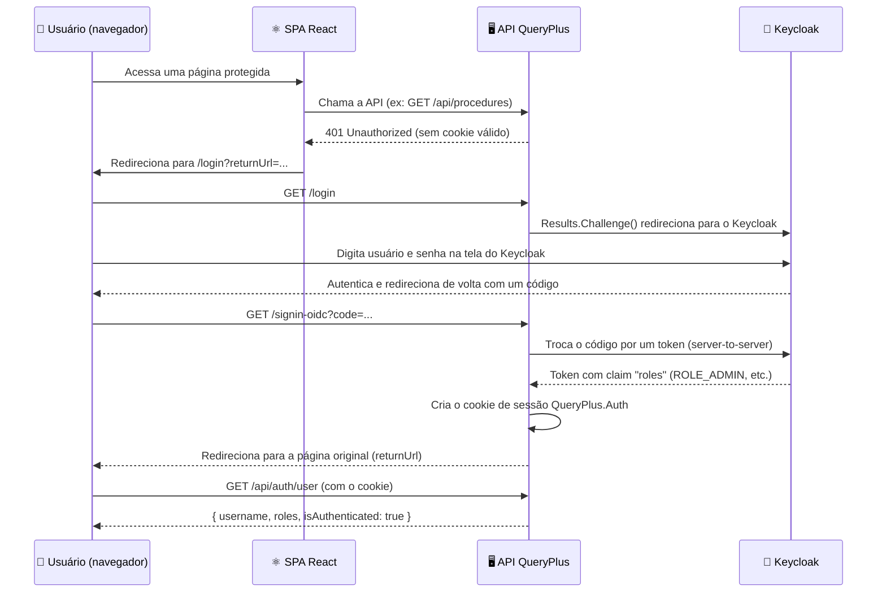
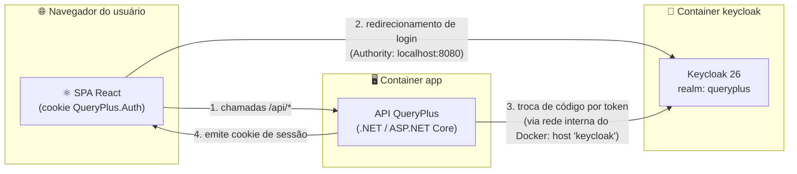

# 🛂 Keycloak: o porteiro do QueryPlus

## 🎈 O que é isso, em uma frase simples

Keycloak é o **porteiro do prédio** do QueryPlus: ele confere quem é você antes de te deixar entrar, e depois decide, sala por sala, quais portas você pode abrir.

## 🏢 Uma analogia grande, explicada com calma

Imagine um prédio de escritórios bem grande e importante. Esse prédio é o QueryPlus.

Só que esse prédio não tem um porteiro próprio na portaria dele. Em vez disso, ele contratou uma **empresa de portaria terceirizada, super confiável**, que cuida de vários prédios da região. Essa empresa se chama Keycloak.

Veja como funciona um dia normal:

1. Você chega na porta do prédio QueryPlus e quer entrar. 🚪
2. O prédio não te conhece ainda (você não tem crachá), então ele te manda para a portaria central da empresa terceirizada — o Keycloak. É tipo ir até a guarita principal do condomínio antes de entrar no seu bloco.
3. Na guarita, você mostra seu documento (usuário e senha). O Keycloak confere num caderno de cadastro dele (o **realm**, uma espécie de "livro de moradores" só daquele condomínio chamado `queryplus`).
4. Se está tudo certo, o Keycloak não te dá o documento de volta — ele te entrega um **crachá temporário**, plastificado, com seu nome e uma lista de "poderes" grudados nele (por exemplo: "pode entrar na sala de Categorias", "pode executar procedimentos"). Esse crachá é o que chamamos de **token**.
5. Você volta para a porta do prédio QueryPlus com o crachá. O prédio olha o crachá, confia na assinatura da empresa de portaria, e te deixa passar.
6. A partir daí, o prédio te dá um **cordão com um cartão de visitante** (um **cookie de sessão**) para você não precisar mostrar o crachá telado toda hora — só passa o cartão na catraca.
7. Cada sala do prédio (cada funcionalidade da API) tem uma placa na porta dizendo quais "poderes" do crachá são aceitos ali. Se seu crachá não tem aquele poder, a porta simplesmente não abre.

Ou seja: o QueryPlus nunca vê sua senha, nunca guarda sua senha, e nunca precisa ficar checando com o Keycloak a cada porta — ele confia no crachá (cookie) que já emitiu para você, com base no que o Keycloak disse.

## 🤔 Por que usamos isso neste projeto

Dá para o QueryPlus ter sua própria "portaria" (tela de login com usuário e senha guardados no próprio banco de dados). Mas isso dá muito trabalho e é arriscado — é como cada prédio ter que treinar seu próprio segurança, guardar cópias de documentos, e ainda ser responsável se um documento vazar.

| Vantagem 🌟 | O que isso significa na prática |
|---|---|
| 🔐 Sem senha guardada no QueryPlus | O QueryPlus nunca vê nem armazena a senha de ninguém — quem guarda isso é o Keycloak |
| 🎫 Login único (SSO) | Um mesmo crachá do Keycloak pode servir para várias aplicações, sem logar de novo em cada uma |
| 📜 Protocolo padrão (OpenID Connect) | É uma "língua" conhecida e testada por muita gente, em vez de um sistema de login "caseiro" e mais fácil de errar |
| 🧑‍💼 Gestão de usuários num só lugar | Criar usuário, resetar senha, dar ou tirar poder (role) — tudo isso é feito no Keycloak, e todo app conectado já enxerga a mudança |
| 🛠️ Painel administrativo pronto | O Keycloak já vem com uma tela de admin pronta (criar usuário, bloquear login por tentativas erradas, etc.) — não precisamos construir isso do zero |

## ⚙️ Como funciona por baixo dos panos

Aqui está o passo a passo completo de um login, do jeito que ele realmente acontece no QueryPlus:



E aqui está a visão geral de "quem fala com quem" e onde cada peça mora:



Repare em uma coisa importante: no passo 2, o navegador fala com o Keycloak usando o endereço público `localhost:8080` (porque é o navegador do usuário, ele está "do lado de fora"). Já no passo 3, é a própria API (rodando dentro do Docker) que troca o código pelo token — e ela faz isso usando o nome interno do container, `keycloak`, porque estão na mesma rede Docker. É como ter uma porta principal com endereço de rua para visitantes, e um corredor de serviço interno que só os funcionários do prédio usam.

## 🧩 Como está configurado neste repositório

### 1. O "livro de moradores" — `docker/keycloak/realm-export.json` 📖

Esse arquivo é importado automaticamente quando o Keycloak sobe (`start-dev --import-realm`). Ele define o realm (o condomínio) chamado `queryplus`, com seus poderes (roles), seu aplicativo cadastrado (client) e dois usuários de demonstração.

Veja em `docker/keycloak/realm-export.json`:

```json
"realm": "queryplus",
"roles": { "realm": [
  {"name":"ROLE_ADMIN","description":"Application administrator - implies every other permission"},
  {"name":"ROLE_CATEGORY_READ", ...}, {"name":"ROLE_CATEGORY_WRITE", ...},
  {"name":"ROLE_PROCEDURE_READ", ...}, {"name":"ROLE_PROCEDURE_WRITE", ...},
  {"name":"ROLE_QUERY_EXEC","description":"Execute catalogued procedures (subject to each procedure's own role entitlement)"}
]},
"clients": [{
  "clientId": "queryplus-web", "publicClient": false, "secret": "change-me-in-production",
  "redirectUris": ["http://localhost:5000/*", "http://localhost:5132/*", "https://localhost:7192/*", ...],
  "standardFlowEnabled": true, "directAccessGrantsEnabled": true, "protocol": "openid-connect", "fullScopeAllowed": true,
  "attributes": { "pkce.code.challenge.method": "S256" },
  "protocolMappers": [{ "name":"roles", "protocolMapper":"oidc-usermodel-realm-role-mapper", "config": {"multivalued":"true","claim.name":"roles", ...}}]
}],
"users": [
  {"username":"demo","email":"demo@queryplus.local","credentials":[{"type":"password","value":"demo","temporary":false}],"realmRoles":["ROLE_QUERY_EXEC","ROLE_CATEGORY_READ","ROLE_PROCEDURE_READ"]},
  {"username":"admin","email":"admin@queryplus.local","credentials":[{"type":"password","value":"admin","temporary":false}],"realmRoles":["ROLE_ADMIN"]}
]
```

Pensando na analogia: `queryplus` é o nome do condomínio. `queryplus-web` é o crachá de "empresa cadastrada" do próprio QueryPlus junto à portaria (ele tem um segredo, o `secret`, que prova que é mesmo o QueryPlus pedindo o crachá, e não um impostor). E cada `protocolMapper` é a instrução "quando emitir um crachá, sempre grude nele a etiqueta de poderes chamada `roles`".

Repare também no `"pkce.code.challenge.method": "S256"`: isso é uma trava extra de segurança no processo de troca do código por token, para impedir que alguém "roube" o código no meio do caminho e finja ser você. Pense nisso como um número de senha de uso único que só quem começou o pedido de crachá conhece.

### 2. Subindo o porteiro — `docker-compose.yml` 🐳

O serviço `keycloak` no `docker-compose.yml` sobe a imagem oficial do Keycloak, já importando o `realm-export.json` como o "livro de moradores" inicial:

Veja em `docker-compose.yml`:

```yaml
keycloak:
  image: quay.io/keycloak/keycloak:26.0
  container_name: queryplus-keycloak
  restart: unless-stopped
  mem_limit: 1g
  cpus: "1.0"
  command: start-dev --import-realm
  environment:
    KEYCLOAK_ADMIN: "${KEYCLOAK_ADMIN}"
    KEYCLOAK_ADMIN_PASSWORD: "${KEYCLOAK_ADMIN_PASSWORD}"
    KC_HTTP_PORT: 8080
    KC_HOSTNAME: localhost
    KC_HOSTNAME_PORT: "8080"
    KC_HOSTNAME_STRICT: "false"
    KC_HOSTNAME_STRICT_HTTPS: "false"
    KC_HTTP_ENABLED: "true"
    KC_PROXY_HEADERS: "xforwarded"
    KC_HEALTH_ENABLED: "true"
  ports:
    - "127.0.0.1:8080:8080"
  volumes:
    - ./docker/keycloak/realm-export.json:/opt/keycloak/data/import/realm-export.json:ro
  healthcheck:
    test: ["CMD-SHELL", "exec 3<>/dev/tcp/127.0.0.1/9000 && printf 'GET /health/ready HTTP/1.1\r\nHost: localhost\r\nConnection: close\r\n\r\n' >&3 && grep -q '\"status\": \"UP\"' <&3"]
    interval: 10s
    timeout: 5s
    retries: 15
    start_period: 30s
```

Algumas coisas para notar aqui:

- 🔒 A porta `8080` só é publicada em `127.0.0.1` — ou seja, só o próprio computador consegue chegar nela de fora do Docker, não a rede inteira.
- 🏠 `KC_HOSTNAME: localhost` diz para o Keycloak: "sempre que você precisar montar uma URL para mostrar ao navegador, use `localhost`, mesmo que quem esteja te chamando por dentro seja outro container com outro nome".
- 🩺 O `healthcheck` é engraçado: ele usa `/dev/tcp` puro (sem `curl`/`wget`) porque a imagem oficial do Keycloak não vem com essas ferramentas instaladas — é como bater na porta com a mão em vez de tocar a campainha, porque a campainha quebrou.

E o serviço `app` (o próprio QueryPlus) recebe as variáveis de ambiente que dizem onde encontrar esse Keycloak:

Veja em `docker-compose.yml`:

```yaml
Keycloak__Authority: "http://localhost:8080/realms/queryplus"
Keycloak__MetadataAddress: "http://keycloak:8080/realms/queryplus/.well-known/openid-configuration"
Keycloak__BackchannelHost: "keycloak"
Keycloak__BackchannelPort: "8080"
Keycloak__ClientId: "${Keycloak__ClientId:-queryplus-web}"
```

Tabela resumindo essas variáveis (a tabela completa de configuração vem logo abaixo):

| Variável | Para que serve | Exemplo |
|---|---|---|
| `Keycloak:Authority` 🌐 | Endereço público que o **navegador** deve usar para ir até o Keycloak | `http://localhost:8080/realms/queryplus` |
| `Keycloak:MetadataAddress` 🔧 | Endereço interno do Docker usado só por trás dos panos, para a API descobrir como o Keycloak funciona | `http://keycloak:8080/realms/queryplus/.well-known/openid-configuration` |
| `Keycloak:BackchannelHost` 🚪 | Nome interno do container Keycloak, usado só em chamadas servidor-para-servidor | `keycloak` |
| `Keycloak:BackchannelPort` 🔢 | Porta pareada com o `BackchannelHost` | `8080` |
| `Keycloak:ClientId` 🪪 | Nome do "crachá de aplicativo" cadastrado no realm | `queryplus-web` |
| `Keycloak:ClientSecret` 🤫 | Senha secreta desse crachá de aplicativo (nunca fica no `appsettings*.json`) | `change-me-in-production` (só em dev) |
| `Keycloak:RequireHttpsMetadata` 🔐 | Se true, exige HTTPS para falar com o Keycloak | `false` (dev), `true` (produção) |

> ⚠️ Diferente das outras linhas da tabela acima, no `docker compose --profile full` o `Keycloak:ClientSecret` **não** chega ao container `app` como uma variável de ambiente comum — ele é semeado no OpenBao pelo serviço `openbao-init` e buscado pela API na inicialização via `OpenBaoSecretLoader`. Veja [docs/openbao.md](./openbao.md) para entender esse fluxo.

Por que existe essa separação entre `Authority` e `MetadataAddress`/`BackchannelHost`? Porque, dentro da rede do Docker, os containers se enxergam pelo nome do serviço (`keycloak`), mas o navegador do usuário, que está fora do Docker, só enxerga `localhost:8080`. Se a API mandasse o navegador para `http://keycloak:8080`, o navegador ficaria perdido, porque esse nome só existe dentro da rede interna. É como se o corredor de serviço interno do prédio tivesse uma placa que não faz sentido nenhum para quem está na rua.

### 3. O crachá vira cookie — `AuthenticationServiceCollectionExtensions.cs` 🍪

Este é o coração da configuração no lado do .NET. Ele registra **dois "seguranças" diferentes** que trabalham juntos:

- Um segurança de **cookie**, que é o padrão para checar toda requisição normal (ele olha o cordão/cartão de visitante que você já tem).
- Um segurança de **OIDC** (OpenID Connect), que só entra em ação quando é hora de te mandar para a portaria central do Keycloak.

Veja em `src/QueryPlus.Api/DependencyInjection/AuthenticationServiceCollectionExtensions.cs`:

```csharp
services.AddAuthentication(options =>
{
    options.DefaultScheme = CookieAuthenticationDefaults.AuthenticationScheme;
    options.DefaultChallengeScheme = CookieAuthenticationDefaults.AuthenticationScheme;
})
.AddCookie(options =>
{
    options.Cookie.Name = "QueryPlus.Auth";
    options.Cookie.SameSite = SameSiteMode.Lax;
    options.SlidingExpiration = true;
    options.ExpireTimeSpan = TimeSpan.FromHours(8);
    options.Events.OnRedirectToLogin = context => { context.Response.StatusCode = StatusCodes.Status401Unauthorized; return Task.CompletedTask; };
    options.Events.OnRedirectToAccessDenied = context => { context.Response.StatusCode = StatusCodes.Status403Forbidden; return Task.CompletedTask; };
})
.AddOpenIdConnect(options =>
{
    options.Authority = authority;                       // e.g. http://localhost:8080/realms/queryplus
    if (!string.IsNullOrWhiteSpace(metadataAddress)) options.MetadataAddress = metadataAddress;
    options.ClientId = section["ClientId"];
    options.ClientSecret = section["ClientSecret"];
    options.ResponseType = OpenIdConnectResponseType.Code; // authorization-code flow
    options.SaveTokens = true;
    options.GetClaimsFromUserInfoEndpoint = true;
    options.RequireHttpsMetadata = section.GetValue("RequireHttpsMetadata", true);
    options.Scope.Clear();
    options.Scope.Add("openid"); options.Scope.Add("profile"); options.Scope.Add("email");
    options.CallbackPath = "/signin-oidc";
    options.SignedOutCallbackPath = "/signout-callback-oidc";
    options.TokenValidationParameters.NameClaimType = "preferred_username";
    options.TokenValidationParameters.RoleClaimType = ClaimTypes.Role; // Keycloak's "roles" claim is auto-remapped to this URI by the JWT handler's inbound claim mapping
    options.TokenValidationParameters.ValidIssuer = authority;
    options.TokenValidationParameters.ValidateIssuer = true;
    if (!string.IsNullOrWhiteSpace(backchannelHost) && Uri.TryCreate(authority, UriKind.Absolute, out var uri))
        options.BackchannelHttpHandler = new KeycloakBackchannelHttpHandler(uri.Host,
            uri.IsDefaultPort ? uri.Scheme == "https" ? 443 : 80 : uri.Port, backchannelHost, backchannelPort);
    options.Events = new OpenIdConnectEvents
    {
        OnRedirectToIdentityProvider = ctx => { KeycloakUrlRewriter.RewriteBrowserFacingIssuer(ctx.ProtocolMessage, authority); return Task.CompletedTask; },
        OnRedirectToIdentityProviderForSignOut = ctx => { KeycloakUrlRewriter.RewriteBrowserFacingIssuer(ctx.ProtocolMessage, authority); return Task.CompletedTask; },
        OnTokenValidated = ctx => { /* defensive fallback: normalize a singular "role" claim to ClaimTypes.Role if ever seen unmapped */ return Task.CompletedTask; }
    };
});
services.AddAuthorizationBuilder()
    .SetFallbackPolicy(new AuthorizationPolicyBuilder().RequireAuthenticatedUser().Build()); // deny-by-default
```

Pontos importantes explicados como para uma criança de 10 anos:

- 🍪 `Cookie.Name = "QueryPlus.Auth"` — esse é o nome do "cartãozinho de visitante" que fica no seu navegador depois que você entra. Ele dura 8 horas (`ExpireTimeSpan`) e vai renovando sozinho enquanto você estiver usando o app (`SlidingExpiration`).
- 🚫 `OnRedirectToLogin` devolve `401` em vez de redirecionar automaticamente pelo servidor. Isso é de propósito: quem decide para onde a pessoa vai (tela de login) é o React, não o backend.
- 🎫 `ResponseType = Code` significa que o QueryPlus usa o fluxo "código de autorização" — ele não recebe o crachá inteiro direto na cara; primeiro recebe um "tíquete" (código) e depois troca esse tíquete pelo crachá de verdade, em uma conversa separada, mais segura.
- 🔀 O bloco `BackchannelHttpHandler = new KeycloakBackchannelHttpHandler(...)` é o "corredor de serviço interno" mencionado lá em cima: ele pega qualquer chamada servidor-para-servidor que a biblioteca de OIDC tentaria fazer para o endereço público (`Authority`, ex. `localhost:8080`) e a reescreve para o nome interno do Docker (`BackchannelHost`, ex. `keycloak:8080`) — assim a própria API nunca depende de `localhost` alcançar o Keycloak de dentro do container.
- 🏷️ `RoleClaimType = ClaimTypes.Role` é a parte mais sutil de tudo. O Keycloak coloca os poderes numa etiqueta chamada `roles`. Só que, por baixo dos panos, o próprio .NET automaticamente troca o nome dessa etiqueta para um nome padrão dele (`ClaimTypes.Role`) assim que o token chega. Então, para o `[Authorize(Roles = ...)]` conseguir ler os poderes certos, é preciso avisar o .NET: "ei, procure os poderes onde eu troquei o nome para, não onde o Keycloak escreveu originalmente".
- 🚧 `SetFallbackPolicy(...RequireAuthenticatedUser())` é a regra "a porta começa trancada". Por padrão, **toda** porta do prédio exige crachá válido, a não ser que alguém marque explicitamente aquela porta como pública.

### 4. As placas nas portas — `AppRoles.cs` e os controllers 🚪🏷️

Cada "poder" (role) do Keycloak vira uma constante no C#, e as combinações mais usadas já vêm prontas como "grupos de poderes":

Veja em `src/QueryPlus.Api/Security/AppRoles.cs`:

```csharp
public const string Admin = "ROLE_ADMIN";
public const string CategoryRead = "ROLE_CATEGORY_READ";
public const string CategoryWrite = "ROLE_CATEGORY_WRITE";
public const string ProcedureRead = "ROLE_PROCEDURE_READ";
public const string ProcedureWrite = "ROLE_PROCEDURE_WRITE";
public const string QueryExec = "ROLE_QUERY_EXEC";

public const string CanReadCategories = CategoryRead + "," + CategoryWrite + "," + Admin;
public const string CanWriteCategories = CategoryWrite + "," + Admin;
public const string CanReadProcedures = ProcedureRead + "," + ProcedureWrite + "," + Admin;
public const string CanWriteProcedures = ProcedureWrite + "," + Admin;
public const string CanReadCategoryLookup = CategoryRead + "," + CategoryWrite + "," + ProcedureRead + "," + ProcedureWrite + "," + Admin;
public const string CanReadOrExecuteProcedures = ProcedureRead + "," + ProcedureWrite + "," + QueryExec + "," + Admin;
public const string CanExecute = QueryExec + "," + Admin;
```

Repare que `ROLE_ADMIN` está sempre incluído em todo grupo. É como o crachá do síndico do prédio: abre a porta de todas as salas, mesmo as que exigem poderes específicos.

Essas constantes são usadas direto nos controllers, como placas coladas nas portas da API:

Veja em `src/QueryPlus.Api/Api/ProceduresController.cs`:

```csharp
[Authorize(Roles = AppRoles.CanWriteProcedures)]
[Authorize(Roles = AppRoles.CanExecute)]
[Authorize(Roles = AppRoles.CanReadProcedures)]
[Authorize(Roles = AppRoles.CanReadOrExecuteProcedures)]
```

E dá para colocar a placa na porta da sala inteira, não só numa porta específica. Os logs de execução (auditoria) só podem ser vistos por administradores:

Veja em `src/QueryPlus.Api/Api/ExecutionLogsController.cs`:

```csharp
[Authorize(Roles = AppRoles.Admin)]
```

Tabela com o que cada role realmente destranca:

| Role (poder) 🏷️ | O que ela destranca | Quem tem, nos usuários de demonstração |
|---|---|---|
| `ROLE_ADMIN` 👑 | Administrador da aplicação; abre absolutamente tudo (aparece em todo grupo de poderes) | `admin` |
| `ROLE_CATEGORY_READ` 👀 | Ver e pesquisar categorias | `demo` |
| `ROLE_CATEGORY_WRITE` ✏️ | Criar, editar e apagar categorias (já inclui o poder de ler) | — |
| `ROLE_PROCEDURE_READ` 👀 | Ver e pesquisar os procedimentos catalogados | `demo` |
| `ROLE_PROCEDURE_WRITE` ✏️ | Criar, editar e apagar procedimentos catalogados (já inclui o poder de ler) | — |
| `ROLE_QUERY_EXEC` ▶️ | Executar procedimentos catalogados e pedir exportação em Excel (cada procedimento ainda pode ter suas próprias regras extras) | `demo` |

### 5. Entrando e saindo — `Program.cs` e `AuthController.cs` 🚶‍♂️

A porta de entrada mais simples é a rota `/login`, que não tem lógica nenhuma além de chamar o desafio do OIDC:

Veja em `src/QueryPlus.Api/Program.cs`:

```csharp
app.MapGet("/login",
    [AllowAnonymous](HttpContext context, string? returnUrl) => Results.Challenge(
        new AuthenticationProperties { RedirectUri = IsLocalUrl(returnUrl) ? returnUrl : "/" },
        [OpenIdConnectDefaults.AuthenticationScheme]));
```

Repare no `IsLocalUrl(returnUrl)`: isso é uma trava para impedir que alguém monte um link malicioso tipo `/login?returnUrl=https://site-falso.com` e te redirecione para fora do QueryPlus depois do login. É como o porteiro checar se o "endereço de volta" que você deu é realmente dentro do próprio condomínio.

O `Program.cs` também configura a proteção contra CSRF (uma trava para impedir que outro site finja ser você e mande comandos "em seu nome" usando seu cookie sem você perceber):

```csharp
builder.Services.AddAntiforgery(options =>
{
    options.HeaderName = "X-CSRF-TOKEN";
    options.Cookie.Name = "QueryPlus.Csrf";
    options.Cookie.HttpOnly = true;
    options.Cookie.SameSite = SameSiteMode.Lax;
});
```

E as três rotas de conta ficam concentradas no `AuthController`, todas marcadas como `[AllowAnonymous]` (pense nelas como três portas do prédio que ficam sempre destrancadas, porque são justamente as portas usadas *antes* de você ter um crachá — não são as únicas: `/login`, a própria SPA e o `HealthController` também são portas públicas, cada uma por um motivo diferente):

Veja em `src/QueryPlus.Api/Api/AuthController.cs`:

```csharp
[HttpGet("user")]
[AllowAnonymous]
public IActionResult GetUser() => Ok(new { user.Username, user.Roles, user.IsAuthenticated });

[HttpGet("csrf")]
[AllowAnonymous]
public IActionResult Csrf([FromServices] IAntiforgery antiforgery)
{
    var tokens = antiforgery.GetAndStoreTokens(HttpContext);
    return Ok(new { token = tokens.RequestToken });
}

[HttpPost("logout")]
[AllowAnonymous]
public IActionResult Logout() => SignOut(new AuthenticationProperties { RedirectUri = "/" },
    CookieAuthenticationDefaults.AuthenticationScheme, OpenIdConnectDefaults.AuthenticationScheme);
```

O `Logout()` é interessante: ele desloga de **dois** lugares ao mesmo tempo — do cookie do próprio QueryPlus **e** do OIDC, o que dispara também um redirecionamento para o Keycloak encerrar a sessão dele. É como devolver tanto o cartão de visitante do prédio quanto avisar a portaria central que você já foi embora de vez.

### 6. Do lado do React — o app que "confia mas verifica" ⚛️

O React nunca guarda senha nem fala diretamente com o Keycloak. Ele só conversa com a própria API do QueryPlus, e reage quando ela diz "401, você não está autenticado":

Veja em `client/queryplus-react/src/api/client.ts`:

```typescript
export async function apiFetch<T>(path: string, init: RequestInit = {}): Promise<T> {
  ...
  if (isUnsafe(method)) headers.set("X-CSRF-TOKEN", await getCsrfToken());
  const response = await fetch(path, { ...init, method, headers, credentials: "include" });
  if (response.status === 401) {
    redirectToLogin();
    throw new ApiError(401, "Unauthorized");
  }
  ...
}
export function redirectToLogin(): void {
  if (unauthorizedRedirect) { unauthorizedRedirect(); return; }
  const returnUrl = `${window.location.pathname}${window.location.search}${window.location.hash}`;
  window.location.assign(`/login?returnUrl=${encodeURIComponent(returnUrl)}`);
}
```

A pergunta "esse usuário está logado, e com quais poderes?" é feita através de uma consulta do TanStack Query:

Veja em `client/queryplus-react/src/api/queries.ts`:

```typescript
export const authQuery = queryOptions({
  queryKey: ["auth", "user"],
  queryFn: () => apiFetch<AuthUser>("/api/auth/user"),
  staleTime: 30_000,
});
```

E as rotas do React usam essa consulta para decidir se deixam a pessoa passar (isso é só uma "cortesia visual" — quem realmente tranca a porta de verdade é sempre a API, com o `[Authorize(Roles=...)]`):

Veja em `client/queryplus-react/src/app/router.tsx`:

```typescript
export async function authLoader({ request }) {
  const user = await queryClient.ensureQueryData(authQuery);
  if (!user.isAuthenticated) {
    const returnUrl = ...;
    window.location.assign(`/login?returnUrl=${encodeURIComponent(returnUrl)}`);
    await new Promise<never>(() => {}); // suspend render until real navigation lands
  }
  return user;
}
export function requireAnyRole(required) {
  return async () => {
    const user = await queryClient.ensureQueryData(authQuery);
    if (!hasAnyRole(user.roles, required)) throw new Response("Forbidden", { status: 403 });
    return null;
  };
}
```

O React ainda mantém uma cópia "espelho" dos grupos de poderes, só para saber quais itens de menu mostrar:

Veja em `client/queryplus-react/src/features/auth/roles.ts`:

```typescript
export const ROLE_ADMIN = "ROLE_ADMIN";
export const CATEGORY_ROLES = ["ROLE_CATEGORY_READ", "ROLE_CATEGORY_WRITE", ROLE_ADMIN];
export const PROCEDURE_ROLES = ["ROLE_PROCEDURE_READ", "ROLE_PROCEDURE_WRITE", ROLE_ADMIN];
export const EXECUTION_LOG_ROLES = [ROLE_ADMIN];
export function hasAnyRole(userRoles, required) { return required.some(r => userRoles?.includes(r)); }
```

⚠️ Importante: essa cópia é só para **esconder botões** que a pessoa não pode usar (uma experiência mais agradável). Ela não é segurança de verdade — a segurança de verdade sempre mora na API, com `[Authorize(Roles = ...)]`. Mesmo que alguém "engane" a tela e clique num botão escondido, a API vai recusar o pedido do mesmo jeito.

E, para não incomodar o usuário com uma mensagem de erro feia quando ele simplesmente precisa logar de novo, o app ignora especificamente o erro 401 no aviso global de erros:

Veja em `client/queryplus-react/src/app/globalErrorNotifications.ts`:

```typescript
export function notifyOnGlobalError(error: unknown): void {
  if (error instanceof ApiError) {
    if (error.status === 401) return; // apiFetch already redirects to /login
    if (error.status >= 500) notify(i18n.t("Notification_ServerError"));
    return;
  }
  if (error instanceof Error) notify(i18n.t("Notification_ConnectionLost"));
}
```

### 7. Testes sem falar com o Keycloak de verdade — `TestAuthHandler.cs` 🎭

Nos testes automatizados, ninguém quer depender de um Keycloak de verdade rodando (isso deixaria os testes lentos e frágeis). Então existe um "porteiro de mentirinha" que finge que já autenticou alguém, lendo os poderes de um cabeçalho de teste:

Veja em `tests/QueryPlus.Api.Tests/Infrastructure/TestAuthHandler.cs`:

```csharp
public const string RolesHeader = "X-Test-Roles";
protected override Task<AuthenticateResult> HandleAuthenticateAsync()
{
    var roles = Request.Headers.TryGetValue(RolesHeader, out var value) && value.Count > 0
        ? value.ToString().Split(',', StringSplitOptions.RemoveEmptyEntries | StringSplitOptions.TrimEntries)
        : ["ROLE_ADMIN"];
    var claims = new List<Claim> { new(ClaimTypes.Name, "test-user"), new("preferred_username", "test-user"), new(ClaimTypes.NameIdentifier, "test-user-id") };
    claims.AddRange(roles.Select(role => new Claim("roles", role)));
    var identity = new ClaimsIdentity(claims, SchemeName, ClaimTypes.Name, "roles");
    var principal = new ClaimsPrincipal(identity);
    return Task.FromResult(AuthenticateResult.Success(new AuthenticationTicket(principal, SchemeName)));
}
```

Por padrão, se o teste não disser nada, ele já vem "logado" como `ROLE_ADMIN`. Assim, os testes conseguem simular qualquer combinação de poderes só passando o cabeçalho `X-Test-Roles`, sem precisar de um Keycloak de verdade rodando ao lado.

## 📚 Glossário rápido

| Termo | O que significa, em palavras simples |
|---|---|
| Keycloak 🛂 | O programa que faz o papel de "porteiro central": confere quem você é e guarda os poderes de cada pessoa |
| OpenID Connect (OIDC) 🗣️ | A "língua combinada" que o QueryPlus e o Keycloak usam para conversar sobre login — assim como dois países podem usar inglês como língua comum, mesmo tendo idiomas diferentes em casa |
| Realm 🏘️ | O "condomínio" isolado dentro do Keycloak — aqui, o condomínio se chama `queryplus`, com seus próprios moradores e regras |
| Client (cliente) 🪪 | O "crachá de aplicativo" — a identidade que o próprio QueryPlus usa para se apresentar ao Keycloak (`queryplus-web`) |
| Role (papel/poder) 🏷️ | Uma etiqueta de permissão, tipo "pode ler categorias" ou "pode executar procedimentos" |
| Token (crachá) 🎫 | O "documento temporário" que o Keycloak entrega depois do login, provando quem você é e quais poderes você tem |
| Cookie de sessão 🍪 | O "cartão de visitante" que o QueryPlus guarda no seu navegador depois do login, para não precisar te mandar de volta ao Keycloak a cada clique |
| Authorization Code Flow (fluxo de código) 🎟️ | Um jeito mais seguro de pegar o crachá: primeiro você recebe um "tíquete" (código), depois ele é trocado pelo crachá de verdade numa conversa separada e mais protegida |
| PKCE 🔑 | Uma trava extra nesse fluxo de código, para impedir que alguém roube o tíquete no meio do caminho e finja ser você |
| CSRF / `X-CSRF-TOKEN` 🛡️ | Uma proteção para impedir que outro site mande comandos "fingindo ser você", usando seu cookie sem você perceber |
| `[Authorize(Roles = ...)]` 🚪 | A "placa na porta" no código do backend, dizendo quais poderes são aceitos para entrar naquela funcionalidade |
| Fallback policy (política padrão) 🔒 | A regra "toda porta começa trancada por padrão", a menos que alguém marque explicitamente uma porta como pública |

## ❓ Perguntas frequentes

**1. Por que o QueryPlus não guarda as senhas dos usuários?**
Porque quem cuida disso é o Keycloak. O QueryPlus só recebe um crachá (token) provando que a pessoa já foi autenticada, e nunca vê a senha em si. Isso tira do QueryPlus a responsabilidade (e o risco) de guardar senhas com segurança.

**2. Se eu ganhar uma role nova no Keycloak, preciso logar de novo para ela funcionar?**
Sim. As roles (poderes) ficam gravadas dentro do crachá (token) no momento do login, e o cookie de sessão é montado a partir dele. Se você ganhar uma role nova depois de já estar logado, seu cookie atual ainda tem a lista antiga de poderes — só um novo login vai buscar a lista atualizada.

**3. Por que existem duas URLs diferentes para o Keycloak (`Authority` e `MetadataAddress`/`BackchannelHost`)?**
Porque o navegador do usuário e o container da API "moram em lugares diferentes" na rede. O navegador só conhece `localhost:8080` (endereço público). A API, rodando dentro do Docker, fala diretamente com o container `keycloak` pelo nome interno, sem precisar passar pela porta pública. É a diferença entre a "porta da rua" e o "corredor de serviço".

**4. O que acontece se eu esconder um botão no React, mas alguém tentar chamar a API mesmo assim?**
A API recusa do mesmo jeito. Esconder botões no React (`requireAnyRole`, `hasAnyRole`) é só para dar uma experiência melhor — quem realmente tranca a porta é sempre o `[Authorize(Roles = ...)]` no backend, checando o cookie de sessão a cada chamada.

**5. Por que os testes automatizados não usam um Keycloak de verdade?**
Porque isso deixaria os testes lentos, instáveis e dependentes de infraestrutura externa. Em vez disso, os testes usam um "porteiro de mentirinha" (`TestAuthHandler`) que já entrega um crachá pronto, com os poderes que o teste pedir através do cabeçalho `X-Test-Roles` — sem precisar bater à porta do Keycloak de verdade.
