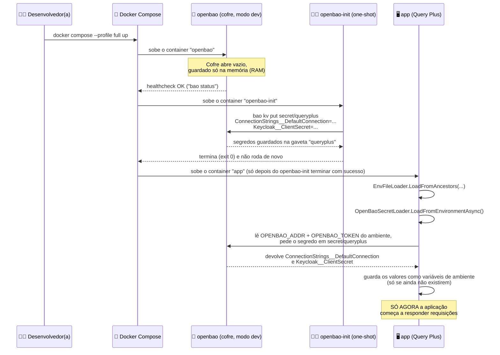
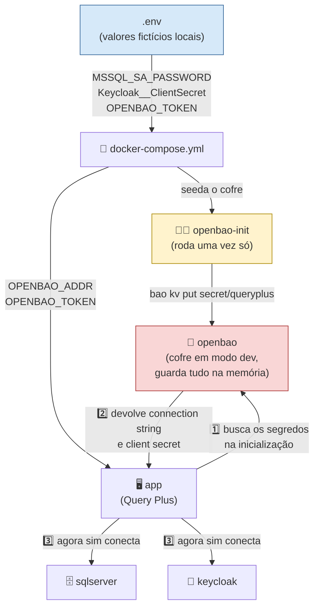

# 🔐 OpenBao: o cofre digital do Query Plus

## 🍭 O que é isso, em uma frase simples

OpenBao é um **cofre eletrônico** que guarda senhas e strings de conexão em vez de deixá-las escritas em arquivos que qualquer pessoa pode abrir — e o Query Plus usa ele só quando roda **dentro do Docker** (perfil `full`), nunca quando você roda com `dotnet run` na sua máquina.

## 🏰 Uma analogia grande: o cofre do prédio

Imagina um prédio de apartamentos. Esse prédio tem um monte de segredinhos importantes: a senha do portão da garagem, a chave da caixa de correio, o código do alarme de incêndio.

Agora imagina duas formas de guardar essas informações:

1. **Jeito perigoso**: escrever tudo num papel colado na porta da portaria. Qualquer visitante, entregador ou pessoa mal-intencionada que passar ali na frente consegue ler.
2. **Jeito seguro**: colocar tudo dentro de um **cofre de metal** trancado, que fica na sala do síndico. Só quem tem a **chave do cofre** consegue abrir e ler o que está lá dentro. O porteiro, quando começa o turno dele de manhã, vai até o cofre, mostra a chave, pega só os códigos que precisa para aquele dia, e guarda de volta.

O OpenBao é exatamente esse cofre de metal. E a aplicação do Query Plus é como o porteiro: assim que ela "começa o turno" (ou seja, assim que o programa liga), ela vai até o cofre, se identifica com a chave, pega os segredos (senha do banco de dados, senha do Keycloak) e só depois disso começa a atender as pessoas (responder requisições).

Sem o cofre, essas senhas ficariam escritas em arquivos de configuração comuns — tipo o papel colado na porta. Qualquer pessoa que tivesse acesso ao código-fonte, a um backup, ou a uma cópia acidental do arquivo, conseguiria ler a senha do banco de dados de produção. É basicamente deixar a chave de casa debaixo do tapete: funciona, mas é a primeira coisa que alguém mal-intencionado vai procurar.

### 🗄️ E o que é esse tal de "KV store" (guarda-valores)?

"KV" quer dizer **Key-Value**, ou seja, **chave-valor**. Pense numa cômoda com várias gavetas, e cada gaveta tem uma etiqueta colada na frente:

| 🏷️ Etiqueta da gaveta (a "chave") | 🎁 O que tem dentro (o "valor") |
|---|---|
| `ConnectionStrings__DefaultConnection` | a frase secreta que diz como conversar com o banco de dados |
| `Keycloak__ClientSecret` | a senha secreta que a aplicação usa para se apresentar ao Keycloak |

Você não precisa abrir a cômoda inteira para achar uma coisa: você lê a etiqueta (`ConnectionStrings__DefaultConnection`) e já sabe qual gaveta puxar. O OpenBao guarda essas gavetas todas dentro de um "compartimento" chamado `secret/queryplus` — como se fosse o nome da cômoda inteira dentro do cofre.

### 🗝️ E o "root token" — a chave mestra?

O **root token** é a chave mestra do cofre: quem tem essa chave abre tudo, sem restrição nenhuma. É como a chave-mestra que o síndico do prédio guarda, que abre a porta de qualquer apartamento.

Por isso, essa chave é perigosíssima de usar em produção — ela não tem "áreas restritas", abre literalmente tudo. No Query Plus, o root token só existe porque o cofre roda em **modo de desenvolvimento** (explicamos isso já já) e serve só para você testar a aplicação na sua máquina. Nunca é usado num ambiente real com usuários de verdade.

## ✅ Por que usamos isso neste projeto

| Sem cofre (senha direta em arquivo) | Com OpenBao (cofre) |
|---|---|
| 😱 Senha aparece em texto puro em `docker-compose.yml` ou variáveis de ambiente do container | 🔒 Senha fica só dentro do cofre; o container só recebe o endereço do cofre e a chave para abri-lo |
| 📋 Fácil de vazar sem querer (print de tela, log, arquivo compartilhado) | 🧯 Difícil de vazar porque o valor real nunca aparece na configuração do container `app` |
| 🔁 Trocar a senha em produção significa editar e reimplantar arquivos de configuração | 🔁 Trocar a senha em produção (com um cofre de verdade) significa só atualizar o cofre, sem tocar no código |
| 🎯 Compatível com um monte de ferramentas | 🎯 OpenBao fala a mesma "língua" (API) do HashiCorp Vault, uma ferramenta usada no mercado inteiro — então o time já aprende um padrão real de mercado |
| 💸 — | 🆓 OpenBao é de código aberto (gratuito), então dá para simular esse comportamento sem pagar por nada |

## ⚙️ Como funciona por baixo dos panos

Existem duas jornadas diferentes acontecendo aqui: a de **subir o cofre e colocar os segredos dentro dele**, e a de **a aplicação buscar os segredos quando ela liga**. Veja o passo a passo:



E aqui está a visão geral de "quem fala com quem" dentro da stack Docker:



> ⚠️ **Detalhe importante**: o OpenBao roda em **modo dev**, que guarda tudo só na memória RAM. Se o container `openbao` reiniciar (crash, falta de memória, reboot da máquina), o cofre "esquece" tudo. E o `openbao-init` tem `restart: "no"` — ou seja, ele não roda de novo sozinho. Se isso acontecer e o `app` não conseguir subir, o remédio é rodar manualmente:
> ```bash
> docker compose up openbao-init
> ```

## 🧩 Como está configurado neste repositório

### 1. `docker-compose.yml` — o cofre e o "seedador" de segredos

O serviço `openbao` sobe o cofre em modo dev, usando o root token que vem do `.env`:

Veja em `docker-compose.yml`:
```yaml
  # Dev-mode OpenBao stores everything in memory - a restart (crash, OOM, host reboot) wipes
  # the KV store, and openbao-init (restart: "no") does NOT automatically re-run. If `app`
  # fails to start after this container restarts, reseed manually:
  #   docker compose up openbao-init
  # Acceptable for a dev-only stack; do not carry this restart policy into a production Vault.
  openbao:
    image: openbao/openbao:2.6.1
    container_name: queryplus-openbao
    restart: unless-stopped
    mem_limit: 256m
    cpus: "0.5"
    environment:
      BAO_DEV_ROOT_TOKEN_ID: "${OPENBAO_TOKEN}"
      BAO_ADDR: "http://127.0.0.1:8200"
    ports:
      # Loopback-only: dev-mode OpenBao is unauthenticated beyond the root token, not meant to
      # be reachable off-host.
      - "127.0.0.1:8200:8200"
    healthcheck:
      test: ["CMD", "bao", "status"]
      interval: 5s
      timeout: 5s
      retries: 10
      start_period: 10s
```

Repare que a porta 8200 só é publicada em `127.0.0.1` — ou seja, o cofre nem sequer fica visível para outros computadores da rede, só para a própria máquina que está rodando o Docker.

Logo abaixo, o `openbao-init` é o "funcionário" que entra no cofre uma única vez, guarda os segredos e vai embora:

Veja em `docker-compose.yml`:
```yaml
  # One-shot: seeds OpenBao's (in-memory, wiped on every restart) KV store from .env-supplied
  # raw secret values, then exits. The app never reads these secrets directly from .env/compose
  # - it fetches them from OpenBao at startup via OPENBAO_ADDR/OPENBAO_TOKEN instead.
  openbao-init:
    image: openbao/openbao:2.6.1
    container_name: queryplus-openbao-init
    restart: "no"
    depends_on:
      openbao:
        condition: service_healthy
    environment:
      BAO_ADDR: "http://openbao:8200"
      BAO_TOKEN: "${OPENBAO_TOKEN}"
    entrypoint: ["/bin/sh", "-c"]
    command:
      - >
        bao kv put secret/queryplus
        ConnectionStrings__DefaultConnection="Server=sqlserver,1433;Database=QueryPlus;User Id=sa;Password=${MSSQL_SA_PASSWORD};TrustServerCertificate=True;Encrypt=False"
        Keycloak__ClientSecret="${Keycloak__ClientSecret}"
```

Note que `restart: "no"` significa "não religue esse container sozinho depois que ele terminar" — é justamente o comportamento de alguém que faz uma tarefa única e vai embora, não fica de plantão.

Repare também que a string de conexão usa `Server=sqlserver,1433` — o nome `sqlserver` é o **nome do serviço** dentro da rede interna do Docker, não "localhost". É como um prédio onde cada apartamento tem um nome próprio na campainha, em vez de todo mundo usar "aqui" — de dentro do container, "aqui" não funcionaria.

Por fim, o serviço `app` recebe só o **endereço do cofre** e o **token**, nunca a senha do banco em si:

Veja em `docker-compose.yml`:
```yaml
  app:
    build:
      context: .
      dockerfile: Dockerfile
    container_name: queryplus-api
    restart: unless-stopped
    mem_limit: 512m
    cpus: "1.0"
    environment:
      ASPNETCORE_ENVIRONMENT: Docker
      OPENBAO_ADDR: "http://openbao:8200"
      OPENBAO_TOKEN: "${OPENBAO_TOKEN}"
      Keycloak__Authority: "http://localhost:8080/realms/queryplus"
      Keycloak__MetadataAddress: "http://keycloak:8080/realms/queryplus/.well-known/openid-configuration"
      Keycloak__BackchannelHost: "keycloak"
      Keycloak__BackchannelPort: "8080"
      Keycloak__ClientId: "${Keycloak__ClientId:-queryplus-web}"
      Keycloak__RequireHttpsMetadata: "false"
      # SPA and API are same-origin here (both served from :5000) so this is never actually
      # exercised by the SPA - it only satisfies Program.cs's non-Development guard requiring
      # Cors:AllowedOrigins to be explicit rather than silently empty.
      Cors__AllowedOrigins__0: "http://localhost:5000"
    ports:
      - "5000:8080"
    depends_on:
      sqlserver:
        condition: service_healthy
      keycloak:
        condition: service_healthy
      openbao-init:
        condition: service_completed_successfully
    profiles:
      - full
```

Note o `depends_on: openbao-init: condition: service_completed_successfully` — o container `app` só liga depois que o "funcionário" `openbao-init` **terminou com sucesso** de guardar os segredos no cofre. É como esperar o porteiro trocar a fechadura antes de deixar o prédio abrir para visitantes.

E note também `profiles: [full]` — isso é o que torna o OpenBao **exclusivo do perfil Docker `full`**. Se você rodar só `docker compose up -d sqlserver keycloak` (sem `--profile full`), o serviço `app` nem sobe, e o cofre inteiro fica irrelevante.

### 2. `.env.example` — o token de dev do cofre

Veja em `.env.example`:
```bash
# --- OpenBao dev-mode root token (docker-compose openbao/openbao-init services) ---
# Only used for Docker Compose ${...} substitution (seeding OpenBao, and the containerized
# app's own OPENBAO_TOKEN). NOT read directly by the app on the host - the app only talks to
# OpenBao when its own process environment also has OPENBAO_ADDR set (true inside the
# docker-compose "full" profile; false for plain `dotnet run`, which keeps reading the plain
# env vars below instead). Do NOT add an OPENBAO_ADDR entry here for that reason.
OPENBAO_TOKEN=dev-only-token
```

Esse comentário é a explicação oficial do próprio repositório sobre por que **não existe** uma linha `OPENBAO_ADDR` no `.env`: se ela existisse, até o `dotnet run` local pensaria que tem um cofre disponível e tentaria buscar segredos nele — o que quebraria o fluxo simples de desenvolvimento local. Por isso, quem decide se o OpenBao entra em cena é a **presença** da variável `OPENBAO_ADDR`, e essa variável só existe dentro do container `app` (veja a seção anterior).

Logo abaixo, o próprio `.env.example` explica a string de conexão "normal", usada fora do Docker:

Veja em `.env.example`:
```bash
# --- ASP.NET Core (double-underscore = nested configuration) ---
# Read directly by the app for the routine `dotnet run` (host) dev flow. The containerized
# app (docker-compose "full" profile) does NOT use these - it fetches the equivalent values
# from OpenBao instead (seeded by the openbao-init service from MSSQL_SA_PASSWORD/
# Keycloak__ClientSecret above/below).
# Host machine: SQL published on localhost:1433
ConnectionStrings__DefaultConnection=Server=localhost,1433;Database=QueryPlus;User Id=sa;Password=Your_strong_Password123;TrustServerCertificate=True;Encrypt=False
```

Aqui está o "porquê" da separação inteira: quando você roda `dotnet run` direto na sua máquina, o SQL Server está publicado em `localhost:1433`. Quando a aplicação roda **dentro** de um container, o SQL Server é outro container chamado `sqlserver`, dentro da mesma rede Docker — e `localhost`, lá dentro, apontaria para o próprio container `app`, não para o banco de dados! Por isso o valor da string de conexão **precisa ser diferente** dependendo de quem está perguntando, e é exatamente esse valor diferente (`Server=sqlserver,1433;...`) que o `openbao-init` grava no cofre.

### 3. `src/QueryPlus.Api/Hosting/OpenBaoSecretLoader.cs` — quem vai até o cofre

Essa é a classe que faz o papel do "porteiro indo buscar a chave e abrindo o cofre". Ela usa a biblioteca `VaultSharp`, que sabe conversar com qualquer cofre compatível com a API do HashiCorp Vault (e o OpenBao é compatível):

Veja em `src/QueryPlus.Api/Hosting/OpenBaoSecretLoader.cs`:
```csharp
using VaultSharp;
using VaultSharp.V1.AuthMethods;
using VaultSharp.V1.AuthMethods.Token;

namespace QueryPlus.Api.Hosting;

/// <summary>
/// Fetches app secrets from an OpenBao (Vault-API-compatible) KV v2 store and merges them into
/// the process environment, mirroring EnvFileLoader's non-destructive precedence (an
/// already-set env var always wins). Bootstrap values (address + token) can't themselves come
/// from OpenBao - they're read from the environment, exactly like EnvFileLoader is itself
/// seeded by the shell/CI before .env is consulted.
/// </summary>
public static class OpenBaoSecretLoader
{
    private const string MountPoint = "secret";
    private const string SecretPath = "queryplus";

    /// <summary>
    /// Reads OPENBAO_ADDR/OPENBAO_TOKEN from the environment and, if both are present, fetches
    /// and applies the KV v2 secret at secret/queryplus. No-ops silently if either is unset, so
    /// environments that don't use OpenBao (e.g. the fast test suite) are unaffected.
    /// </summary>
    public static async Task LoadFromEnvironmentAsync()
    {
        var address = Environment.GetEnvironmentVariable("OPENBAO_ADDR");
        var token = Environment.GetEnvironmentVariable("OPENBAO_TOKEN");
        if (string.IsNullOrWhiteSpace(address) || string.IsNullOrWhiteSpace(token))
        {
            return;
        }

        IReadOnlyDictionary<string, string> secrets;
        try
        {
            secrets = await FetchSecretsAsync(address, token, MountPoint, SecretPath);
        }
        catch (Exception ex)
        {
            throw new InvalidOperationException($"Failed to fetch secrets from OpenBao at '{address}'.", ex);
        }

        foreach (var (key, value) in secrets)
        {
            if (key.Length > 0 && string.IsNullOrEmpty(Environment.GetEnvironmentVariable(key)))
            {
                Environment.SetEnvironmentVariable(key, value);
            }
        }
    }

    /// <summary>
    /// Reads a KV v2 secret and returns its entries as strings. Pure and side-effect free (no
    /// environment mutation), so it can be unit/integration-tested against a real OpenBao
    /// instance without touching process state.
    /// </summary>
    public static async Task<IReadOnlyDictionary<string, string>> FetchSecretsAsync(
        string address,
        string token,
        string mountPoint,
        string secretPath)
    {
        IAuthMethodInfo authMethod = new TokenAuthMethodInfo(token);
        var client = new VaultClient(new VaultClientSettings(address, authMethod));

        var secret = await client.V1.Secrets.KeyValue.V2.ReadSecretAsync(secretPath, mountPoint: mountPoint);

        return secret.Data.Data.ToDictionary(
            kvp => kvp.Key,
            kvp => kvp.Value?.ToString() ?? string.Empty);
    }
}
```

Repare em três detalhes importantes, explicados com a nossa analogia:

- 🚪 **"Se não tem endereço nem chave, nem tenta bater na porta"**: se `OPENBAO_ADDR` ou `OPENBAO_TOKEN` estiverem vazios, o método simplesmente retorna sem fazer nada (`return;`). É por isso que rodar localmente com `dotnet run` nunca "esbarra" no cofre — como não existe `OPENBAO_ADDR` no `.env`, essa função nem tenta se conectar.
- 🥇 **"Quem chegou primeiro, fica"**: o `if (... string.IsNullOrEmpty(Environment.GetEnvironmentVariable(key)))` garante que, se uma variável de ambiente **já** existir (por exemplo, alguém definiu manualmente no shell ou no CI), o valor vindo do cofre **não a sobrescreve**. O cofre só preenche o que ainda está vazio.
- 💥 **"Se prometeu abrir e não abriu, avisa alto"**: uma vez que o endereço e o token existem, qualquer falha ao buscar os segredos vira uma exceção que impede a aplicação de continuar subindo. Faz sentido: se a aplicação foi configurada para depender do cofre e o cofre falhou, é melhor travar a inicialização do que rodar sem a senha do banco de dados.

### 4. `src/QueryPlus.Api/Program.cs` — a ordem de chegada

A ordem das chamadas no início do `Program.cs` é o que garante que os segredos estejam prontos **antes** de qualquer outra coisa da aplicação ser configurada:

Veja em `src/QueryPlus.Api/Program.cs`:
```csharp
EnvFileLoader.LoadFromAncestors(Directory.GetCurrentDirectory());
EnvFileLoader.LoadFromAncestors(AppContext.BaseDirectory);
await OpenBaoSecretLoader.LoadFromEnvironmentAsync();
var builder = WebApplication.CreateBuilder(args);
```

Isso é como uma checklist de abertura de loja pela manhã:

1. Primeiro, olha se tem um bilhete (`.env`) deixado na mesa com anotações (`EnvFileLoader`).
2. Depois, vai até o cofre e busca o que estiver faltando (`OpenBaoSecretLoader`).
3. **Só então** monta o restante da loja (`WebApplication.CreateBuilder(args)`), já com tudo que precisa em mãos.

Isso garante que, quando o resto do programa for ler `ConnectionStrings__DefaultConnection` (por exemplo, para montar a conexão com o banco de dados), o valor já esteja disponível como uma variável de ambiente comum — o resto da aplicação nem "sabe" que existiu um cofre no meio do caminho.

### 5. Testes: garantindo que o "não fazer nada" também funciona

O arquivo de teste confirma justamente o comportamento de "não bater na porta se faltar chave ou endereço" — importante para garantir que a suíte de testes rápida (sem Docker) nunca tente, sem querer, conversar com um cofre que não existe:

Veja em `tests/QueryPlus.Api.Tests/OpenBaoSecretLoaderTests.cs`:
```csharp
[Fact]
public async Task LoadFromEnvironmentAsync_NoOps_WhenBothAddressAndTokenAreUnset()
{
    Environment.SetEnvironmentVariable("OPENBAO_ADDR", null);
    Environment.SetEnvironmentVariable("OPENBAO_TOKEN", null);

    // Must return without ever attempting a network call - an unreachable OpenBao is only
    // fatal once explicitly configured, never by default (keeps the fast test suite/CI
    // network-free even if a developer happens to have these vars set in their shell).
    var act = async () => await OpenBaoSecretLoader.LoadFromEnvironmentAsync();

    await act.Should().NotThrowAsync();
}

[Theory]
[InlineData("http://127.0.0.1:8200", null)]
[InlineData(null, "some-token")]
public async Task LoadFromEnvironmentAsync_NoOps_WhenOnlyOneOfAddressOrTokenIsSet(
    string? address, string? token)
{
    Environment.SetEnvironmentVariable("OPENBAO_ADDR", address);
    Environment.SetEnvironmentVariable("OPENBAO_TOKEN", token);

    var act = async () => await OpenBaoSecretLoader.LoadFromEnvironmentAsync();

    await act.Should().NotThrowAsync();
}
```

Ou seja: só ter o endereço, ou só ter o token, não é suficiente — é preciso ter **os dois juntos** para o cofre ser consultado. É como precisar do endereço da portaria **e** da chave ao mesmo tempo; ter só um dos dois não abre porta nenhuma.

### 📋 Resumo das variáveis de ambiente envolvidas

| Variável | Onde aparece | Para que serve |
|---|---|---|
| `OPENBAO_TOKEN` 🗝️ | `.env` → `docker-compose.yml` (serviços `openbao`, `openbao-init`, `app`) | Root token de dev — usado para o Compose subir/seedar o cofre e repassado ao container `app` |
| `OPENBAO_ADDR` 📍 | Só dentro do container `app` (`docker-compose.yml`) | Endereço do cofre (`http://openbao:8200`) — **de propósito, não existe no `.env`**, para o `dotnet run` local nunca tentar usar o cofre |
| `BAO_DEV_ROOT_TOKEN_ID` 🔓 | Serviço `openbao` (`docker-compose.yml`) | Define qual vai ser o root token do cofre assim que ele sobe em modo dev |
| `BAO_ADDR` / `BAO_TOKEN` 🧑‍🔧 | Serviço `openbao-init` (`docker-compose.yml`) | Endereço e token usados pelo "funcionário" para entrar no cofre e gravar os segredos |
| `ConnectionStrings__DefaultConnection` 🗄️ | `.env` (host) **ou** dentro do cofre (container) | String de conexão com o SQL Server — muda de valor conforme quem pergunta (`localhost` vs `sqlserver`) |
| `Keycloak__ClientSecret` 🛂 | `.env` (host) **ou** dentro do cofre (container) | Senha secreta que a aplicação usa para se identificar junto ao Keycloak |

## 📖 Glossário rápido

| Termo | O que significa, em palavras simples |
|---|---|
| 🔐 OpenBao | O cofre digital de código aberto que guarda senhas, compatível com a "língua" (API) do HashiCorp Vault |
| 🗄️ KV store (guarda-valores) | Uma cômoda de gavetas etiquetadas: cada etiqueta (chave) tem um conteúdo secreto (valor) dentro |
| 🗝️ Root token | A chave mestra do cofre — abre tudo, sem restrição; só deve ser usada em desenvolvimento local |
| 🧪 Modo dev | Jeito de rodar o cofre "para testes": ele guarda tudo só na memória (RAM) e esquece tudo se reiniciar |
| 🧑‍🔧 `openbao-init` | O "funcionário" que liga uma única vez, guarda os segredos no cofre e vai embora |
| 🏷️ `secret/queryplus` | O nome da "gaveta grande" dentro do cofre onde ficam todos os segredos do Query Plus |
| 🖥️ `OpenBaoSecretLoader` | A classe C# que vai até o cofre, se identifica com o token, pega os segredos e os transforma em variáveis de ambiente comuns |
| 📄 `.env` | Arquivo local (nunca commitado no Git) com valores fictícios usados só para desenvolvimento na sua máquina |
| 🐳 Perfil Docker `full` | Modo de subir a stack inteira containerizada (`docker compose --profile full up`) — é o único cenário onde o OpenBao entra em ação |

## ❓ Perguntas frequentes

**1. Se eu rodar `dotnet run` na minha máquina, preciso me preocupar com o OpenBao?**
Não. Rodando localmente, a aplicação lê a senha direto do arquivo `.env`, do jeito de sempre. O OpenBao só entra em cena dentro do container Docker do perfil `full`.

**2. Por que a mesma senha do banco de dados aparece em dois lugares (`.env` e dentro do cofre)?**
Porque o valor **não é exatamente o mesmo**: o `.env` guarda a senha "crua" (`MSSQL_SA_PASSWORD`) e usa `Server=localhost,1433` para o `dotnet run` local. Já dentro do cofre, o `openbao-init` monta uma string de conexão diferente, com `Server=sqlserver,1433`, porque de dentro do container Docker o banco de dados é enxergado pelo nome do serviço (`sqlserver`), não por `localhost`.

**3. O que acontece se eu reiniciar só o container `openbao` sem reiniciar o resto?**
O cofre "esquece" tudo, porque ele guarda tudo na memória (modo dev). Se o container `app` for reiniciado depois disso, ele vai falhar ao buscar os segredos. A solução é rodar `docker compose up openbao-init` de novo para regravar os segredos no cofre vazio.

**4. É seguro usar esse root token em produção?**
Não, de jeito nenhum. O root token é a chave mestra: ela abre qualquer gaveta do cofre, sem controle de permissão nenhum. Neste projeto ele existe só para o ambiente de desenvolvimento local, com valores fictícios (veja os comentários do `.env.example` avisando isso). Um cofre de produção de verdade usaria tokens com permissões limitadas, nunca o root token.

**5. Por que a aplicação falha ao iniciar se o `OPENBAO_ADDR` estiver definido mas o cofre estiver fora do ar?**
Porque, uma vez que a aplicação foi explicitamente configurada para depender do cofre (isto é, `OPENBAO_ADDR` e `OPENBAO_TOKEN` existem), um cofre inacessível é tratado como uma falha grave — melhor a aplicação nem subir do que subir sem a senha certa do banco de dados. Já se nenhuma das duas variáveis existir, a aplicação nem tenta conversar com o cofre, e segue normalmente lendo as variáveis de ambiente comuns.
